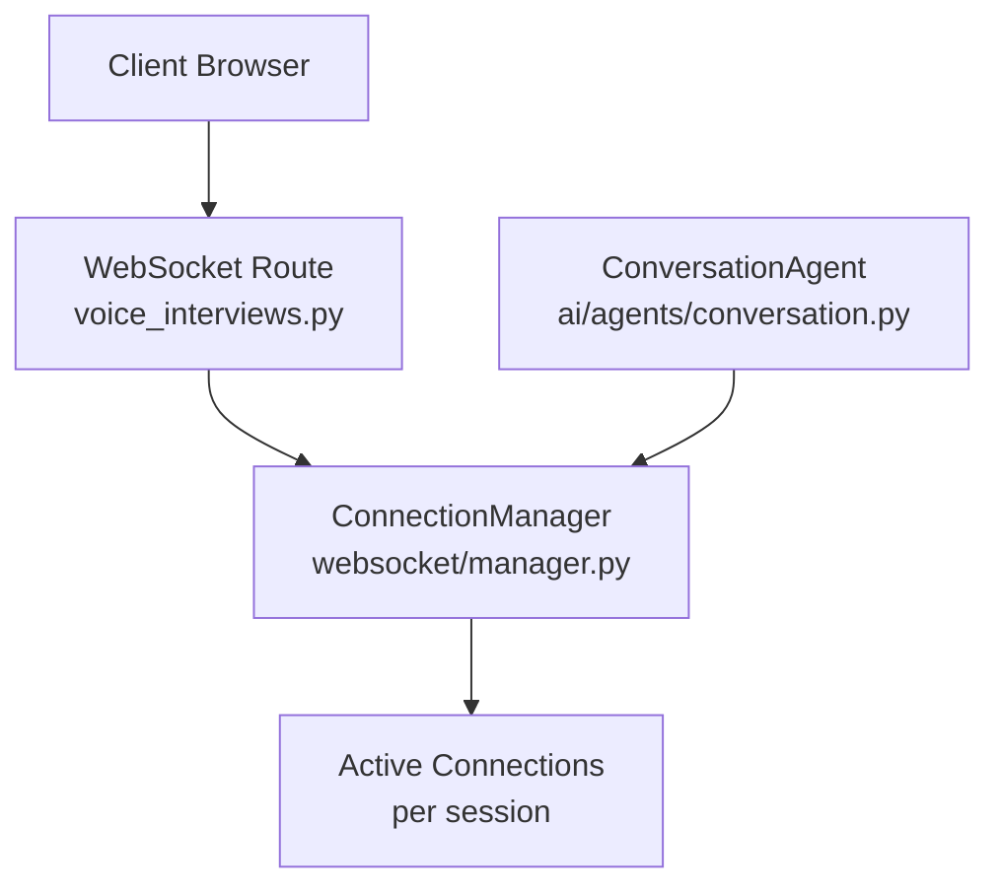
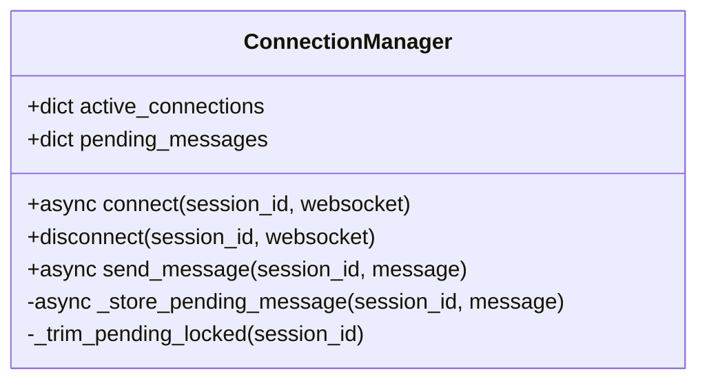
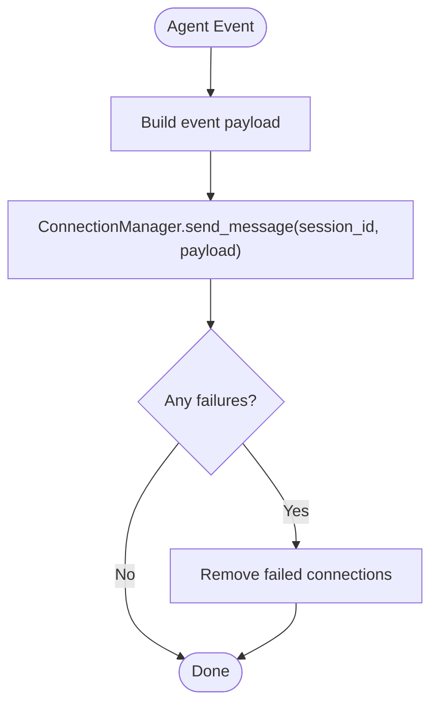
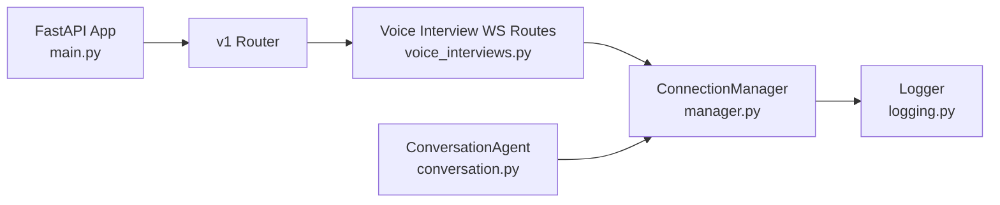

# WebSocket Connection Management

<cite>
**Referenced Files in This Document**
- [manager.py](file://Backend/app/websocket/manager.py)
- [voice_interviews.py](file://Backend/app/api/v1/voice_interviews.py)
- [conversation.py](file://Backend/app/ai/agents/conversation.py)
- [main.py](file://Backend/app/main.py)
- [logging.py](file://Backend/app/logging.py)
</cite>

## Table of Contents
1. Introduction
2. Project Structure
3. Core Components
4. Architecture Overview
5. Detailed Component Analysis
6. Dependency Analysis
7. Performance Considerations
8. Troubleshooting Guide
9. Conclusion

## Introduction
This document explains how the voice interview system manages real-time communication using WebSockets. It focuses on the ConnectionManager class that tracks active connections per interview session, queues pending messages when no clients are connected, and ensures reliable delivery and cleanup. It also covers event handling patterns, message broadcasting to multiple clients, connection lifecycle management, error handling strategies, and performance optimizations for high-concurrency scenarios. Examples include message formats, connection establishment protocols, and disconnection workflows.

## Project Structure
The WebSocket subsystem is implemented in the backend FastAPI application:
- The FastAPI app registers routers and middleware but does not directly implement WebSocket logic.
- Voice interview endpoints expose WebSocket routes for telemetry and integrate with the conversation agent pipeline.
- A shared ConnectionManager provides session-scoped connection tracking and message queuing.
- The conversation agent publishes transcript and state events via the manager to all connected clients for a given session.



**Diagram sources**
- [voice_interviews.py:258-288](file://Backend/app/api/v1/voice_interviews.py#L258-L288)
- [manager.py:14-96](file://Backend/app/websocket/manager.py#L14-L96)
- [conversation.py:204-310](file://Backend/app/ai/agents/conversation.py#L204-L310)

**Section sources**
- [main.py:15-62](file://Backend/app/main.py#L15-L62)
- [voice_interviews.py:258-416](file://Backend/app/api/v1/voice_interviews.py#L258-L416)

## Core Components
- ConnectionManager: Tracks active WebSocket connections per session, queues messages when no clients are present, and broadcasts to all active connections. It uses an asyncio lock to protect concurrent access and trims pending message queues to prevent unbounded growth.
- WebSocket Routes: Accept client connections per attempt_id (session), register them with the manager, handle incoming client signals (e.g., user_requested_end, user_audio_activity), and clean up on disconnect.
- Conversation Agent: Emits transcript and control events to clients through the manager during the interview flow.

Key responsibilities:
- Session-based connection model keyed by attempt_id.
- Message queuing for early or offline periods.
- Robust broadcast with failure isolation and cleanup.
- Minimal locking to reduce contention under load.

**Section sources**
- [manager.py:14-96](file://Backend/app/websocket/manager.py#L14-L96)
- [voice_interviews.py:258-288](file://Backend/app/api/v1/voice_interviews.py#L258-L288)
- [conversation.py:204-310](file://Backend/app/ai/agents/conversation.py#L204-L310)

## Architecture Overview
The runtime architecture connects clients to FastAPI WebSocket endpoints, which delegate to ConnectionManager for connection lifecycle and messaging. The conversation agent publishes events into the manager, which fans out to all active clients for the same session.

```mermaid
sequenceDiagram
participant C as "Client"
participant R as "FastAPI Route<br/>voice_interviews.py"
participant M as "ConnectionManager<br/>manager.py"
participant A as "ConversationAgent<br/>conversation.py"
C->>R : "WS connect /telemetry?attempt_id=..."
R->>M : "connect(session_id, websocket)"
Note over R,M : "Register connection and flush pending"
A-->>M : "send_message(session_id, event)"
M-->>C : "Broadcast event to all active connections"
C-->>R : "receive_text() signals"
R->>A : "Forward signals to agent if needed"
C--|x|R : "disconnect"
R->>M : "disconnect(session_id, websocket)"
```

**Diagram sources**
- [voice_interviews.py:258-288](file://Backend/app/api/v1/voice_interviews.py#L258-L288)
- [manager.py:22-79](file://Backend/app/websocket/manager.py#L22-L79)
- [conversation.py:204-310](file://Backend/app/ai/agents/conversation.py#L204-L310)

## Detailed Component Analysis

### ConnectionManager
Responsibilities:
- Maintain per-session lists of active WebSocket connections.
- Queue messages when no clients are connected; flush on connect.
- Broadcast messages to all active connections; isolate failures and remove broken connections.
- Trim pending queues to a bounded size to limit memory usage.

Concurrency and safety:
- Uses an asyncio.Lock to serialize mutations to shared state.
- Copies active connections before sending to avoid holding locks during I/O.

Performance characteristics:
- O(n) broadcast per message where n is number of active connections for the session.
- Pending queue bounded to a fixed maximum to cap memory.

Error handling:
- Logs send failures and removes failed connections from the active set.
- On partial failure, retains successful sends and continues processing other connections.



**Diagram sources**
- [manager.py:14-96](file://Backend/app/websocket/manager.py#L14-L96)

**Section sources**
- [manager.py:14-96](file://Backend/app/websocket/manager.py#L14-L96)

### WebSocket Routes (Telemetry Endpoints)
Endpoints:
- Profile interview telemetry: /candidates/me/profile-interview-attempts/{attempt_id}/voice/telemetry
- Applied interview telemetry: /candidates/me/applied-interviews/{attempt_id}/voice/telemetry

Lifecycle:
- Accept WebSocket and register with ConnectionManager using attempt_id as session key.
- Read text frames; parse JSON; forward specific signals to the conversation orchestrator when relevant.
- On disconnect, deregister the connection.

Client signals handled:
- user_requested_end: triggers end workflow in the conversation agent.
- user_audio_activity: updates audio activity metrics in the agent.

```mermaid
sequenceDiagram
participant C as "Client"
participant R as "Route<br/>voice_interviews.py"
participant M as "ConnectionManager"
participant O as "Orchestrator/Agent"
C->>R : "WS connect"
R->>M : "connect(attempt_id, ws)"
loop receive loop
C->>R : "text frame"
R->>R : "parse JSON"
alt type == "user_requested_end"
R->>O : "prepare_user_requested_end()"
R->>O : "arm_user_requested_end()"
else type == "user_audio_activity"
R->>O : "note_user_audio_activity()"
end
end
C--|x|R : "disconnect"
R->>M : "disconnect(attempt_id, ws)"
```

**Diagram sources**
- [voice_interviews.py:258-288](file://Backend/app/api/v1/voice_interviews.py#L258-L288)
- [voice_interviews.py:387-416](file://Backend/app/api/v1/voice_interviews.py#L387-L416)

**Section sources**
- [voice_interviews.py:258-288](file://Backend/app/api/v1/voice_interviews.py#L258-L288)
- [voice_interviews.py:387-416](file://Backend/app/api/v1/voice_interviews.py#L387-L416)

### Conversation Agent Event Publishing
The conversation agent emits events to clients via ConnectionManager during the interview:
- Transcript events: new_transcript_message with speaker and message_type fields.
- Speech boundary events: agent_speech_started, agent_speech_ended.
- Control events: interview_end_requested, interview_end_confirmed, interview_end_cancelled.
- Domain flags: off_domain_flag.

These events are sent only when a session_id is available and are resilient to send errors.



**Diagram sources**
- [conversation.py:204-310](file://Backend/app/ai/agents/conversation.py#L204-L310)
- [conversation.py:621-630](file://Backend/app/ai/agents/conversation.py#L621-L630)
- [conversation.py:771-839](file://Backend/app/ai/agents/conversation.py#L771-L839)
- [conversation.py:972-1182](file://Backend/app/ai/agents/conversation.py#L972-L1182)

**Section sources**
- [conversation.py:204-310](file://Backend/app/ai/agents/conversation.py#L204-L310)
- [conversation.py:621-630](file://Backend/app/ai/agents/conversation.py#L621-L630)
- [conversation.py:771-839](file://Backend/app/ai/agents/conversation.py#L771-L839)
- [conversation.py:972-1182](file://Backend/app/ai/agents/conversation.py#L972-L1182)

## Dependency Analysis
- FastAPI app wires routers and middleware; WebSocket routes are included via the v1 router.
- Voice interview routes depend on ConnectionManager for connection lifecycle and messaging.
- Conversation agent depends on ConnectionManager to publish events to clients.
- Logging is centralized via a logger facade used throughout.



**Diagram sources**
- [main.py:15-62](file://Backend/app/main.py#L15-L62)
- [voice_interviews.py:258-416](file://Backend/app/api/v1/voice_interviews.py#L258-L416)
- [manager.py:14-96](file://Backend/app/websocket/manager.py#L14-L96)
- [conversation.py:204-310](file://Backend/app/ai/agents/conversation.py#L204-L310)
- [logging.py:1-37](file://Backend/app/logging.py#L1-L37)

**Section sources**
- [main.py:15-62](file://Backend/app/main.py#L15-L62)
- [voice_interviews.py:258-416](file://Backend/app/api/v1/voice_interviews.py#L258-L416)
- [manager.py:14-96](file://Backend/app/websocket/manager.py#L14-L96)
- [conversation.py:204-310](file://Backend/app/ai/agents/conversation.py#L204-L310)
- [logging.py:1-37](file://Backend/app/logging.py#L1-L37)

## Performance Considerations
- Bounded pending queue: Pending messages are trimmed to a fixed maximum to prevent unbounded memory growth.
- Lock granularity: Critical sections are minimal; copies of connection lists are taken outside locks to reduce contention during I/O.
- Broadcast fan-out: Each message is sent to all active connections for a session; consider rate limiting or batching at the agent layer for very large audiences.
- Failure isolation: Failed sends do not block others; broken connections are removed promptly.
- Idle sessions: When no clients are connected, messages are queued until a client connects, then flushed once.

[No sources needed since this section provides general guidance]

## Troubleshooting Guide
Common issues and mitigations:
- No clients connected: Messages are queued and delivered when a client connects. Check pending queue trimming behavior to ensure recent messages are retained.
- Intermittent send failures: Failed connections are removed automatically; reconnection will re-establish the session and flush any remaining pending messages.
- Invalid JSON frames: Routes silently skip malformed frames to keep the connection alive.
- Excessive logging: Use the centralized logger to filter logs by level and component.

Operational checks:
- Verify WebSocket route acceptance and registration in logs.
- Confirm that agent events are published and received by clients.
- Monitor pending queue sizes to detect connectivity issues.

**Section sources**
- [manager.py:48-89](file://Backend/app/websocket/manager.py#L48-L89)
- [voice_interviews.py:258-288](file://Backend/app/api/v1/voice_interviews.py#L258-L288)
- [logging.py:1-37](file://Backend/app/logging.py#L1-L37)

## Conclusion
The WebSocket subsystem centers around a robust ConnectionManager that provides session-scoped connection tracking, message queuing, and reliable broadcasting. FastAPI routes manage connection lifecycles and forward client signals to the conversation agent, which publishes transcript and control events to clients. The design balances reliability, simplicity, and performance, with bounded queues, minimal locking, and failure isolation suitable for high-concurrency voice interviews.

[No sources needed since this section summarizes without analyzing specific files]