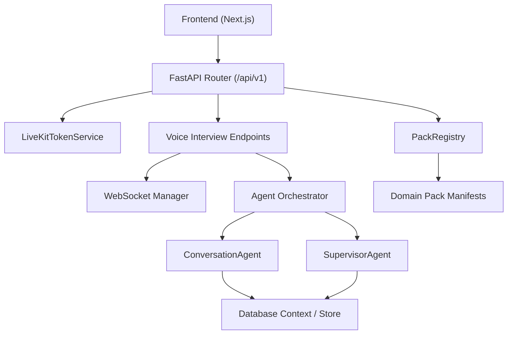
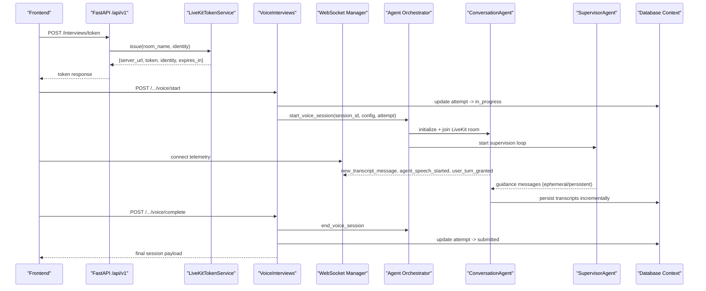
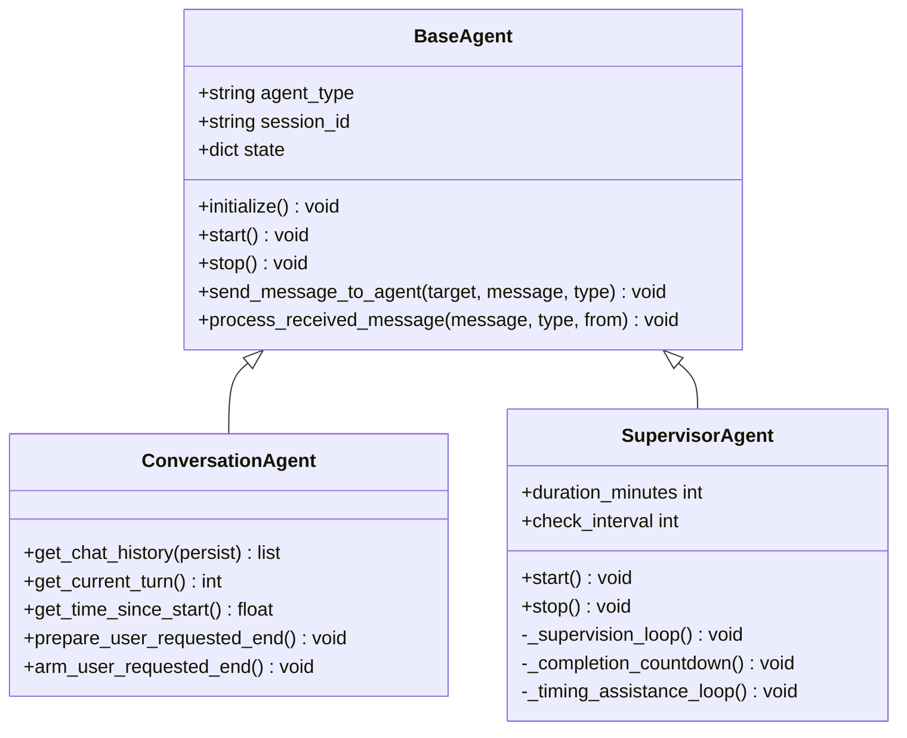
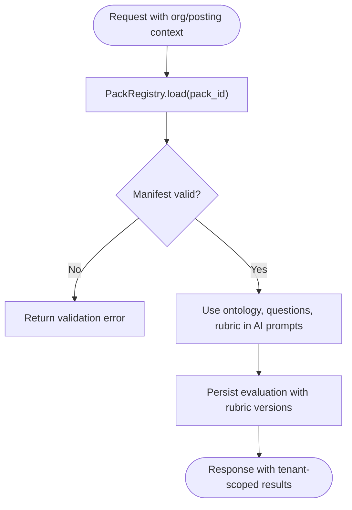
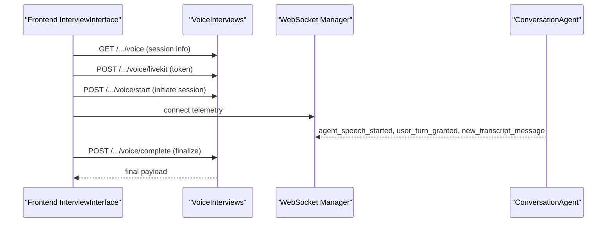
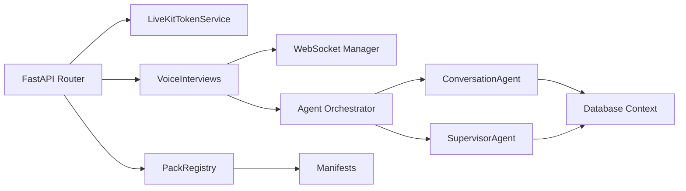

# System Architecture

<cite>
**Referenced Files in This Document**
- [architecture.md](file://architecture.md)
- [design.md](file://design.md)
- [Backend/app/main.py](file://Backend/app/main.py)
- [Backend/app/api/v1/router.py](file://Backend/app/api/v1/router.py)
- [Backend/app/services/livekit.py](file://Backend/app/services/livekit.py)
- [Backend/app/ai/agents/base.py](file://Backend/app/ai/agents/base.py)
- [Backend/app/ai/agents/conversation.py](file://Backend/app/ai/agents/conversation.py)
- [Backend/app/ai/agents/supervisor.py](file://Backend/app/ai/agents/supervisor.py)
- [Backend/app/services/packs.py](file://Backend/app/services/packs.py)
- [domain-packs/education/manifest.json](file://domain-packs/education/manifest.json)
- [Backend/app/api/v1/voice_interviews.py](file://Backend/app/api/v1/voice_interviews.py)
- [Backend/app/websocket/manager.py](file://Backend/app/websocket/manager.py)
- [Backend/app/services/ai/service.py](file://Backend/app/services/ai/service.py)
- [Backend/app/api/models/database.py](file://Backend/app/api/models/database.py)
- [Backend/app/core/config.py](file://Backend/app/core/config.py)
- [Frontend/components/interviews/voice/InterviewInterface.tsx](file://Frontend/components/interviews/voice/InterviewInterface.tsx)
</cite>

## Table of Contents
1. Introduction
2. Project Structure
3. Core Components
4. Architecture Overview
5. Detailed Component Analysis
6. Dependency Analysis
7. Performance Considerations
8. Troubleshooting Guide
9. Conclusion

## Introduction
This document describes the ATS system architecture with a layered design (API, service, data access), multi-tenant isolation via organizations and domain packs, AI agent orchestration for interviews, and real-time communication using LiveKit and WebSockets. It also covers scalability, security boundaries, and deployment topology guidance based on the repository’s code and design documents.

## Project Structure
The backend is a FastAPI application that exposes REST endpoints under /api/v1, wires middleware (CORS, request context), and mounts feature routers. The AI subsystem provides base agents, conversation management, and supervisor coordination. Domain packs are JSON manifests loaded by a registry to inject industry-specific configuration without changing engine code. Real-time voice interviews use LiveKit tokens issued by the API and telemetry over WebSockets. The frontend Next.js app integrates with LiveKit rooms and the backend telemetry channel to drive interview UI state.

**Diagram sources**
- [Backend/app/api/v1/router.py:1-71](file://Backend/app/api/v1/router.py#L1-L71)
- [Backend/app/services/livekit.py:10-39](file://Backend/app/services/livekit.py#L10-L39)
- [Backend/app/api/v1/voice_interviews.py:177-416](file://Backend/app/api/v1/voice_interviews.py#L177-L416)
- [Backend/app/websocket/manager.py:14-96](file://Backend/app/websocket/manager.py#L14-L96)
- [Backend/app/ai/agents/conversation.py:184-800](file://Backend/app/ai/agents/conversation.py#L184-L800)
- [Backend/app/ai/agents/supervisor.py:20-716](file://Backend/app/ai/agents/supervisor.py#L20-L716)
- [Backend/app/services/packs.py:64-97](file://Backend/app/services/packs.py#L64-L97)
- [domain-packs/education/manifest.json:1-143](file://domain-packs/education/manifest.json#L1-L143)

**Section sources**
- [Backend/app/main.py:15-62](file://Backend/app/main.py#L15-L62)
- [Backend/app/api/v1/router.py:1-71](file://Backend/app/api/v1/router.py#L1-L71)
- [architecture.md:47-71](file://architecture.md#L47-L71)

## Core Components
- API Layer: FastAPI app with CORS and request context middleware; versioned router mounting auth, candidates, jobs, postings, pipeline, search, storage, quiz, voice interviews, workflows, and packs.
- Service Layer: LiveKit token issuance, AI question generation adapter, voice interview session lifecycle, synthesis/analysis triggers, identity verification helpers.
- Data Access Layer: Database context shim mapping live agent sessions to attempt rows; store functions for profile/applied attempts; settings-driven database target.
- AI Agents: Base agent abstraction, conversation agent handling realtime transcription and turn control, supervisor agent providing periodic guidance and timing enforcement.
- Domain Packs: JSON manifests validated by a registry; provide ontology, rubrics, and interview question sets per industry.
- Realtime Communication: LiveKit rooms for media; WebSocket manager for telemetry events between frontend and backend during interviews.

**Section sources**
- [Backend/app/api/v1/router.py:1-71](file://Backend/app/api/v1/router.py#L1-L71)
- [Backend/app/services/livekit.py:10-39](file://Backend/app/services/livekit.py#L10-L39)
- [Backend/app/services/ai/service.py:13-86](file://Backend/app/services/ai/service.py#L13-L86)
- [Backend/app/api/models/database.py:22-103](file://Backend/app/api/models/database.py#L22-L103)
- [Backend/app/ai/agents/base.py:14-85](file://Backend/app/ai/agents/base.py#L14-L85)
- [Backend/app/ai/agents/conversation.py:184-800](file://Backend/app/ai/agents/conversation.py#L184-L800)
- [Backend/app/ai/agents/supervisor.py:20-716](file://Backend/app/ai/agents/supervisor.py#L20-L716)
- [Backend/app/services/packs.py:64-97](file://Backend/app/services/packs.py#L64-L97)
- [domain-packs/education/manifest.json:1-143](file://domain-packs/education/manifest.json#L1-L143)

## Architecture Overview
The system follows a layered approach:
- API layer routes requests, enforces tenancy and permissions, and delegates to services.
- Service layer encapsulates business logic: interview orchestration, AI adapters, pack resolution, and external integrations (LiveKit, AI providers).
- Data access layer persists transcripts, evaluations, and session metadata to the configured database.

Multi-tenancy is enforced at request and query boundaries, with organization-scoped resources and domain packs pinned per organization/posting. Domain packs supply industry-specific content and evaluation rubrics through a strict manifest contract.

AI orchestration uses a base agent interface, a conversation agent that manages realtime turns and transcript capture, and a supervisor agent that periodically analyzes conversation context and timing to guide the interviewer agent and enforce end-of-interview behavior.

Real-time communication combines LiveKit for audio/video with a WebSocket telemetry channel for status, transcript streaming, and control signals.

**Diagram sources**
- [Backend/app/api/v1/router.py:43-70](file://Backend/app/api/v1/router.py#L43-L70)
- [Backend/app/services/livekit.py:14-39](file://Backend/app/services/livekit.py#L14-L39)
- [Backend/app/api/v1/voice_interviews.py:204-256](file://Backend/app/api/v1/voice_interviews.py#L204-L256)
- [Backend/app/websocket/manager.py:22-83](file://Backend/app/websocket/manager.py#L22-L83)
- [Backend/app/ai/agents/conversation.py:204-311](file://Backend/app/ai/agents/conversation.py#L204-L311)
- [Backend/app/ai/agents/supervisor.py:137-268](file://Backend/app/ai/agents/supervisor.py#L137-L268)
- [Backend/app/api/models/database.py:155-188](file://Backend/app/api/models/database.py#L155-L188)

**Section sources**
- [architecture.md:19-43](file://architecture.md#L19-L43)
- [Backend/app/core/config.py:72-120](file://Backend/app/core/config.py#L72-L120)

## Detailed Component Analysis

### API Layer
- Application bootstrap registers CORS, request ID/correlation middleware, exception handlers, health and v1 routers.
- Versioned router includes feature modules and defines shared endpoints such as interview token issuance and AI question generation.

Key behaviors:
- Cross-origin policy allows frontend origins and required headers.
- Request context middleware injects tracing identifiers.
- Feature routers encapsulate domain endpoints (auth, candidates, jobs, postings, pipeline, search, storage, quiz, voice interviews, workflows, packs).

**Section sources**
- [Backend/app/main.py:15-62](file://Backend/app/main.py#L15-L62)
- [Backend/app/api/v1/router.py:1-71](file://Backend/app/api/v1/router.py#L1-L71)

### Service Layer
- LiveKit Token Service validates configuration and issues short-lived JWTs scoped to a room and identity.
- Voice Interview endpoints manage session lifecycle: load attempt, ensure readiness, start session, complete session, and expose telemetry WebSocket.
- AI Question Generation Service wraps provider adapters, validates outputs, and returns structured responses with metadata.

Security and reliability:
- Missing LiveKit configuration raises an integration error.
- AI generation falls back to human review when unavailable or invalid.

**Section sources**
- [Backend/app/services/livekit.py:10-39](file://Backend/app/services/livekit.py#L10-L39)
- [Backend/app/api/v1/voice_interviews.py:177-416](file://Backend/app/api/v1/voice_interviews.py#L177-L416)
- [Backend/app/services/ai/service.py:13-86](file://Backend/app/services/ai/service.py#L13-L86)

### Data Access Layer
- Database context shim maps agent sessions to attempt rows, enabling incremental transcript persistence and status updates.
- Status mapping normalizes internal states to store values and vice versa.
- Live session cache reduces repeated lookups within a process lifetime.

Operational notes:
- Persists started_at timestamps and evaluation/report fields.
- Uses configured database target (PostgreSQL URL or SQLite path).

**Section sources**
- [Backend/app/api/models/database.py:22-103](file://Backend/app/api/models/database.py#L22-L103)
- [Backend/app/api/models/database.py:155-188](file://Backend/app/api/models/database.py#L155-L188)
- [Backend/app/core/config.py:35-40](file://Backend/app/core/config.py#L35-L40)

### AI Agent Orchestration
Base Agent:
- Defines lifecycle methods (initialize, start, stop), state tracking, and inter-agent messaging.

Conversation Agent:
- Manages realtime transcript capture, turn control, answer caps, silence detection, and wrap-up flows.
- Emits telemetry events (agent speech, user speech, transcript updates) via WebSocket manager.
- Persists chat history incrementally and coordinates with supervisor for KPI coverage and timing.

Supervisor Agent:
- Runs periodic checks, formats recent transcript snippets, and calls an LLM to produce guidance.
- Enforces time-based phases (questioning ended, grace period, wrap-up) and sends persistent or ephemeral guidance to the conversation agent.
- Coordinates completion countdown and fallback actions if closing does not start cleanly.

**Diagram sources**
- [Backend/app/ai/agents/base.py:14-85](file://Backend/app/ai/agents/base.py#L14-L85)
- [Backend/app/ai/agents/conversation.py:184-800](file://Backend/app/ai/agents/conversation.py#L184-L800)
- [Backend/app/ai/agents/supervisor.py:20-716](file://Backend/app/ai/agents/supervisor.py#L20-L716)

**Section sources**
- [Backend/app/ai/agents/base.py:14-85](file://Backend/app/ai/agents/base.py#L14-L85)
- [Backend/app/ai/agents/conversation.py:184-800](file://Backend/app/ai/agents/conversation.py#L184-L800)
- [Backend/app/ai/agents/supervisor.py:20-716](file://Backend/app/ai/agents/supervisor.py#L20-L716)

### Multi-Tenant Architecture and Domain Packs
- Organizations own resources; domain packs are pinned per posting and provide ontology, matching weights, interview questions, and evaluation rubrics.
- PackRegistry loads manifests from a configured directory, validates required keys and structure, and serves them to engine services.
- Education pack example demonstrates scenario-style questions, competency tags, and rubric dimensions.

**Diagram sources**
- [Backend/app/services/packs.py:34-97](file://Backend/app/services/packs.py#L34-L97)
- [domain-packs/education/manifest.json:1-143](file://domain-packs/education/manifest.json#L1-L143)

**Section sources**
- [architecture.md:74-136](file://architecture.md#L74-L136)
- [Backend/app/services/packs.py:64-97](file://Backend/app/services/packs.py#L64-L97)
- [domain-packs/education/manifest.json:1-143](file://domain-packs/education/manifest.json#L1-L143)

### Real-Time Communication (LiveKit + WebSocket)
- Frontend connects to a LiveKit room and establishes a telemetry WebSocket to receive transcript updates, turn control, and setup status.
- Backend voice endpoints start sessions, issue participant tokens, and stream telemetry events.
- WebSocket manager tracks active connections per session, queues pending messages, and handles disconnects.

**Diagram sources**
- [Frontend/components/interviews/voice/InterviewInterface.tsx:474-763](file://Frontend/components/interviews/voice/InterviewInterface.tsx#L474-L763)
- [Backend/app/api/v1/voice_interviews.py:177-416](file://Backend/app/api/v1/voice_interviews.py#L177-L416)
- [Backend/app/websocket/manager.py:22-83](file://Backend/app/websocket/manager.py#L22-L83)

**Section sources**
- [Backend/app/api/v1/voice_interviews.py:177-416](file://Backend/app/api/v1/voice_interviews.py#L177-L416)
- [Backend/app/websocket/manager.py:14-96](file://Backend/app/websocket/manager.py#L14-L96)
- [Frontend/components/interviews/voice/InterviewInterface.tsx:474-763](file://Frontend/components/interviews/voice/InterviewInterface.tsx#L474-L763)

### Frontend Integration
- The interview component manages LiveKit room connectivity, microphone/camera lifecycle, and telemetry WebSocket reconnection with exponential backoff.
- It reacts to backend signals to enable/disable mic, show agent speaking state, render transcripts, and finalize the session.
- Identity verification captures a single frame once camera is available and posts it to the backend for comparison against the candidate’s avatar.

**Section sources**
- [Frontend/components/interviews/voice/InterviewInterface.tsx:133-397](file://Frontend/components/interviews/voice/InterviewInterface.tsx#L133-L397)
- [Frontend/components/interviews/voice/InterviewInterface.tsx:474-763](file://Frontend/components/interviews/voice/InterviewInterface.tsx#L474-L763)

## Dependency Analysis
- API depends on services for LiveKit token issuance, voice interview orchestration, and AI question generation.
- AI agents depend on configuration (models, timeouts, intervals) and the database context for transcript persistence.
- Domain packs are decoupled via the registry; engine code reads manifests rather than importing pack content directly.
- Frontend depends on LiveKit client libraries and the backend telemetry WebSocket for real-time updates.

**Diagram sources**
- [Backend/app/api/v1/router.py:1-71](file://Backend/app/api/v1/router.py#L1-L71)
- [Backend/app/services/livekit.py:10-39](file://Backend/app/services/livekit.py#L10-L39)
- [Backend/app/api/v1/voice_interviews.py:177-416](file://Backend/app/api/v1/voice_interviews.py#L177-L416)
- [Backend/app/websocket/manager.py:14-96](file://Backend/app/websocket/manager.py#L14-L96)
- [Backend/app/ai/agents/conversation.py:184-800](file://Backend/app/ai/agents/conversation.py#L184-L800)
- [Backend/app/ai/agents/supervisor.py:20-716](file://Backend/app/ai/agents/supervisor.py#L20-L716)
- [Backend/app/services/packs.py:64-97](file://Backend/app/services/packs.py#L64-L97)

**Section sources**
- [Backend/app/core/config.py:72-120](file://Backend/app/core/config.py#L72-L120)
- [Backend/app/services/packs.py:64-97](file://Backend/app/services/packs.py#L64-L97)

## Performance Considerations
- Kanban/board views should use virtualization for large datasets; search and matching are async-indexed.
- Sandbox execution and AI-graded tasks are expensive; rate-limit retakes and track compute cost.
- Notification bursts must be throttled and deduplicated at workers.
- Transcript persistence and telemetry events are batched and queued to avoid blocking realtime paths.

[No sources needed since this section provides general guidance]

## Troubleshooting Guide
Common issues and mitigations:
- LiveKit misconfiguration: missing URL/key/secret causes integration errors; verify environment variables and TTL constraints.
- AI provider disabled or unavailable: question generation returns “disabled” or “unavailable” with human review flag; configure provider keys or fall back to manual curation.
- WebSocket disconnects: frontend reconnects with exponential backoff; backend queues pending messages until connection resumes.
- Supervisor timing edge cases: if time is up but closing did not start cleanly, supervisor sends a fallback wrap-up signal to prevent silent stalls.

**Section sources**
- [Backend/app/services/livekit.py:14-39](file://Backend/app/services/livekit.py#L14-L39)
- [Backend/app/services/ai/service.py:43-86](file://Backend/app/services/ai/service.py#L43-L86)
- [Backend/app/websocket/manager.py:48-83](file://Backend/app/websocket/manager.py#L48-L83)
- [Backend/app/ai/agents/supervisor.py:185-203](file://Backend/app/ai/agents/supervisor.py#L185-L203)

## Conclusion
The ATS architecture separates concerns across API, service, and data layers while isolating domain knowledge into configurable packs. AI agents coordinate interview flow with robust timing and guidance, and real-time communication leverages LiveKit and WebSockets for responsive candidate experiences. Multi-tenancy is enforced throughout, and the system is designed for scalable operations with clear security boundaries and observable failure modes.

[No sources needed since this section summarizes without analyzing specific files]