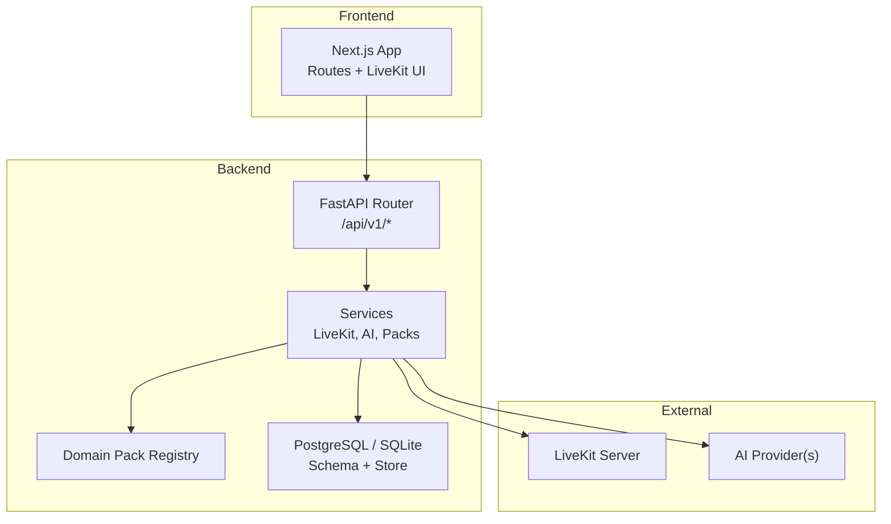
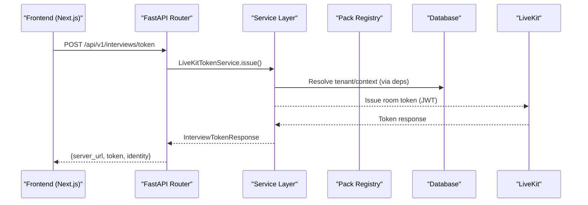
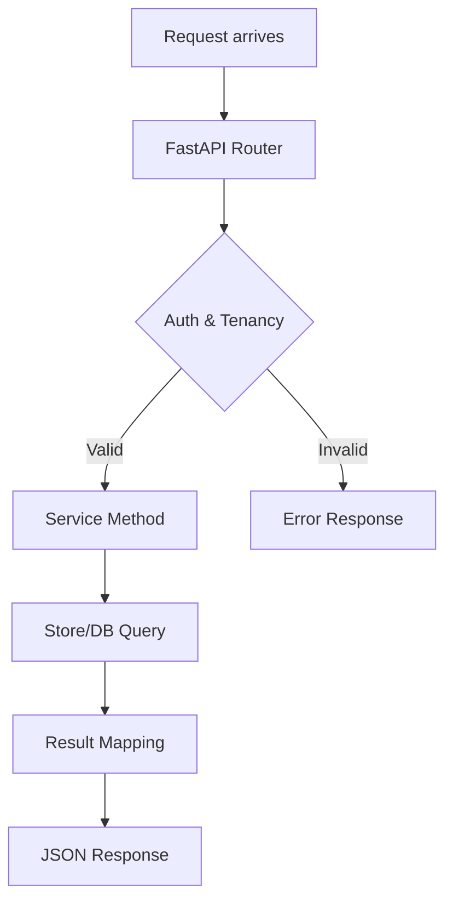
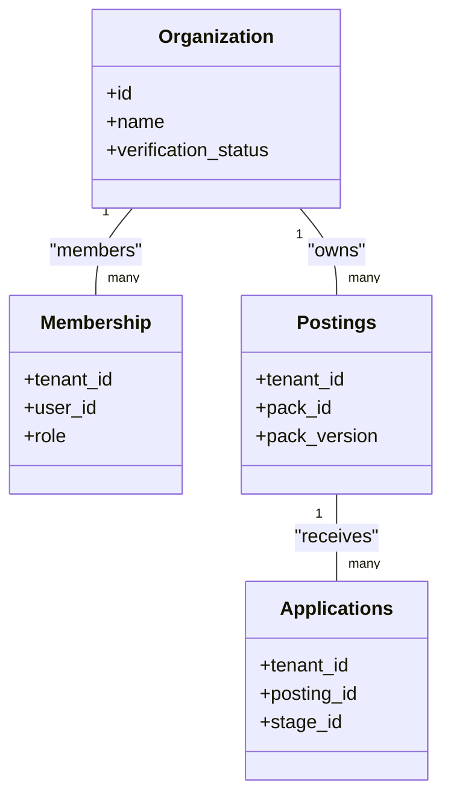
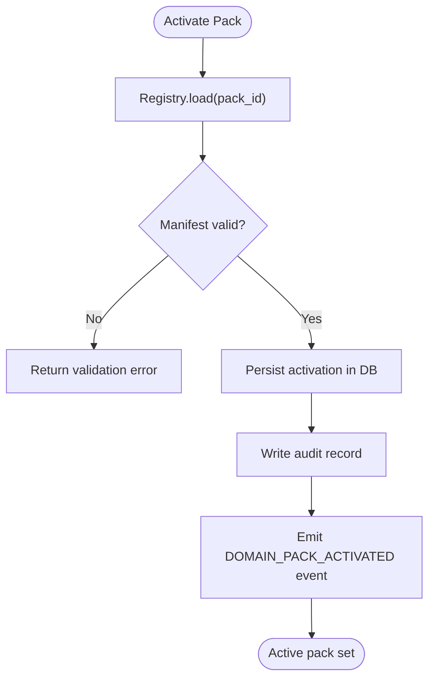
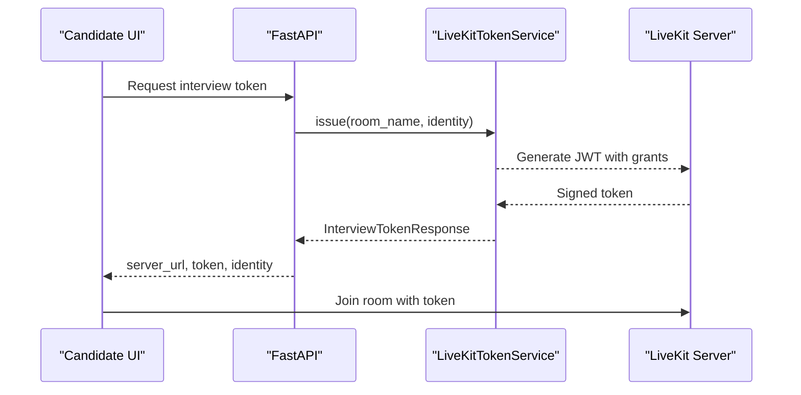
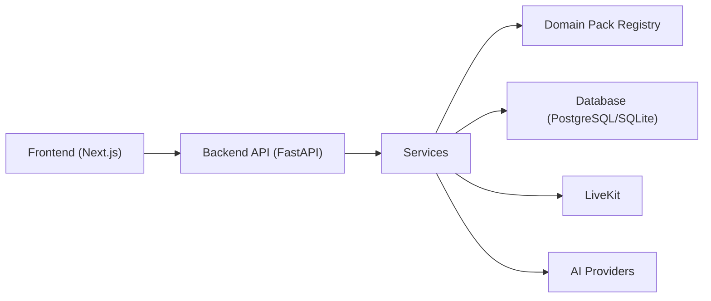

# System Overview & Architecture Patterns

<cite>
**Referenced Files in This Document**
- [architecture.md](file://architecture.md)
- [Backend/app/main.py](file://Backend/app/main.py)
- [Backend/pyproject.toml](file://Backend/pyproject.toml)
- [Backend/app/core/config.py](file://Backend/app/core/config.py)
- [Backend/app/api/v1/router.py](file://Backend/app/api/v1/router.py)
- [Backend/app/services/livekit.py](file://Backend/app/services/livekit.py)
- [Backend/app/services/packs.py](file://Backend/app/services/packs.py)
- [Backend/app/api/v1/packs.py](file://Backend/app/api/v1/packs.py)
- [Backend/app/db/database.py](file://Backend/app/db/database.py)
- [Backend/app/db/store.py](file://Backend/app/db/store.py)
- [Backend/app/api/v1/organizations.py](file://Backend/app/api/v1/organizations.py)
- [Frontend/package.json](file://Frontend/package.json)
- [Frontend/lib/api.ts](file://Frontend/lib/api.ts)
- [domain-packs/education/manifest.json](file://domain-packs/education/manifest.json)
</cite>

## Table of Contents
1. Introduction
2. Project Structure
3. Core Components
4. Architecture Overview
5. Detailed Component Analysis
6. Dependency Analysis
7. Performance Considerations
8. Troubleshooting Guide
9. Conclusion

## Introduction
This document explains the ATS system’s layered architecture, multi-tenant design, domain pack plugin system, and real-time communication integration. It maps how FastAPI powers the backend API, Next.js serves the frontend, PostgreSQL persists data, and LiveKit enables real-time voice/video interviews. The design emphasizes clear separation between API, service, and data layers; configuration-driven behavior via domain packs; and extensibility without modifying core code.

## Project Structure
The repository is organized into:
- Backend (FastAPI): API layer, services, domain pack registry, database schema, and integrations (LiveKit, AI).
- Frontend (Next.js): Employer and candidate UIs with LiveKit components for interviews.
- Domain Packs: JSON manifests that define industry-specific ontology, questions, rubrics, and matching weights.
- Infrastructure: Local Docker compose for running dependencies.

**Diagram sources**
- [Backend/app/api/v1/router.py:1-71](file://Backend/app/api/v1/router.py#L1-L71)
- [Backend/app/services/livekit.py:1-39](file://Backend/app/services/livekit.py#L1-L39)
- [Backend/app/services/packs.py:1-97](file://Backend/app/services/packs.py#L1-L97)
- [Backend/app/db/database.py:1-526](file://Backend/app/db/database.py#L1-L526)

**Section sources**
- [Backend/app/main.py:1-62](file://Backend/app/main.py#L1-L62)
- [Backend/pyproject.toml:1-56](file://Backend/pyproject.toml#L1-L56)
- [Frontend/package.json:1-36](file://Frontend/package.json#L1-L36)

## Core Components
- API Layer: FastAPI app with middleware (CORS, request context), health and v1 routers, exception handlers.
- Service Layer: Business logic for authentication, organizations, postings, pipeline, search, storage, voice interviews, and domain packs.
- Data Access Layer: Database abstraction over PostgreSQL or SQLite with tenant-scoped tables, migrations, and a store module for queries.
- Domain Pack Registry: Loads and validates JSON manifests from the domain-packs directory; enforces contract keys and semantic versioning.
- Real-Time Communication: LiveKit token issuance for interview rooms.
- Configuration: Centralized settings for DB, CORS, JWT, LiveKit, AI providers, and voice interview parameters.

Key responsibilities and boundaries are enforced by strict layering and configuration-driven behavior to avoid branching on domain specifics in engine code.

**Section sources**
- [Backend/app/main.py:15-58](file://Backend/app/main.py#L15-L58)
- [Backend/app/api/v1/router.py:1-71](file://Backend/app/api/v1/router.py#L1-L71)
- [Backend/app/services/packs.py:1-97](file://Backend/app/services/packs.py#L1-L97)
- [Backend/app/db/database.py:1-526](file://Backend/app/db/database.py#L1-L526)
- [Backend/app/core/config.py:16-215](file://Backend/app/core/config.py#L16-L215)

## Architecture Overview
The system follows a layered architecture with clear separation:
- API Layer: Routes and request/response contracts under /api/v1.
- Service Layer: Orchestration of business operations, external integrations (LiveKit, AI), and domain pack resolution.
- Data Layer: Tenant-scoped persistence with PostgreSQL (preferred) or SQLite for development.

Multi-tenancy is enforced at every boundary: requests carry tenant context, queries filter by tenant_id, events include tenant_id, and object storage/search indices are tenant-scoped.

Domain packs provide industry-specific configurations loaded at runtime, enabling new industries without core changes.

Real-time interviews use LiveKit tokens issued by the backend after verifying tenant and identity.

**Diagram sources**
- [Backend/app/api/v1/router.py:43-70](file://Backend/app/api/v1/router.py#L43-L70)
- [Backend/app/services/livekit.py:10-39](file://Backend/app/services/livekit.py#L10-L39)
- [Backend/app/db/database.py:1-526](file://Backend/app/db/database.py#L1-L526)

**Section sources**
- [architecture.md:19-43](file://architecture.md#L19-L43)
- [architecture.md:277-297](file://architecture.md#L277-L297)

## Detailed Component Analysis

### Layered API, Service, Data Pattern
- API Layer: FastAPI application lifecycle, middleware, and router composition. Health and v1 routes are included centrally.
- Service Layer: Encapsulates cross-cutting concerns like LiveKit token issuance, AI question generation, and domain pack resolution.
- Data Layer: Provides a unified connection interface supporting both PostgreSQL and SQLite, with tenant-scoped tables and migration helpers.

**Diagram sources**
- [Backend/app/main.py:15-58](file://Backend/app/main.py#L15-L58)
- [Backend/app/api/v1/router.py:1-71](file://Backend/app/api/v1/router.py#L1-L71)
- [Backend/app/db/database.py:373-516](file://Backend/app/db/database.py#L373-L516)

**Section sources**
- [Backend/app/main.py:15-58](file://Backend/app/main.py#L15-L58)
- [Backend/app/api/v1/router.py:1-71](file://Backend/app/api/v1/router.py#L1-L71)
- [Backend/app/db/database.py:1-526](file://Backend/app/db/database.py#L1-L526)

### Multi-Tenant Design and Organization Isolation
- Every table includes tenant_id where applicable; queries filter by tenant.
- APIs enforce organization context through dependencies and capabilities.
- Audit records and outbox events include tenant_id for traceability.
- Tests verify cross-tenant denial and non-leaking responses.

**Diagram sources**
- [Backend/app/db/database.py:43-331](file://Backend/app/db/database.py#L43-L331)
- [Backend/app/api/v1/organizations.py:77-127](file://Backend/app/api/v1/organizations.py#L77-L127)

**Section sources**
- [Backend/app/db/database.py:43-331](file://Backend/app/db/database.py#L43-L331)
- [Backend/app/api/v1/organizations.py:77-127](file://Backend/app/api/v1/organizations.py#L77-L127)
- [Backend/tests/test_tenancy.py:1-71](file://Backend/tests/test_tenancy.py#L1-L71)

### Domain Pack System (Plugin Architecture)
- Manifests define ontology, skills, certifications, concepts, matching weights, interview question sets, and evaluation rubrics.
- Registry loads manifests from the domain-packs directory, validates required keys, semver, and structure.
- APIs allow listing, retrieving, creating, updating, deleting custom packs per tenant, and activating one pack per tenant.
- Engine code never branches on domain; it reads active pack configuration at runtime.

**Diagram sources**
- [Backend/app/services/packs.py:34-97](file://Backend/app/services/packs.py#L34-L97)
- [Backend/app/api/v1/packs.py:421-472](file://Backend/app/api/v1/packs.py#L421-L472)
- [domain-packs/education/manifest.json:1-143](file://domain-packs/education/manifest.json#L1-L143)

**Section sources**
- [Backend/app/services/packs.py:1-97](file://Backend/app/services/packs.py#L1-L97)
- [Backend/app/api/v1/packs.py:1-490](file://Backend/app/api/v1/packs.py#L1-L490)
- [domain-packs/education/manifest.json:1-143](file://domain-packs/education/manifest.json#L1-L143)

### Real-Time Interviews with LiveKit
- Frontend uses LiveKit components and client SDK to join rooms.
- Backend issues short-lived tokens scoped to room name and user identity.
- Settings validate token TTL and require URL, API key, and secret.

**Diagram sources**
- [Backend/app/api/v1/router.py:43-70](file://Backend/app/api/v1/router.py#L43-L70)
- [Backend/app/services/livekit.py:10-39](file://Backend/app/services/livekit.py#L10-L39)
- [Backend/app/core/config.py:72-76](file://Backend/app/core/config.py#L72-L76)

**Section sources**
- [Backend/app/services/livekit.py:1-39](file://Backend/app/services/livekit.py#L1-L39)
- [Backend/app/core/config.py:72-76](file://Backend/app/core/config.py#L72-L76)
- [Frontend/package.json:13-20](file://Frontend/package.json#L13-L20)

### Technology Stack Decisions
- FastAPI: High-performance async API with dependency injection, middleware, and Pydantic models.
- Next.js: Modern React framework for employer and candidate portals with route groups and shared components.
- PostgreSQL: Primary relational store with optional pgvector for ANN search; fallback to SQLite for local dev.
- LiveKit: Real-time media streaming and token-based room access for voice/video interviews.
- AI Providers: Configurable via settings; used behind adapters for interview question generation and analysis.

These choices support:
- Scalability: Async API, horizontal scaling of stateless services, and offloading heavy tasks (AI, sandbox) to workers.
- Maintainability: Clear layering, configuration-driven behavior, and contract-validated domain packs.
- Extensibility: New domains via manifests; new integrations via services without touching core routes.

**Section sources**
- [Backend/pyproject.toml:11-33](file://Backend/pyproject.toml#L11-L33)
- [Frontend/package.json:13-20](file://Frontend/package.json#L13-L20)
- [Backend/app/core/config.py:35-101](file://Backend/app/core/config.py#L35-L101)
- [architecture.md:64-71](file://architecture.md#L64-L71)

## Dependency Analysis
High-level component relationships:
- Frontend depends on Backend REST endpoints and LiveKit for real-time sessions.
- Backend API depends on Services for business logic and integrations.
- Services depend on Domain Pack Registry for configuration and on Database for persistence.
- Database provides tenant-scoped tables and migration utilities.

**Diagram sources**
- [Backend/app/api/v1/router.py:1-71](file://Backend/app/api/v1/router.py#L1-L71)
- [Backend/app/services/packs.py:1-97](file://Backend/app/services/packs.py#L1-L97)
- [Backend/app/db/database.py:1-526](file://Backend/app/db/database.py#L1-L526)

**Section sources**
- [Backend/app/api/v1/router.py:1-71](file://Backend/app/api/v1/router.py#L1-L71)
- [Backend/app/services/packs.py:1-97](file://Backend/app/services/packs.py#L1-L97)
- [Backend/app/db/database.py:1-526](file://Backend/app/db/database.py#L1-L526)

## Performance Considerations
- Kanban/board views should use virtualization for large datasets.
- Search and matching run asynchronously; write paths remain fast.
- Sandbox execution and AI grading are expensive; rate-limit and track compute cost.
- Notification bursts must be throttled and deduplicated in workers.
- Use PostgreSQL for production workloads; enable vector extension when needed.

[No sources needed since this section provides general guidance]

## Troubleshooting Guide
Common issues and diagnostics:
- LiveKit misconfiguration: Missing URL, API key, or secret will cause token issuance errors.
- Domain pack validation failures: Missing manifest keys or invalid semver result in 422 errors.
- Cross-tenant access: Requests without proper tenant context return forbidden; ensure headers and middleware propagate tenant context.
- Database connectivity: Ensure DATABASE_URL points to PostgreSQL or configure SQLite path; check migrations applied.
- Frontend auth refresh: If 401 occurs, the client attempts token refresh; network unreachable errors indicate backend not started.

Actionable checks:
- Verify environment variables for LiveKit and AI providers.
- Confirm domain pack manifests pass validation rules.
- Inspect audit records and outbox events for tenant-scoped actions.
- Use health endpoint to confirm API readiness.

**Section sources**
- [Backend/app/services/livekit.py:14-21](file://Backend/app/services/livekit.py#L14-L21)
- [Backend/app/services/packs.py:34-62](file://Backend/app/services/packs.py#L34-L62)
- [Backend/app/db/database.py:462-505](file://Backend/app/db/database.py#L462-L505)
- [Frontend/lib/api.ts:25-57](file://Frontend/lib/api.ts#L25-L57)

## Conclusion
The ATS system employs a clean layered architecture with strong multi-tenancy, configuration-driven domain packs, and robust real-time interview capabilities. FastAPI, Next.js, PostgreSQL, and LiveKit form a scalable, maintainable, and extensible foundation. Domain packs enable industry-specific behavior without core modifications, while services encapsulate integrations and business logic. This design supports growth, clarity, and safe evolution of the platform.

[No sources needed since this section summarizes without analyzing specific files]