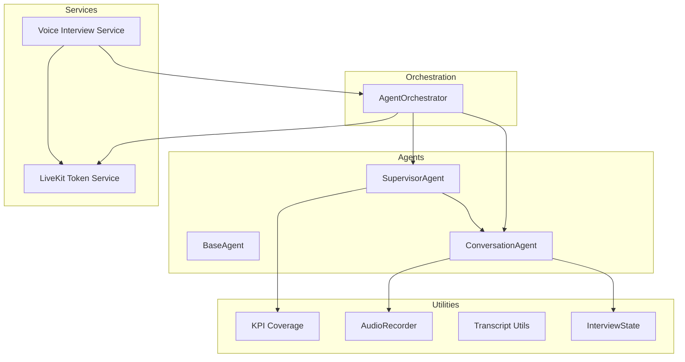
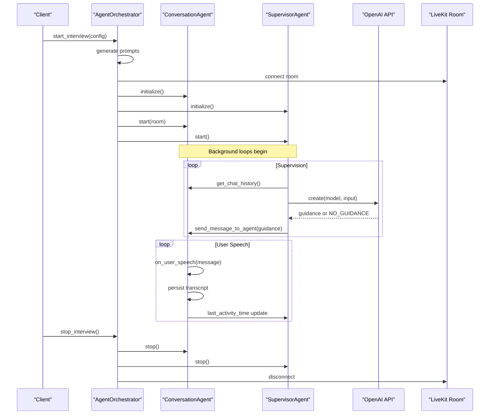
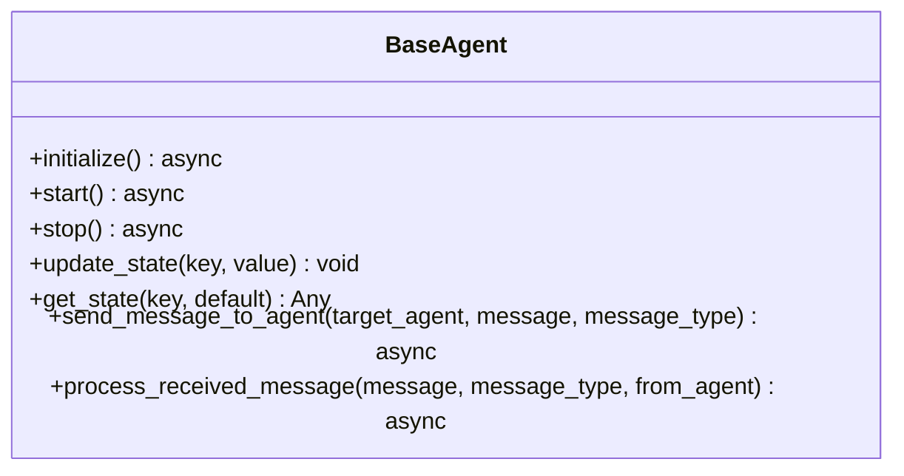
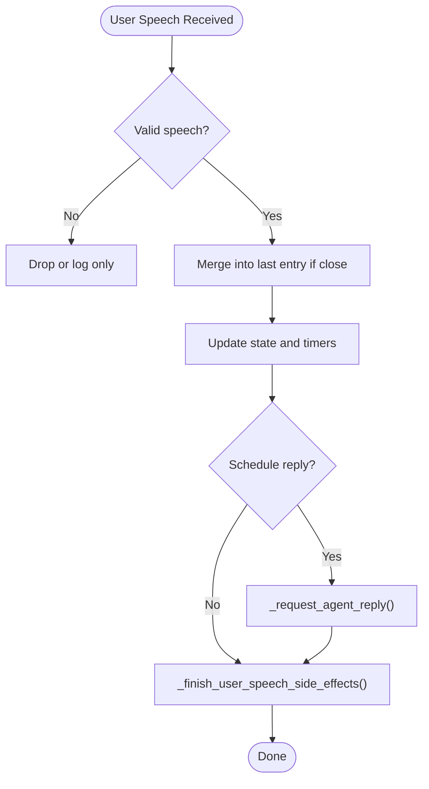
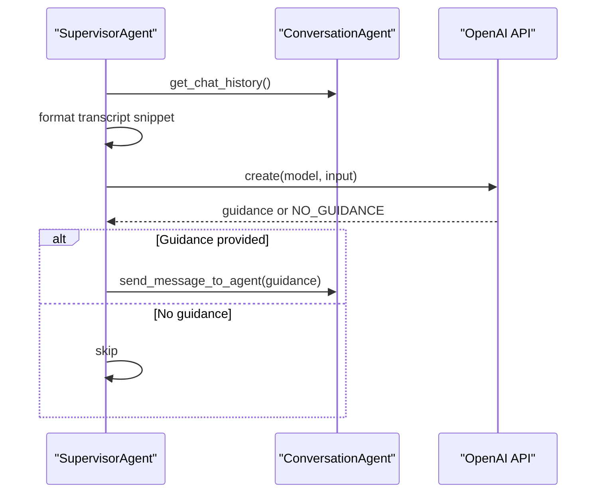
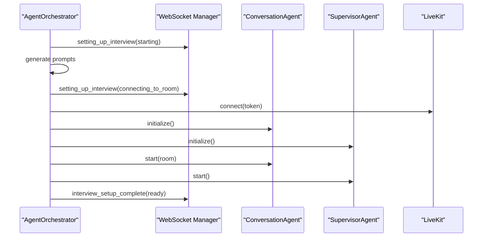
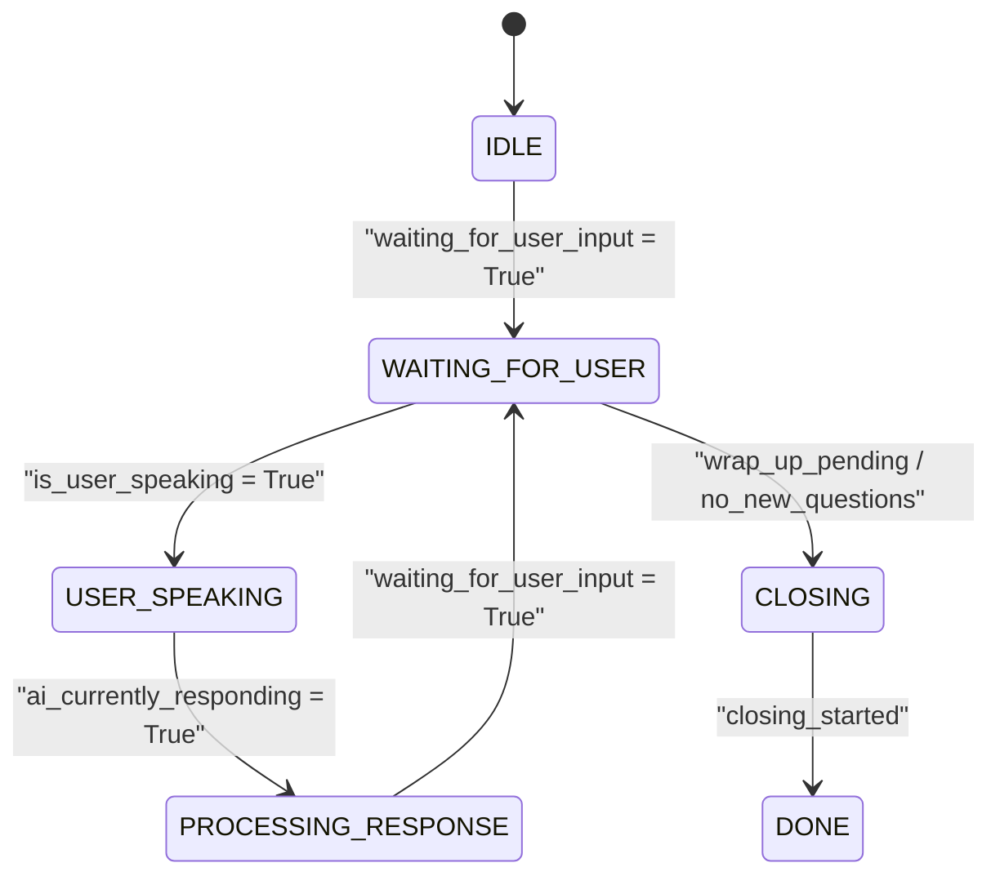
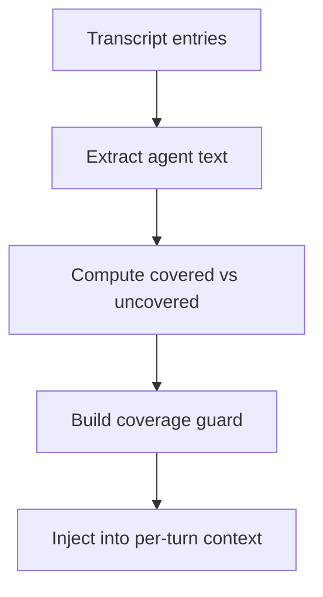
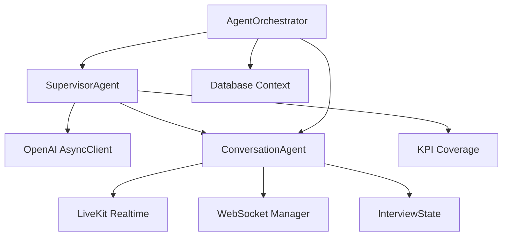

# AI Agent Testing

<cite>
**Referenced Files in This Document**
- [base.py](file://Backend/app/ai/agents/base.py)
- [supervisor.py](file://Backend/app/ai/agents/supervisor.py)
- [conversation.py](file://Backend/app/ai/agents/conversation.py)
- [agent_orchestrator.py](file://Backend/app/ai/services/agent_orchestrator.py)
- [interview_state.py](file://Backend/app/ai/utils/interview_state.py)
- [kpi_coverage.py](file://Backend/app/ai/utils/kpi_coverage.py)
- [transcript_utils.py](file://Backend/app/ai/utils/transcript_utils.py)
- [audio_recorder.py](file://Backend/app/ai/utils/audio_recorder.py)
- [livekit.py](file://Backend/app/services/livekit.py)
- [voice_interview.py](file://Backend/app/services/voice_interview.py)
- [test_voice_interview.py](file://Backend/tests/test_voice_interview.py)
- [test_ai.py](file://Backend/tests/test_ai.py)
- [test_livekit.py](file://Backend/tests/test_livekit.py)
- [conftest.py](file://Backend/tests/conftest.py)
</cite>

## Table of Contents
1. Introduction
2. Project Structure
3. Core Components
4. Architecture Overview
5. Detailed Component Analysis
6. Dependency Analysis
7. Performance Considerations
8. Troubleshooting Guide
9. Conclusion
10. Appendices

## Introduction
This document provides specialized testing guidance for the AI agent system and voice interview processing. It focuses on:
- Testing AI agent orchestration, conversation flows, and supervisor coordination
- Mocking OpenAI API calls to simulate deterministic AI responses
- Testing voice interview sessions, audio recording, and transcription handling
- Validating interview state management, KPI coverage analysis, and transcript utilities
- Verifying real-time features via LiveKit integration and media recording
- Addressing asynchronous operations and ensuring deterministic test results

The goal is to help you build robust, fast, and reliable tests that cover both unit-level logic and integration-style flows without depending on external services.

## Project Structure
The relevant code spans several modules:
- Agents: base class, conversation agent, supervisor agent
- Orchestration: orchestrator that wires agents, rooms, and lifecycle
- Utilities: interview state, KPI coverage, transcript normalization, audio recording
- Services: LiveKit token issuance and voice interview session control
- Tests: configuration fixtures, API tests, voice readiness checks, LiveKit behavior

**Diagram sources**
- [agent_orchestrator.py:29-172](file://Backend/app/ai/services/agent_orchestrator.py#L29-L172)
- [conversation.py:184-310](file://Backend/app/ai/agents/conversation.py#L184-L310)
- [supervisor.py:20-172](file://Backend/app/ai/agents/supervisor.py#L20-L172)
- [interview_state.py:29-101](file://Backend/app/ai/utils/interview_state.py#L29-L101)
- [kpi_coverage.py:54-68](file://Backend/app/ai/utils/kpi_coverage.py#L54-L68)
- [transcript_utils.py:8-61](file://Backend/app/ai/utils/transcript_utils.py#L8-L61)
- [audio_recorder.py:16-84](file://Backend/app/ai/utils/audio_recorder.py#L16-L84)
- [livekit.py:10-38](file://Backend/app/services/livekit.py#L10-L38)
- [voice_interview.py:189-227](file://Backend/app/services/voice_interview.py#L189-L227)

**Section sources**
- [agent_orchestrator.py:29-172](file://Backend/app/ai/services/agent_orchestrator.py#L29-L172)
- [conversation.py:184-310](file://Backend/app/ai/agents/conversation.py#L184-L310)
- [supervisor.py:20-172](file://Backend/app/ai/agents/supervisor.py#L20-L172)
- [interview_state.py:29-101](file://Backend/app/ai/utils/interview_state.py#L29-L101)
- [kpi_coverage.py:54-68](file://Backend/app/ai/utils/kpi_coverage.py#L54-L68)
- [transcript_utils.py:8-61](file://Backend/app/ai/utils/transcript_utils.py#L8-L61)
- [audio_recorder.py:16-84](file://Backend/app/ai/utils/audio_recorder.py#L16-L84)
- [livekit.py:10-38](file://Backend/app/services/livekit.py#L10-L38)
- [voice_interview.py:189-227](file://Backend/app/services/voice_interview.py#L189-L227)

## Core Components
Key components to test:
- BaseAgent: common lifecycle and messaging interface
- ConversationAgent: handles real-time speech, transcript capture, turn management, and LLM interactions
- SupervisorAgent: periodic supervision, timing assistance, wrap-up enforcement, and KPI-driven guidance
- AgentOrchestrator: creates and coordinates agents, connects to LiveKit, manages setup sequence and cleanup
- InterviewState: shared state machine with timers, grace periods, and end-interview confirmation flow
- KPI Coverage: tracks covered/uncovered KPIs and builds per-turn guard instructions
- Transcript Utils: normalizes persisted transcripts for consistent consumption
- AudioRecorder: records LiveKit audio tracks to WAV files
- LiveKit Token Service: issues tokens for participants or agents
- Voice Interview Service: builds configs, starts/stops sessions, and integrates with orchestrator

Testing strategies:
- Unit tests for pure functions (KPI coverage, transcript normalization, state transitions)
- Isolated integration tests for orchestrator setup using mocked LLM and LiveKit connections
- Deterministic mocks for OpenAI responses to ensure stable outcomes
- Event-driven tests for WebSocket messages and transcript updates
- Failure-path tests for missing configuration and timeouts

**Section sources**
- [base.py:14-85](file://Backend/app/ai/agents/base.py#L14-L85)
- [conversation.py:184-310](file://Backend/app/ai/agents/conversation.py#L184-L310)
- [supervisor.py:20-172](file://Backend/app/ai/agents/supervisor.py#L20-L172)
- [agent_orchestrator.py:29-172](file://Backend/app/ai/services/agent_orchestrator.py#L29-L172)
- [interview_state.py:29-101](file://Backend/app/ai/utils/interview_state.py#L29-L101)
- [kpi_coverage.py:54-68](file://Backend/app/ai/utils/kpi_coverage.py#L54-L68)
- [transcript_utils.py:8-61](file://Backend/app/ai/utils/transcript_utils.py#L8-L61)
- [audio_recorder.py:16-84](file://Backend/app/ai/utils/audio_recorder.py#L16-L84)
- [livekit.py:10-38](file://Backend/app/services/livekit.py#L10-L38)
- [voice_interview.py:189-227](file://Backend/app/services/voice_interview.py#L189-L227)

## Architecture Overview
The system orchestrates a ConversationAgent and a SupervisorAgent within a LiveKit room. The orchestrator generates prompts, connects to LiveKit, initializes agents, and starts background tasks for supervision and timing assistance. The conversation agent captures user and agent speech, persists transcripts, and emits WebSocket events. The supervisor periodically inspects the transcript, computes KPI coverage, and sends guidance to steer the conversation toward uncovered topics and proper wrap-up.

**Diagram sources**
- [agent_orchestrator.py:77-172](file://Backend/app/ai/services/agent_orchestrator.py#L77-L172)
- [conversation.py:312-571](file://Backend/app/ai/agents/conversation.py#L312-L571)
- [supervisor.py:137-268](file://Backend/app/ai/agents/supervisor.py#L137-L268)

## Detailed Component Analysis

### BaseAgent and Messaging
- Purpose: define lifecycle methods and inter-agent messaging
- Test focus:
  - Verify abstract methods exist and are implemented by subclasses
  - Validate message sending and error logging paths
  - Ensure state updates and timestamps are recorded deterministically

**Diagram sources**
- [base.py:14-85](file://Backend/app/ai/agents/base.py#L14-L85)

**Section sources**
- [base.py:14-85](file://Backend/app/ai/agents/base.py#L14-L85)

### ConversationAgent
- Purpose: manage real-time conversation, transcript capture, turn phases, and LLM interaction
- Test focus:
  - Simulate user speech events and verify transcript persistence and WebSocket emissions
  - Validate noise filtering and duplicate detection
  - Confirm timer start on first interactive turn
  - Check end-interview request handling and confirmation flow
  - Ensure post-time behavior blocks new questions but logs late speech

**Diagram sources**
- [conversation.py:312-571](file://Backend/app/ai/agents/conversation.py#L312-L571)

**Section sources**
- [conversation.py:312-571](file://Backend/app/ai/agents/conversation.py#L312-L571)

### SupervisorAgent
- Purpose: supervise conversation, provide guidance based on transcript and KPI coverage, enforce timing and wrap-up
- Test focus:
  - Mock OpenAI responses to return deterministic guidance or NO_GUIDANCE
  - Verify skip conditions during active speech, grace period, and wrap-up
  - Validate completion countdown triggers questioning ended phase and fallback wrap-up
  - Confirm timing assistance respects busy states and posts ephemeral guidance
  - Ensure client resources are closed on stop

**Diagram sources**
- [supervisor.py:151-268](file://Backend/app/ai/agents/supervisor.py#L151-L268)
- [supervisor.py:289-331](file://Backend/app/ai/agents/supervisor.py#L289-L331)

**Section sources**
- [supervisor.py:137-268](file://Backend/app/ai/agents/supervisor.py#L137-L268)
- [supervisor.py:289-331](file://Backend/app/ai/agents/supervisor.py#L289-L331)
- [supervisor.py:496-561](file://Backend/app/ai/agents/supervisor.py#L496-L561)
- [supervisor.py:603-671](file://Backend/app/ai/agents/supervisor.py#L603-L671)

### AgentOrchestrator
- Purpose: coordinate setup sequence, connect to LiveKit, initialize agents, manage background tasks, and cleanup
- Test focus:
  - Assert setup progress events are emitted
  - Verify prompt generation and interviewer identity extraction
  - Confirm room connection and agent initialization order
  - Validate stop sequence cancels tasks, closes clients, and disconnects room
  - Ensure resume path reloads persisted transcripts

**Diagram sources**
- [agent_orchestrator.py:77-172](file://Backend/app/ai/services/agent_orchestrator.py#L77-L172)

**Section sources**
- [agent_orchestrator.py:77-172](file://Backend/app/ai/services/agent_orchestrator.py#L77-L172)
- [agent_orchestrator.py:244-277](file://Backend/app/ai/services/agent_orchestrator.py#L244-L277)
- [agent_orchestrator.py:329-361](file://Backend/app/ai/services/agent_orchestrator.py#L329-L361)

### InterviewState
- Purpose: manage conversation phases, timers, grace periods, and end-interview confirmation
- Test focus:
  - Validate phase transitions and property setters
  - Confirm elapsed/remaining time calculations
  - Ensure no-new-questions phase and grace period behaviors
  - Verify timer restoration from transcripts and time-based ending flags

**Diagram sources**
- [interview_state.py:22-101](file://Backend/app/ai/utils/interview_state.py#L22-L101)
- [interview_state.py:171-234](file://Backend/app/ai/utils/interview_state.py#L171-L234)

**Section sources**
- [interview_state.py:22-101](file://Backend/app/ai/utils/interview_state.py#L22-L101)
- [interview_state.py:124-170](file://Backend/app/ai/utils/interview_state.py#L124-L170)
- [interview_state.py:171-234](file://Backend/app/ai/utils/interview_state.py#L171-L234)
- [interview_state.py:236-272](file://Backend/app/ai/utils/interview_state.py#L236-L272)

### KPI Coverage
- Purpose: track covered/uncovered KPIs and build per-turn guards to rotate themes
- Test focus:
  - Validate KPI name extraction from config and plan
  - Confirm mention detection and alias handling
  - Verify coverage computation and streak detection
  - Ensure anti-repeat and domain boundary guards produce expected instruction blocks

**Diagram sources**
- [kpi_coverage.py:54-68](file://Backend/app/ai/utils/kpi_coverage.py#L54-L68)
- [kpi_coverage.py:101-169](file://Backend/app/ai/utils/kpi_coverage.py#L101-L169)

**Section sources**
- [kpi_coverage.py:9-31](file://Backend/app/ai/utils/kpi_coverage.py#L9-L31)
- [kpi_coverage.py:38-68](file://Backend/app/ai/utils/kpi_coverage.py#L38-L68)
- [kpi_coverage.py:71-98](file://Backend/app/ai/utils/kpi_coverage.py#L71-L98)
- [kpi_coverage.py:101-169](file://Backend/app/ai/utils/kpi_coverage.py#L101-L169)

### Transcript Utils
- Purpose: normalize stored transcript rows to a consistent shape
- Test focus:
  - Validate role mapping and content flattening
  - Ensure empty entries are skipped
  - Confirm timestamp preservation for timer restoration

**Section sources**
- [transcript_utils.py:8-61](file://Backend/app/ai/utils/transcript_utils.py#L8-L61)

### AudioRecorder
- Purpose: record LiveKit audio tracks to WAV files
- Test focus:
  - Verify file creation and stream setup
  - Confirm frame writing and cleanup on stop
  - Handle errors gracefully and release resources

**Section sources**
- [audio_recorder.py:16-84](file://Backend/app/ai/utils/audio_recorder.py#L16-L84)

### LiveKit Integration
- Purpose: issue tokens for participants and agents; validate configuration
- Test focus:
  - Ensure token issuance fails safely when credentials are missing
  - Validate TTL and grants
  - Confirm production rejects caller-chosen identities

**Section sources**
- [livekit.py:10-38](file://Backend/app/services/livekit.py#L10-L38)
- [test_livekit.py:7-18](file://Backend/tests/test_livekit.py#L7-L18)
- [test_livekit.py:21-36](file://Backend/tests/test_livekit.py#L21-L36)

### Voice Interview Service
- Purpose: build configs, start/end sessions, integrate with orchestrator
- Test focus:
  - Validate profile screening and job interview config construction
  - Ensure ensure_voice_ready raises appropriate errors when missing configuration
  - Confirm start_voice_session registers and launches orchestrator task
  - Verify end_voice_session cancels pending tasks and initiates wrap-up

**Section sources**
- [voice_interview.py:53-151](file://Backend/app/services/voice_interview.py#L53-L151)
- [voice_interview.py:154-166](file://Backend/app/services/voice_interview.py#L154-L166)
- [voice_interview.py:189-227](file://Backend/app/services/voice_interview.py#L189-L227)
- [test_voice_interview.py:12-49](file://Backend/tests/test_voice_interview.py#L12-L49)

## Dependency Analysis
Key dependencies and coupling:
- SupervisorAgent depends on OpenAI client and ConversationAgent transcript access
- ConversationAgent depends on LiveKit Realtime model and websocket manager
- AgentOrchestrator depends on PromptGenerator, LiveKit, and database contexts
- InterviewState is shared across agents for timing and phase control
- KPI Coverage reads transcript history to compute coverage and build guards

**Diagram sources**
- [supervisor.py:55-57](file://Backend/app/ai/agents/supervisor.py#L55-L57)
- [conversation.py:39-67](file://Backend/app/ai/agents/conversation.py#L39-L67)
- [agent_orchestrator.py:77-172](file://Backend/app/ai/services/agent_orchestrator.py#L77-L172)
- [kpi_coverage.py:54-68](file://Backend/app/ai/utils/kpi_coverage.py#L54-L68)

**Section sources**
- [supervisor.py:55-57](file://Backend/app/ai/agents/supervisor.py#L55-L57)
- [conversation.py:39-67](file://Backend/app/ai/agents/conversation.py#L39-L67)
- [agent_orchestrator.py:77-172](file://Backend/app/ai/services/agent_orchestrator.py#L77-L172)
- [kpi_coverage.py:54-68](file://Backend/app/ai/utils/kpi_coverage.py#L54-L68)

## Performance Considerations
- Minimize LLM calls in tests by mocking responses and limiting lookback windows
- Use short durations and small transcript snippets to reduce processing time
- Avoid heavy I/O in tests; mock filesystem writes for recordings
- Prefer deterministic fixtures and isolated databases to speed up test runs
- Cancel long-running tasks promptly in teardown to prevent resource leaks

[No sources needed since this section provides general guidance]

## Troubleshooting Guide
Common issues and how to address them in tests:
- Missing configuration: ensure tests assert appropriate error codes and status codes for missing LiveKit or AI keys
- Stalled setup: verify orchestrator cancels existing setup tasks and reinitializes cleanly
- Graceful shutdown: confirm all background tasks are cancelled and clients closed on stop
- Transcript normalization: validate edge cases like list content and unknown roles
- Audio recording: handle exceptions in stream reading and ensure files are closed

**Section sources**
- [test_livekit.py:7-18](file://Backend/tests/test_livekit.py#L7-L18)
- [test_voice_interview.py:40-49](file://Backend/tests/test_voice_interview.py#L40-L49)
- [agent_orchestrator.py:244-277](file://Backend/app/ai/services/agent_orchestrator.py#L244-L277)
- [audio_recorder.py:56-84](file://Backend/app/ai/utils/audio_recorder.py#L56-L84)
- [transcript_utils.py:8-61](file://Backend/app/ai/utils/transcript_utils.py#L8-L61)

## Conclusion
By structuring tests around clear boundaries—unit tests for utilities, isolated integration tests for orchestration, and deterministic mocks for external services—you can reliably validate AI agent orchestration, conversation flows, supervisor coordination, and voice interview processing. Focus on state transitions, KPI coverage, transcript normalization, and real-time event handling to ensure robustness under varied conditions.

[No sources needed since this section summarizes without analyzing specific files]

## Appendices

### Mocking OpenAI API Calls
- Strategy: patch the OpenAI client used by SupervisorAgent to return controlled responses
- Patterns:
  - Return NO_GUIDANCE to test idle supervision
  - Return tagged guidance (PERSISTENT/EPHEMERAL) to test forwarding logic
  - Simulate delays and errors to validate retry and error handling
- Validation points:
  - Ensure guidance is parsed and forwarded correctly
  - Verify timing assistance skips during busy states
  - Confirm client closure on stop

**Section sources**
- [supervisor.py:251-268](file://Backend/app/ai/agents/supervisor.py#L251-L268)
- [supervisor.py:313-331](file://Backend/app/ai/agents/supervisor.py#L313-L331)
- [supervisor.py:439-456](file://Backend/app/ai/agents/supervisor.py#L439-L456)

### Testing Interview State Management
- Validate phase transitions and timer behavior
- Confirm grace period and no-new-questions phases
- Test end-interview confirmation flow and blocking after end announcement

**Section sources**
- [interview_state.py:22-101](file://Backend/app/ai/utils/interview_state.py#L22-L101)
- [interview_state.py:171-234](file://Backend/app/ai/utils/interview_state.py#L171-L234)
- [conversation.py:637-757](file://Backend/app/ai/agents/conversation.py#L637-L757)

### Testing KPI Coverage and Transcript Utilities
- Validate KPI extraction and mention detection
- Confirm coverage computation and guard generation
- Normalize transcripts and verify role/content mapping

**Section sources**
- [kpi_coverage.py:9-31](file://Backend/app/ai/utils/kpi_coverage.py#L9-L31)
- [kpi_coverage.py:54-68](file://Backend/app/ai/utils/kpi_coverage.py#L54-L68)
- [kpi_coverage.py:101-169](file://Backend/app/ai/utils/kpi_coverage.py#L101-L169)
- [transcript_utils.py:8-61](file://Backend/app/ai/utils/transcript_utils.py#L8-L61)

### Testing Real-Time Features and LiveKit Integration
- Assert token issuance failures when credentials are missing
- Validate production identity restrictions
- Confirm orchestrator setup events and room connectivity

**Section sources**
- [test_livekit.py:7-18](file://Backend/tests/test_livekit.py#L7-L18)
- [test_livekit.py:21-36](file://Backend/tests/test_livekit.py#L21-L36)
- [agent_orchestrator.py:113-172](file://Backend/app/ai/services/agent_orchestrator.py#L113-L172)

### Testing Asynchronous Operations and Determinism
- Use fixtures to isolate environment and database
- Mock external services to avoid flakiness
- Cancel and await background tasks in teardown
- Validate WebSocket messages and transcript persistence deterministically

**Section sources**
- [conftest.py:14-49](file://Backend/tests/conftest.py#L14-L49)
- [test_ai.py:9-27](file://Backend/tests/test_ai.py#L9-L27)
- [agent_orchestrator.py:244-277](file://Backend/app/ai/services/agent_orchestrator.py#L244-L277)