# Backend Testing

<cite>
**Referenced Files in This Document**
- [conftest.py](file://Backend/tests/conftest.py)
- [pyproject.toml](file://Backend/pyproject.toml)
- [main.py](file://Backend/app/main.py)
- [config.py](file://Backend/app/core/config.py)
- [auth.py](file://Backend/app/api/v1/auth.py)
- [voice_interview.py](file://Backend/app/services/voice_interview.py)
- [test_auth.py](file://Backend/tests/test_auth.py)
- [test_voice_interview.py](file://Backend/tests/test_voice_interview.py)
- [test_livekit.py](file://Backend/tests/test_livekit.py)
- [test_ai.py](file://Backend/tests/test_ai.py)
- [test_postgres.py](file://Backend/tests/test_postgres.py)
- [test_tenancy.py](file://Backend/tests/test_tenancy.py)
- [test_hiring_loop.py](file://Backend/tests/test_hiring_loop.py)
- [test_cv_upload.py](file://Backend/tests/test_cv_upload.py)
</cite>

## Table of Contents
1. Introduction
2. Project Structure
3. Core Components
4. Architecture Overview
5. Detailed Component Analysis
6. Dependency Analysis
7. Performance Considerations
8. Troubleshooting Guide
9. Conclusion

## Introduction
This document explains how the ATS backend is tested with pytest. It covers unit testing strategies for services and business logic, integration tests for API endpoints and database interactions, and approaches for mocking external integrations such as AI providers and LiveKit. It also documents shared test fixtures, configuration patterns, and best practices for FastAPI-based applications.

## Project Structure
The backend uses a standard FastAPI layout with feature-oriented modules under app/. Tests live under Backend/tests/ and are configured via pyproject.toml. The application factory create_app builds the FastAPI instance with CORS, request context middleware, exception handlers, and routers. A minimal TestClient fixture is provided to run requests against an isolated in-memory SQLite database during tests.

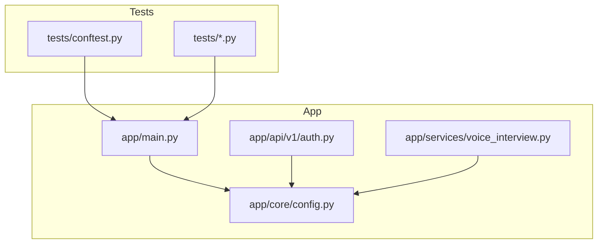

**Diagram sources**
- [main.py:15-58](file://Backend/app/main.py#L15-L58)
- [config.py:16-215](file://Backend/app/core/config.py#L16-L215)
- [auth.py:74-185](file://Backend/app/api/v1/auth.py#L74-L185)
- [voice_interview.py:154-167](file://Backend/app/services/voice_interview.py#L154-L167)

**Section sources**
- [pyproject.toml:45-48](file://Backend/pyproject.toml#L45-L48)
- [main.py:15-58](file://Backend/app/main.py#L15-L58)

## Core Components
- Test client and settings: A reusable TestClient fixture creates an isolated FastAPI app per test using Settings configured for the TEST environment with SQLite and disabled external services.
- Development identity header: Tests can bypass authentication by sending X-Development-Identity when appropriate, enabling fast multi-user scenarios without tokens.
- Optional live PostgreSQL smoke tests: A separate test module conditionally runs against a real Postgres if reachable, seeding demo data for broader validation.

Key responsibilities:
- conftest.py provides settings and client fixtures and helper headers.
- main.py wires middleware, routers, and lifespan behavior.
- config.py defines Settings with validators and properties used across tests to assert readiness and environment-specific behavior.

**Section sources**
- [conftest.py:14-49](file://Backend/tests/conftest.py#L14-L49)
- [main.py:15-58](file://Backend/app/main.py#L15-L58)
- [config.py:16-215](file://Backend/app/core/config.py#L16-L215)
- [test_postgres.py:20-55](file://Backend/tests/test_postgres.py#L20-L55)

## Architecture Overview
The testing architecture centers on a lightweight TestClient that exercises FastAPI routes against an isolated database. External dependencies (AI, LiveKit, SMTP, S3) are intentionally disabled or mocked via Settings so tests remain deterministic and fast. Integration tests validate cross-cutting concerns like tenancy, role enforcement, and workflow transitions.

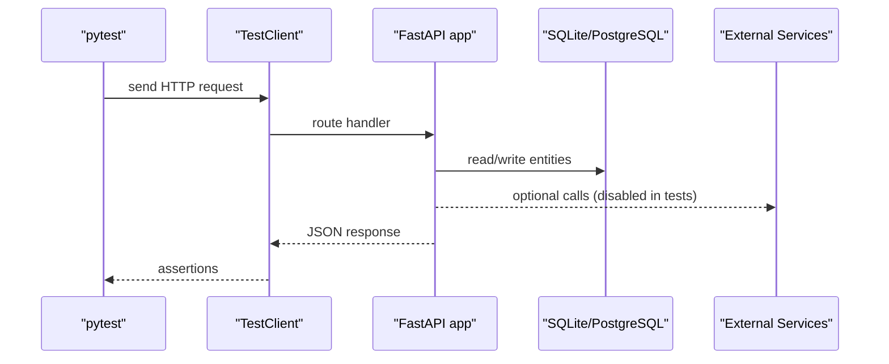

[No sources needed since this diagram shows conceptual workflow, not actual code structure]

## Detailed Component Analysis

### Authentication Flow Testing
Strategy:
- Use the shared TestClient to register users, log in, refresh tokens, and logout.
- Validate token rotation semantics and replay protection.
- Verify development identity header works for quick access in tests.
- Assert error codes for invalid credentials and account state.

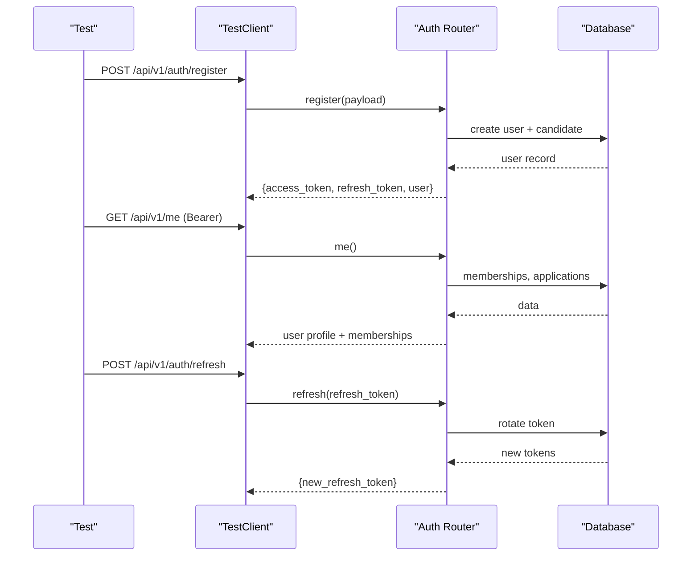

**Diagram sources**
- [auth.py:74-148](file://Backend/app/api/v1/auth.py#L74-L148)
- [test_auth.py:21-53](file://Backend/tests/test_auth.py#L21-L53)

Best practices:
- Always assert both status codes and structured error codes/messages.
- Use idempotency keys where applicable to verify safe retries.
- Leverage development identity header for non-authenticated flows in tests.

**Section sources**
- [test_auth.py:21-166](file://Backend/tests/test_auth.py#L21-L166)
- [auth.py:74-185](file://Backend/app/api/v1/auth.py#L74-L185)

### Voice Interview Processing and Readiness Checks
Strategy:
- Validate strategy selection and evaluation mapping for different interview types.
- Ensure voice interviews fail gracefully when LiveKit or AI are not configured.
- Confirm that production rejects caller-chosen identities for security.

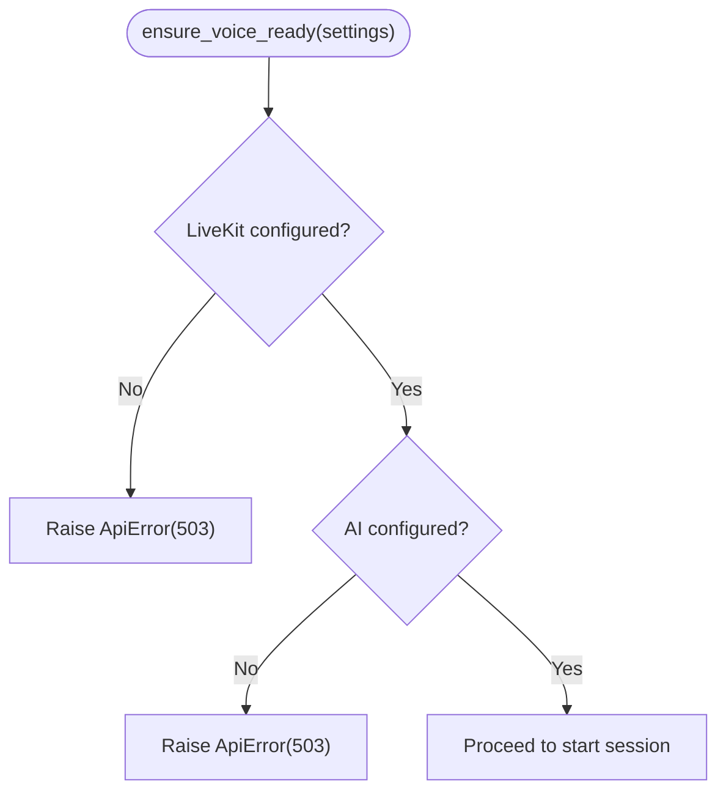

**Diagram sources**
- [voice_interview.py:154-167](file://Backend/app/services/voice_interview.py#L154-L167)

Additional notes:
- Strategy functions return human-readable descriptions tailored to interview type; tests assert language and focus.
- Evaluation mapping normalizes scores and flags human review requirements.

**Section sources**
- [test_voice_interview.py:12-49](file://Backend/tests/test_voice_interview.py#L12-L49)
- [voice_interview.py:53-151](file://Backend/app/services/voice_interview.py#L53-L151)
- [voice_interview.py:154-167](file://Backend/app/services/voice_interview.py#L154-L167)

### AI Service Mocking and Fallbacks
Strategy:
- When AI is disabled, endpoints return a deterministic disabled status with empty results and metadata preserved.
- In production-like settings, unauthenticated requests are rejected even if provider keys are present.

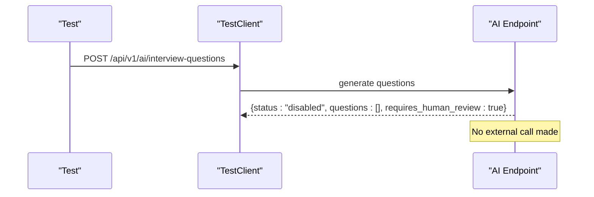

**Diagram sources**
- [test_ai.py:9-27](file://Backend/tests/test_ai.py#L9-L27)

**Section sources**
- [test_ai.py:9-55](file://Backend/tests/test_ai.py#L9-L55)

### LiveKit Token Issuance and Security
Strategy:
- Without credentials, token issuance returns a clear integration-not-configured error with consistent shape and request ID correlation.
- Production enforces trusted identity; caller-selected identities are rejected.

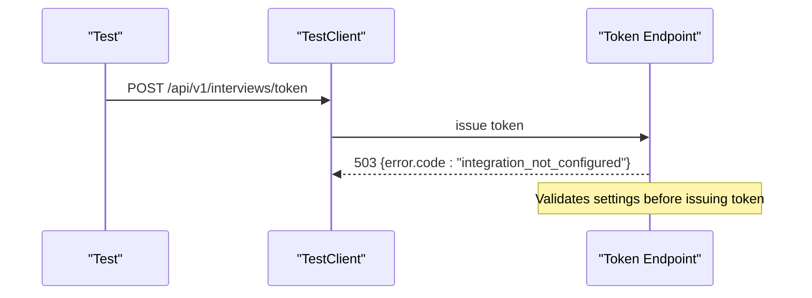

**Diagram sources**
- [test_livekit.py:7-18](file://Backend/tests/test_livekit.py#L7-L18)

**Section sources**
- [test_livekit.py:7-37](file://Backend/tests/test_livekit.py#L7-L37)

### Multi-Tenant Isolation and Role Enforcement
Strategy:
- Create organizations per tenant and assert strict isolation of postings, pipeline, and direct object access.
- Non-existent org IDs must not leak existence information; responses match forbidden semantics.
- Role checks block non-admin configuration actions.

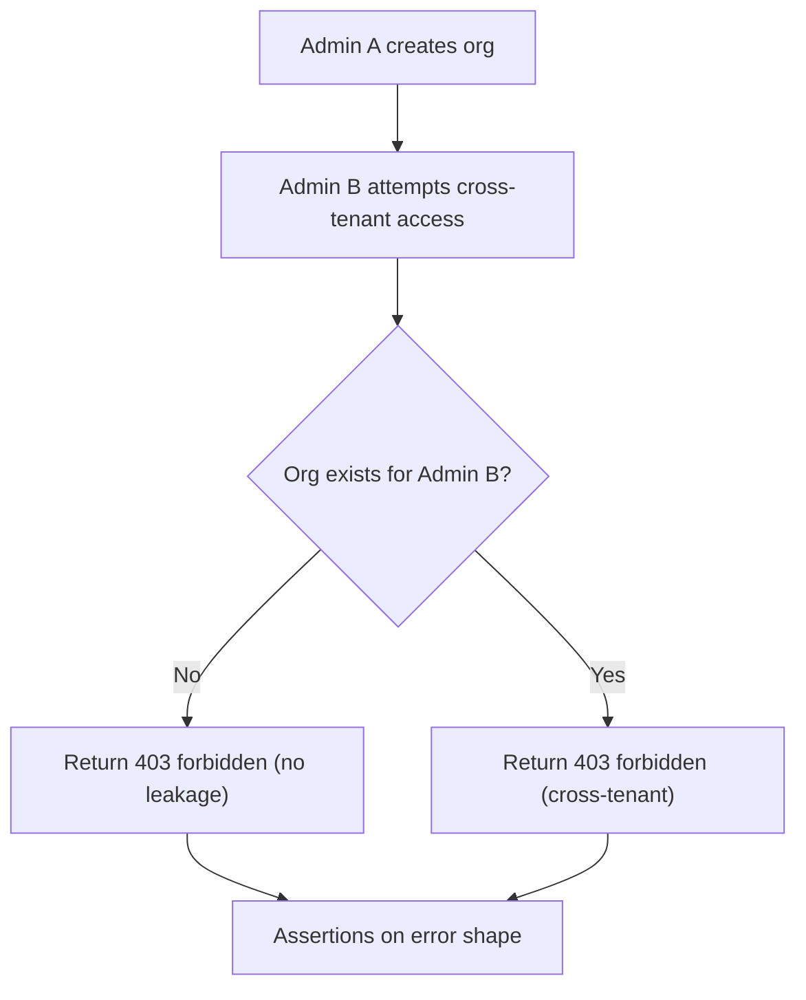

**Diagram sources**
- [test_tenancy.py:27-48](file://Backend/tests/test_tenancy.py#L27-L48)

**Section sources**
- [test_tenancy.py:19-116](file://Backend/tests/test_tenancy.py#L19-L116)

### End-to-End Hiring Loop
Strategy:
- Exercise full lifecycle: organization setup, domain pack activation, workflow creation, job posting, question pool generation/lock/publish, application submission, stage transitions, applied interview invitation/response/submit, scorecard creation, decision path, notifications, and audit trail.
- Validate idempotency, versioned transitions, and terminal stage constraints.

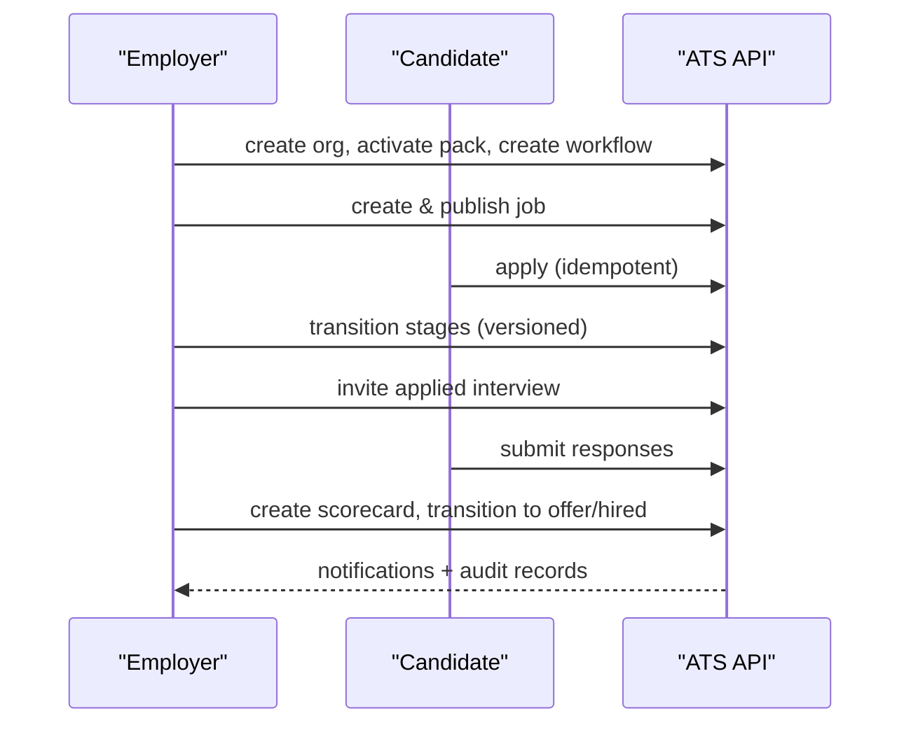

**Diagram sources**
- [test_hiring_loop.py:9-54](file://Backend/tests/test_hiring_loop.py#L9-L54)
- [test_hiring_loop.py:57-275](file://Backend/tests/test_hiring_loop.py#L57-L275)

**Section sources**
- [test_hiring_loop.py:57-275](file://Backend/tests/test_hiring_loop.py#L57-L275)

### CV Upload and Extraction
Strategy:
- Unit-test extraction from DOCX and PDF with synthetic content.
- Reject unsupported legacy formats with a specific error code.
- End-to-end upload endpoint validates parsing and embedding availability.

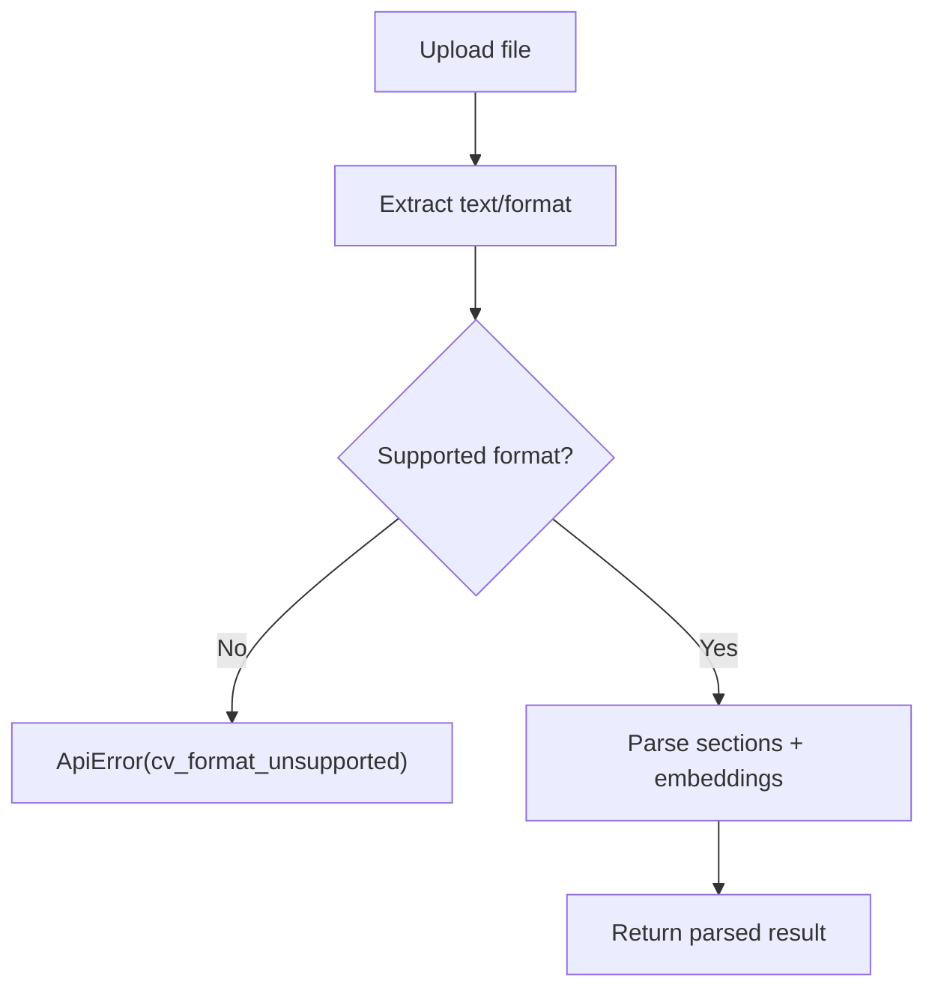

**Diagram sources**
- [test_cv_upload.py:73-113](file://Backend/tests/test_cv_upload.py#L73-L113)

**Section sources**
- [test_cv_upload.py:73-113](file://Backend/tests/test_cv_upload.py#L73-L113)

### Optional Live PostgreSQL Smoke Tests
Strategy:
- Skip unless THOS_DATABASE_URL points to a reachable Postgres.
- Seed demo data and assert employer data availability through API endpoints.

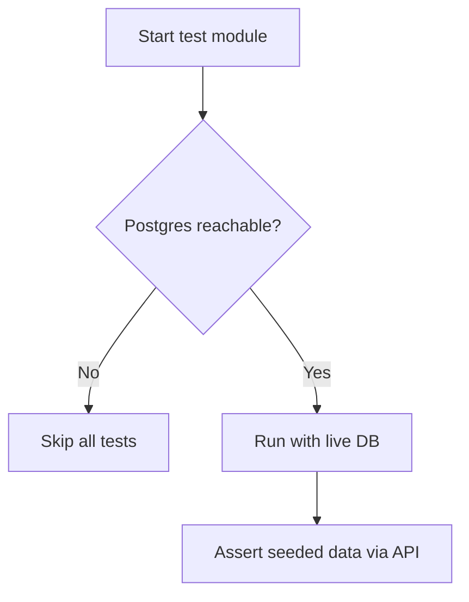

**Diagram sources**
- [test_postgres.py:20-36](file://Backend/tests/test_postgres.py#L20-L36)
- [test_postgres.py:58-72](file://Backend/tests/test_postgres.py#L58-L72)

**Section sources**
- [test_postgres.py:20-72](file://Backend/tests/test_postgres.py#L20-L72)

## Dependency Analysis
- Test client depends on create_app which wires middleware and routers.
- Settings drive behavior: environment, database target, AI/LiveKit readiness, and CORS.
- Auth endpoints depend on store operations and token services; tests assert both success and failure paths.
- Voice interview service depends on AI and LiveKit readiness; tests assert graceful failures.

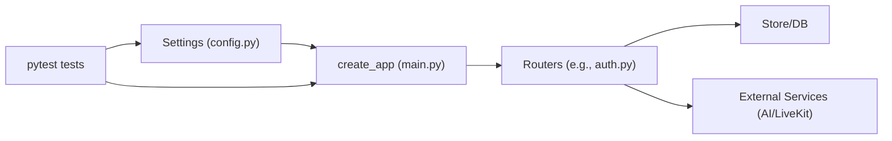

**Diagram sources**
- [config.py:16-215](file://Backend/app/core/config.py#L16-L215)
- [main.py:15-58](file://Backend/app/main.py#L15-L58)
- [auth.py:74-185](file://Backend/app/api/v1/auth.py#L74-L185)

**Section sources**
- [config.py:16-215](file://Backend/app/core/config.py#L16-L215)
- [main.py:15-58](file://Backend/app/main.py#L15-L58)

## Performance Considerations
- Prefer in-memory SQLite for most tests to avoid I/O overhead; only use live Postgres for targeted smoke tests.
- Disable external integrations via Settings to eliminate network latency and flakiness.
- Keep fixtures minimal and reuse them; avoid heavy setup inside individual tests.
- Use idempotency keys in tests to validate retry safety without side effects.

[No sources needed since this section provides general guidance]

## Troubleshooting Guide
Common issues and resolutions:
- Missing external configuration:
  - LiveKit/AI not configured leads to 503 errors with explicit codes; ensure Settings include required keys or assert expected failures in tests.
- Unexpected authentication behavior:
  - In production-like environments, unauthenticated requests are rejected; use development identity header only in tests where appropriate.
- Tenancy leaks:
  - Cross-tenant access should always return forbidden with no leakage; verify error shapes and messages.
- Database connectivity:
  - For live Postgres tests, ensure THOS_DATABASE_URL is set and reachable; otherwise tests skip automatically.

**Section sources**
- [test_livekit.py:7-37](file://Backend/tests/test_livekit.py#L7-L37)
- [test_ai.py:30-55](file://Backend/tests/test_ai.py#L30-L55)
- [test_tenancy.py:27-48](file://Backend/tests/test_tenancy.py#L27-L48)
- [test_postgres.py:20-36](file://Backend/tests/test_postgres.py#L20-L36)

## Conclusion
The ATS backend employs a robust pytest strategy combining isolated unit tests, focused integration tests, and optional live-database smoke tests. Shared fixtures centralize configuration and client setup, while Settings enable deterministic behavior by disabling external dependencies. Tests cover authentication, voice interview readiness, AI fallbacks, LiveKit security, multi-tenancy, and end-to-end hiring workflows, ensuring reliability and clarity across the system.