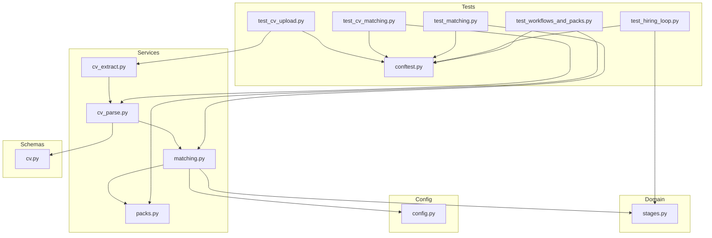
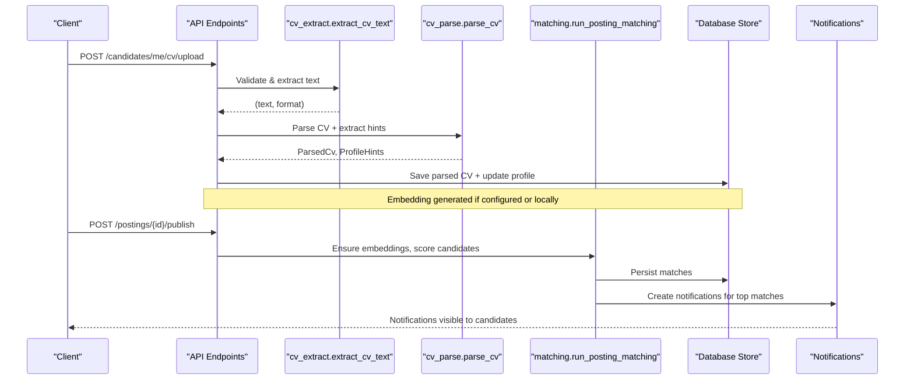
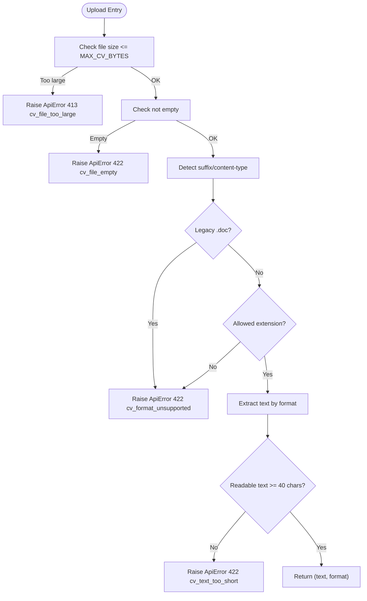
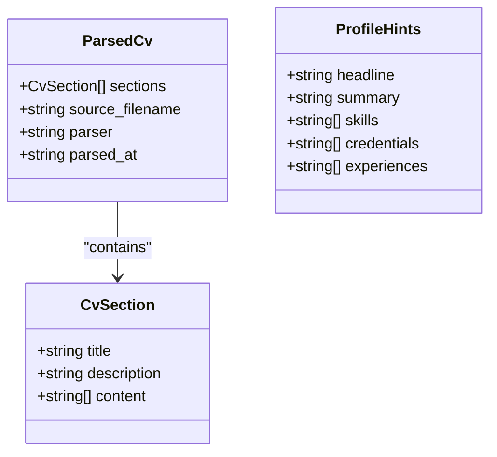
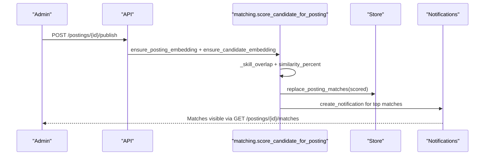
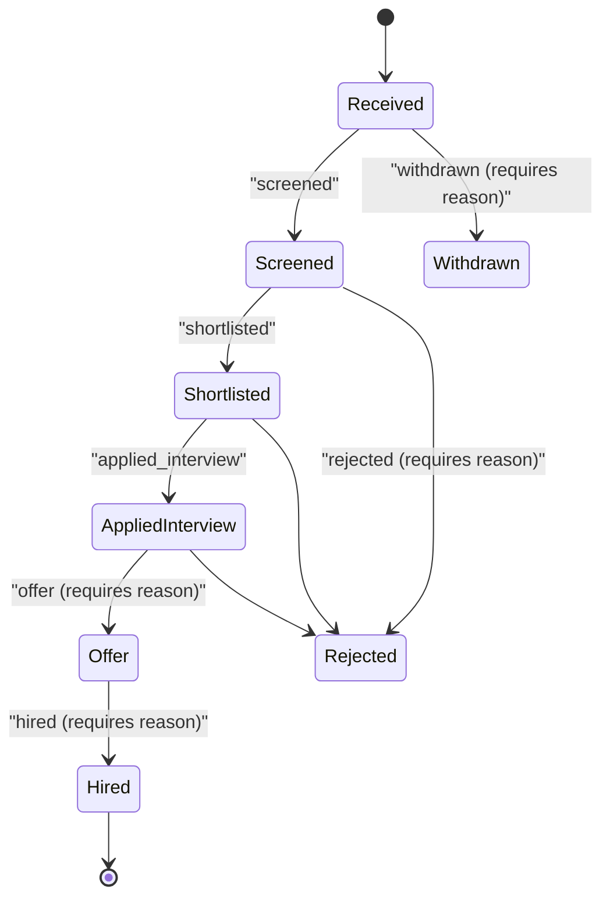
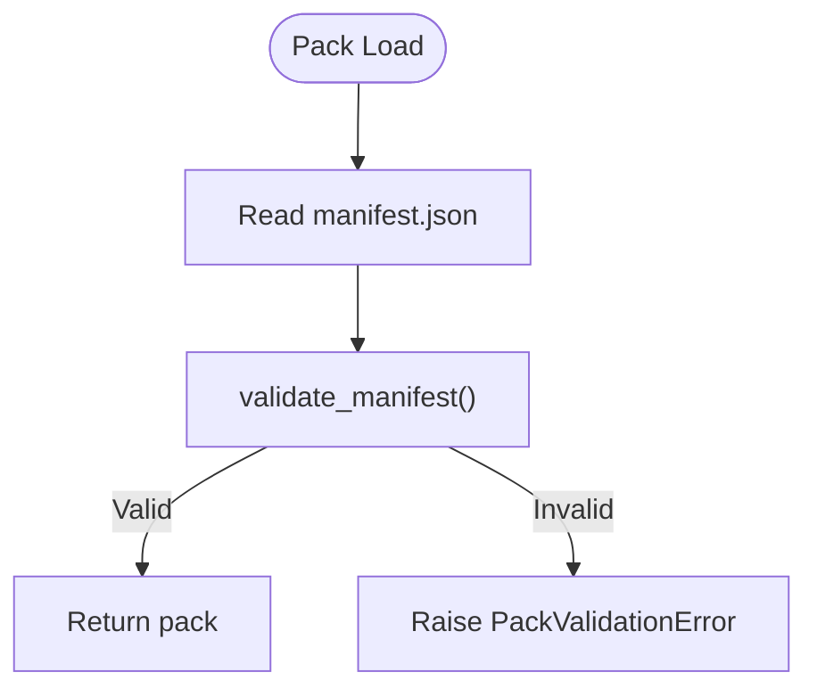
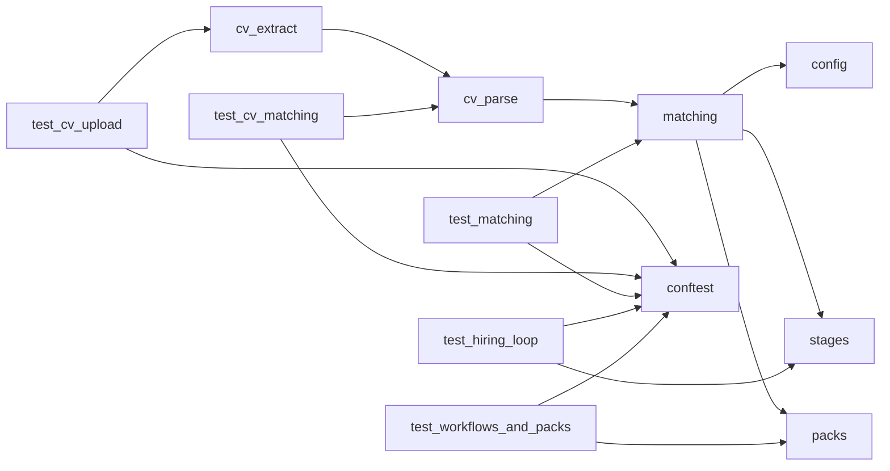

# Business Logic Testing

<cite>
**Referenced Files in This Document**
- [cv_extract.py](file://Backend/app/services/cv_extract.py)
- [cv_parse.py](file://Backend/app/services/cv_parse.py)
- [matching.py](file://Backend/app/services/matching.py)
- [stages.py](file://Backend/app/domain/stages.py)
- [packs.py](file://Backend/app/services/packs.py)
- [cv.py](file://Backend/app/schemas/cv.py)
- [config.py](file://Backend/app/core/config.py)
- [test_cv_upload.py](file://Backend/tests/test_cv_upload.py)
- [test_cv_matching.py](file://Backend/tests/test_cv_matching.py)
- [test_matching.py](file://Backend/tests/test_matching.py)
- [test_hiring_loop.py](file://Backend/tests/test_hiring_loop.py)
- [test_workflows_and_packs.py](file://Backend/tests/test_workflows_and_packs.py)
- [conftest.py](file://Backend/tests/conftest.py)
</cite>

## Table of Contents
1. Introduction
2. Project Structure
3. Core Components
4. Architecture Overview
5. Detailed Component Analysis
6. Dependency Analysis
7. Performance Considerations
8. Troubleshooting Guide
9. Conclusion
10. Appendices

## Introduction
This document provides comprehensive testing guidance for core business logic in the ATS backend, focusing on:
- CV upload processing and file validation
- Resume parsing and skill extraction
- Job-candidate matching with embeddings and skill overlap
- Hiring loop automation across workflow stages
- Domain pack functionality and evaluation rubrics
- Multi-stage hiring processes, evaluation scoring, and pipeline management
- Patterns for testing business rule validation, data transformation, and state transitions
- Edge cases in candidate evaluation and automated decision-making

The goal is to help engineers design robust tests that validate both unit-level behavior and end-to-end workflows while ensuring reliability, correctness, and safety under real-world conditions.

## Project Structure
The relevant backend components are organized into services (parsing, extraction, matching), domain models (stages), schemas (CV structures), configuration, and a comprehensive test suite covering uploads, matching, hiring loops, and domain packs.

**Diagram sources**
- [cv_extract.py:1-152](file://Backend/app/services/cv_extract.py#L1-L152)
- [cv_parse.py:1-242](file://Backend/app/services/cv_parse.py#L1-L242)
- [matching.py:1-345](file://Backend/app/services/matching.py#L1-L345)
- [stages.py:1-300](file://Backend/app/domain/stages.py#L1-L300)
- [packs.py:1-97](file://Backend/app/services/packs.py#L1-L97)
- [cv.py:1-35](file://Backend/app/schemas/cv.py#L1-L35)
- [config.py:1-215](file://Backend/app/core/config.py#L1-L215)
- [test_cv_upload.py:1-113](file://Backend/tests/test_cv_upload.py#L1-L113)
- [test_cv_matching.py:1-118](file://Backend/tests/test_cv_matching.py#L1-L118)
- [test_matching.py:1-100](file://Backend/tests/test_matching.py#L1-L100)
- [test_hiring_loop.py:1-275](file://Backend/tests/test_hiring_loop.py#L1-L275)
- [test_workflows_and_packs.py:1-265](file://Backend/tests/test_workflows_and_packs.py#L1-L265)
- [conftest.py:1-50](file://Backend/tests/conftest.py#L1-L50)

**Section sources**
- [cv_extract.py:1-152](file://Backend/app/services/cv_extract.py#L1-L152)
- [cv_parse.py:1-242](file://Backend/app/services/cv_parse.py#L1-L242)
- [matching.py:1-345](file://Backend/app/services/matching.py#L1-L345)
- [stages.py:1-300](file://Backend/app/domain/stages.py#L1-L300)
- [packs.py:1-97](file://Backend/app/services/packs.py#L1-L97)
- [cv.py:1-35](file://Backend/app/schemas/cv.py#L1-L35)
- [config.py:1-215](file://Backend/app/core/config.py#L1-L215)
- [test_cv_upload.py:1-113](file://Backend/tests/test_cv_upload.py#L1-L113)
- [test_cv_matching.py:1-118](file://Backend/tests/test_cv_matching.py#L1-L118)
- [test_matching.py:1-100](file://Backend/tests/test_matching.py#L1-L100)
- [test_hiring_loop.py:1-275](file://Backend/tests/test_hiring_loop.py#L1-L275)
- [test_workflows_and_packs.py:1-265](file://Backend/tests/test_workflows_and_packs.py#L1-L265)
- [conftest.py:1-50](file://Backend/tests/conftest.py#L1-L50)

## Core Components
- CV Extraction: Validates file size, format, content type; extracts text from PDF/DOCX/plain text; enforces minimum readable text length.
- CV Parsing: Heuristic parser for structured sections; optional LLM-based parsing with fallback; extracts profile hints (skills, credentials, experiences).
- Matching: Embedding-based similarity plus skill overlap; configurable weights; threshold gating; proactive notifications; interview score blending.
- Stages and Workflows: Fixed anchors and catalog components define valid pipelines; transition rules enforce forward/backward movement and terminal states; candidate-facing status mapping.
- Domain Packs: Manifest validation; question pools; evaluation rubrics; activation and pinning; guardrails against deletion when in use.
- Configuration: Environment-aware settings; AI provider toggles; local embedding fallback; timeouts and retries.

Testing strategies should cover:
- Unit tests for extraction, parsing, and matching functions
- Integration tests for API endpoints handling uploads, parsing, publishing, and transitions
- End-to-end tests for full hiring loops including workflow execution and pack usage
- Edge case tests for invalid inputs, stale versions, locked pools, and consent checks

**Section sources**
- [cv_extract.py:1-152](file://Backend/app/services/cv_extract.py#L1-L152)
- [cv_parse.py:1-242](file://Backend/app/services/cv_parse.py#L1-L242)
- [matching.py:1-345](file://Backend/app/services/matching.py#L1-L345)
- [stages.py:1-300](file://Backend/app/domain/stages.py#L1-L300)
- [packs.py:1-97](file://Backend/app/services/packs.py#L1-L97)
- [config.py:1-215](file://Backend/app/core/config.py#L1-L215)

## Architecture Overview
The system processes CV uploads through extraction and parsing, generates embeddings, and scores candidates against job postings using both embeddings and skill overlap. Published postings trigger proactive matching and notifications. Hiring workflows govern application lifecycle transitions with strict validation and auditability.

**Diagram sources**
- [cv_extract.py:70-152](file://Backend/app/services/cv_extract.py#L70-L152)
- [cv_parse.py:171-242](file://Backend/app/services/cv_parse.py#L171-L242)
- [matching.py:190-287](file://Backend/app/services/matching.py#L190-L287)

**Section sources**
- [cv_extract.py:70-152](file://Backend/app/services/cv_extract.py#L70-L152)
- [cv_parse.py:171-242](file://Backend/app/services/cv_parse.py#L171-L242)
- [matching.py:190-287](file://Backend/app/services/matching.py#L190-L287)

## Detailed Component Analysis

### CV Upload Processing and File Validation
Focus areas:
- Size limits, allowed extensions/content types
- Legacy .doc rejection
- Minimum readable text enforcement
- Error codes and messages for client feedback

Testing patterns:
- Unit tests for extract_cv_text with various formats and edge cases (empty, oversized, unsupported)
- Integration tests for upload endpoint asserting response structure and side effects (parsed sections, embedding presence)
- Negative tests for legacy .doc and unsupported content types

**Diagram sources**
- [cv_extract.py:70-152](file://Backend/app/services/cv_extract.py#L70-L152)

**Section sources**
- [test_cv_upload.py:73-113](file://Backend/tests/test_cv_upload.py#L73-L113)
- [cv_extract.py:70-152](file://Backend/app/services/cv_extract.py#L70-L152)

### Resume Parsing and Skill Extraction
Focus areas:
- Heuristic parsing into structured sections
- Optional LLM parsing with deterministic fallback
- Profile hints extraction (headline, summary, skills, credentials, experiences)
- Text normalization and section deduplication

Testing patterns:
- Unit tests for parse_cv_heuristic validating section titles and content
- Tests for local embeddings comparability when AI is not configured
- Endpoint tests asserting parsed sections stored and profile hints populated

**Diagram sources**
- [cv.py:8-35](file://Backend/app/schemas/cv.py#L8-L35)

**Section sources**
- [test_cv_matching.py:31-63](file://Backend/tests/test_cv_matching.py#L31-L63)
- [cv_parse.py:126-242](file://Backend/app/services/cv_parse.py#L126-L242)
- [cv.py:8-35](file://Backend/app/schemas/cv.py#L8-L35)

### Job-Candidate Matching Systems
Focus areas:
- Embedding generation for postings and candidates
- Skill overlap scoring with ontology hits
- Weighted combination with interview scores
- Threshold gating and notification limits
- Consent checks for proactive matching

Testing patterns:
- Integration tests verifying publish triggers matching and returns expected counts and reasons
- Assertions on match thresholds, reasons, and notification creation
- Tests for local vs remote embeddings and cosine similarity

**Diagram sources**
- [matching.py:55-187](file://Backend/app/services/matching.py#L55-L187)
- [matching.py:190-287](file://Backend/app/services/matching.py#L190-L287)

**Section sources**
- [test_matching.py:36-100](file://Backend/tests/test_matching.py#L36-L100)
- [matching.py:55-187](file://Backend/app/services/matching.py#L55-L187)
- [matching.py:190-287](file://Backend/app/services/matching.py#L190-L287)

### Hiring Loop Automation and Workflow Execution
Focus areas:
- Question pool generation and locking before publishing
- Idempotent applications and transitions
- Stage transitions with versioning and conflict detection
- Applied interviews: invitations, responses, submission immutability
- Scorecards and human-approved decisions requiring reasons
- Terminal stages and candidate-facing status mapping

Testing patterns:
- End-to-end tests simulating full hiring loop from org setup to hired state
- Assertions on timeline statuses, valid destinations, and conflict errors
- Audit trail verification for actions across the loop

**Diagram sources**
- [stages.py:56-106](file://Backend/app/domain/stages.py#L56-L106)
- [stages.py:212-242](file://Backend/app/domain/stages.py#L212-L242)

**Section sources**
- [test_hiring_loop.py:9-275](file://Backend/tests/test_hiring_loop.py#L9-L275)
- [stages.py:56-106](file://Backend/app/domain/stages.py#L56-L106)
- [stages.py:212-242](file://Backend/app/domain/stages.py#L212-L242)

### Domain Pack Functionality and Evaluation Rubrics
Focus areas:
- Manifest validation (required keys, semantic version, questions, task styles, rubric dimensions)
- Custom pack CRUD and deletion guards when in use
- Activation and pinning on postings with workflow snapshots
- Catalog availability and talent search integration

Testing patterns:
- Tests for unknown components rejected and company workflows assembled from catalog
- Custom pack creation, patching, activation, and deletion blocking
- Locked question pool immutability and regeneration prevention

**Diagram sources**
- [packs.py:34-97](file://Backend/app/services/packs.py#L34-L97)

**Section sources**
- [test_workflows_and_packs.py:67-206](file://Backend/tests/test_workflows_and_packs.py#L67-L206)
- [packs.py:34-97](file://Backend/app/services/packs.py#L34-L97)

### Evaluation Scoring and Pipeline Management
Focus areas:
- Weighted scoring combining CV match and interview scores
- Reason generation for explainable matches
- Pipeline order and valid destination computation
- Candidate-facing status mapping and ordering

Testing patterns:
- Assertions on overall score calculation and reasons
- Valid destinations for transitions based on stage categories
- Candidate timeline showing mapped statuses without internal names

**Section sources**
- [matching.py:115-187](file://Backend/app/services/matching.py#L115-L187)
- [stages.py:189-242](file://Backend/app/domain/stages.py#L189-L242)
- [test_hiring_loop.py:81-132](file://Backend/tests/test_hiring_loop.py#L81-L132)

## Dependency Analysis
Key dependencies and relationships:
- cv_extract depends on file format libraries and raises ApiError for invalid inputs
- cv_parse depends on config for AI settings and uses LangChain/OpenAI when configured; falls back to heuristic parsing
- matching depends on embeddings service, store, and config; computes similarity and skill overlap; persists matches and creates notifications
- stages defines canonical workflow model and validates transitions
- packs validates manifests and serves pack content to engine services
- tests rely on conftest fixtures for isolated DB and settings

**Diagram sources**
- [cv_extract.py:1-152](file://Backend/app/services/cv_extract.py#L1-L152)
- [cv_parse.py:1-242](file://Backend/app/services/cv_parse.py#L1-L242)
- [matching.py:1-345](file://Backend/app/services/matching.py#L1-L345)
- [stages.py:1-300](file://Backend/app/domain/stages.py#L1-L300)
- [packs.py:1-97](file://Backend/app/services/packs.py#L1-L97)
- [config.py:1-215](file://Backend/app/core/config.py#L1-L215)
- [test_cv_upload.py:1-113](file://Backend/tests/test_cv_upload.py#L1-L113)
- [test_cv_matching.py:1-118](file://Backend/tests/test_cv_matching.py#L1-L118)
- [test_matching.py:1-100](file://Backend/tests/test_matching.py#L1-L100)
- [test_hiring_loop.py:1-275](file://Backend/tests/test_hiring_loop.py#L1-L275)
- [test_workflows_and_packs.py:1-265](file://Backend/tests/test_workflows_and_packs.py#L1-L265)
- [conftest.py:1-50](file://Backend/tests/conftest.py#L1-L50)

**Section sources**
- [cv_extract.py:1-152](file://Backend/app/services/cv_extract.py#L1-L152)
- [cv_parse.py:1-242](file://Backend/app/services/cv_parse.py#L1-L242)
- [matching.py:1-345](file://Backend/app/services/matching.py#L1-L345)
- [stages.py:1-300](file://Backend/app/domain/stages.py#L1-L300)
- [packs.py:1-97](file://Backend/app/services/packs.py#L1-L97)
- [config.py:1-215](file://Backend/app/core/config.py#L1-L215)
- [test_cv_upload.py:1-113](file://Backend/tests/test_cv_upload.py#L1-L113)
- [test_cv_matching.py:1-118](file://Backend/tests/test_cv_matching.py#L1-L118)
- [test_matching.py:1-100](file://Backend/tests/test_matching.py#L1-L100)
- [test_hiring_loop.py:1-275](file://Backend/tests/test_hiring_loop.py#L1-L275)
- [test_workflows_and_packs.py:1-265](file://Backend/tests/test_workflows_and_packs.py#L1-L265)
- [conftest.py:1-50](file://Backend/tests/conftest.py#L1-L50)

## Performance Considerations
- Embeddings: Prefer cached vectors; avoid recomputation; use local fallback in tests to reduce latency
- Parsing: Limit text length and normalize whitespace to reduce processing overhead
- Matching: Cap maximum matches and notifications; use thresholds to filter low-signal results
- Transitions: Enforce idempotency and version checks to prevent conflicts and redundant operations
- Packs: Validate manifests once and cache where possible; lock question pools to prevent churn

[No sources needed since this section provides general guidance]

## Troubleshooting Guide
Common issues and how tests validate them:
- Unsupported or oversized CV files: Assert specific error codes and messages
- Empty or unreadable CVs: Ensure minimum text length enforcement
- Legacy .doc uploads: Reject with appropriate code
- Stale transition versions: Expect conflict errors and idempotent replay
- Locked question pools: Prevent modifications and regeneration after lock
- Missing required reasons for terminal transitions: Validate reason requirement
- Consent checks: Proactive matching only for discoverable candidates

**Section sources**
- [test_cv_upload.py:87-113](file://Backend/tests/test_cv_upload.py#L87-L113)
- [test_hiring_loop.py:108-132](file://Backend/tests/test_hiring_loop.py#L108-L132)
- [test_workflows_and_packs.py:163-206](file://Backend/tests/test_workflows_and_packs.py#L163-L206)
- [matching.py:115-187](file://Backend/app/services/matching.py#L115-L187)

## Conclusion
The testing strategy covers unit, integration, and end-to-end scenarios to ensure robustness across CV processing, matching, and hiring workflows. By validating file handling, parsing accuracy, embedding similarity, skill overlap, workflow transitions, and domain pack integrity, the tests provide confidence in both correctness and resilience. Emphasize idempotency, consent checks, and explicit error codes to maintain clarity and safety in automated decision-making processes.

[No sources needed since this section summarizes without analyzing specific files]

## Appendices

### Testing Strategies Summary
- CV Upload: Validate size, format, content type; assert extracted text and parsed sections
- Parsing: Test heuristic and LLM paths; verify profile hints and embeddings
- Matching: Confirm thresholds, reasons, and notifications; test local vs remote embeddings
- Hiring Loop: Simulate full lifecycle; assert timeline statuses, valid destinations, and audit trails
- Domain Packs: Validate manifests; test activation, pinning, and deletion guards
- Configuration: Use test settings to isolate DB and disable external services

**Section sources**
- [test_cv_upload.py:1-113](file://Backend/tests/test_cv_upload.py#L1-L113)
- [test_cv_matching.py:1-118](file://Backend/tests/test_cv_matching.py#L1-L118)
- [test_matching.py:1-100](file://Backend/tests/test_matching.py#L1-L100)
- [test_hiring_loop.py:1-275](file://Backend/tests/test_hiring_loop.py#L1-L275)
- [test_workflows_and_packs.py:1-265](file://Backend/tests/test_workflows_and_packs.py#L1-L265)
- [conftest.py:1-50](file://Backend/tests/conftest.py#L1-L50)