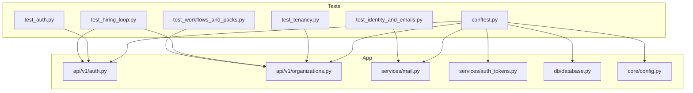
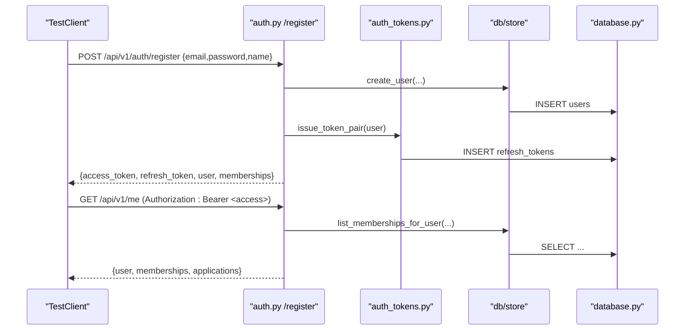
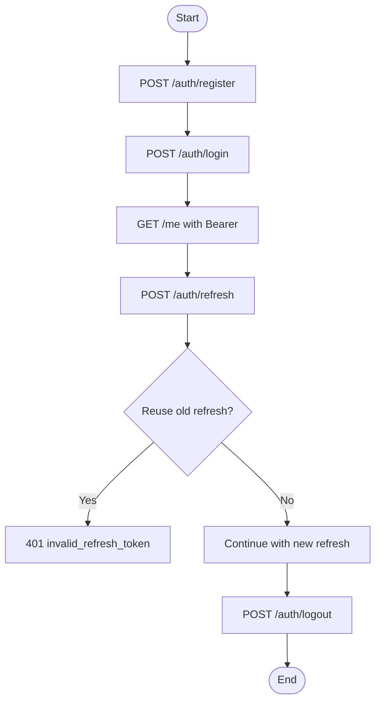
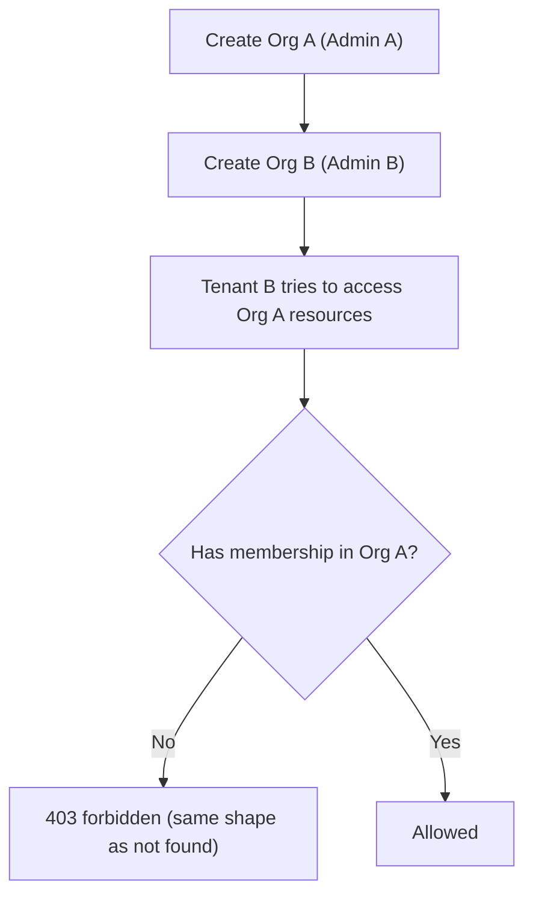
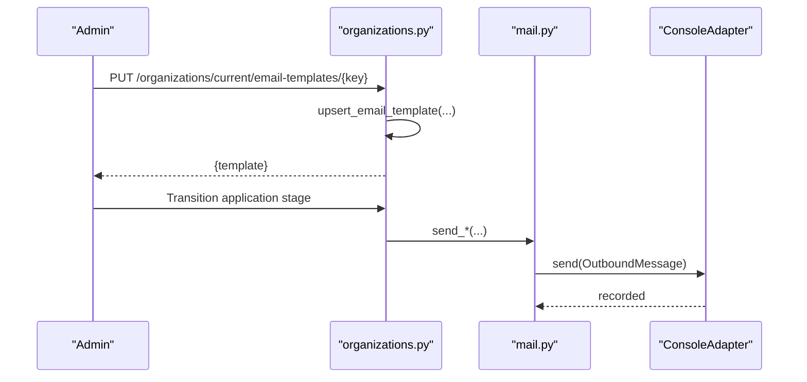
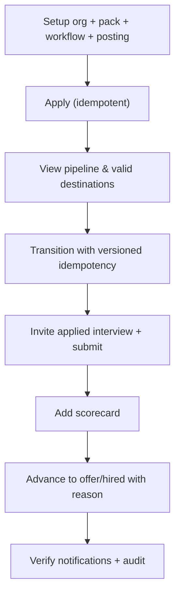
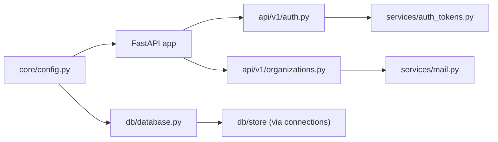

# Integration Testing

<cite>
**Referenced Files in This Document**
- [conftest.py](file://Backend/tests/conftest.py)
- [test_auth.py](file://Backend/tests/test_auth.py)
- [test_identity_and_emails.py](file://Backend/tests/test_identity_and_emails.py)
- [test_tenancy.py](file://Backend/tests/test_tenancy.py)
- [test_hiring_loop.py](file://Backend/tests/test_hiring_loop.py)
- [test_workflows_and_packs.py](file://Backend/tests/test_workflows_and_packs.py)
- [auth.py](file://Backend/app/api/v1/auth.py)
- [organizations.py](file://Backend/app/api/v1/organizations.py)
- [mail.py](file://Backend/app/services/mail.py)
- [auth_tokens.py](file://Backend/app/services/auth_tokens.py)
- [database.py](file://Backend/app/db/database.py)
- [config.py](file://Backend/app/core/config.py)
</cite>

## Table of Contents
1. [Introduction](#introduction)
2. [Project Structure](#project-structure)
3. [Core Components](#core-components)
4. [Architecture Overview](#architecture-overview)
5. [Detailed Component Analysis](#detailed-component-analysis)
6. [Dependency Analysis](#dependency-analysis)
7. [Performance Considerations](#performance-considerations)
8. [Troubleshooting Guide](#troubleshooting-guide)
9. [Conclusion](#conclusion)

## Introduction
This document explains how to run and extend integration tests for the ATS system with a focus on multi-component interactions across authentication, identity management, email services, organization isolation (multi-tenancy), and end-to-end hiring workflows. It covers test fixtures setup using conftest.py, strategies for mocking external services while keeping realistic scenarios, transaction and cleanup patterns, and performance considerations for reliable integration testing.

## Project Structure
The backend uses FastAPI with an in-process TestClient. Tests are organized under Backend/tests and rely on a shared conftest that configures settings, database, and a test client. Core APIs for auth, organizations, and services like mail and JWT token handling live under app/api/v1 and app/services. The database layer supports both SQLite and PostgreSQL; tests force SQLite via temporary paths for isolation and speed.

**Diagram sources**
- [conftest.py:14-49](file://Backend/tests/conftest.py#L14-L49)
- [auth.py:74-148](file://Backend/app/api/v1/auth.py#L74-L148)
- [organizations.py:77-218](file://Backend/app/api/v1/organizations.py#L77-L218)
- [mail.py:28-88](file://Backend/app/services/mail.py#L28-L88)
- [auth_tokens.py:22-127](file://Backend/app/services/auth_tokens.py#L22-L127)
- [database.py:490-516](file://Backend/app/db/database.py#L490-L516)
- [config.py:16-70](file://Backend/app/core/config.py#L16-L70)

**Section sources**
- [conftest.py:14-49](file://Backend/tests/conftest.py#L14-L49)
- [database.py:490-516](file://Backend/app/db/database.py#L490-L516)
- [config.py:16-70](file://Backend/app/core/config.py#L16-L70)

## Core Components
- Test client and settings fixture: Provides an isolated SQLite-backed application instance per test session with safe defaults (no SMTP, no AI keys).
- Authentication endpoints: Register, login, refresh, logout, and current user info; issue and rotate JWT access tokens and opaque refresh tokens.
- Organization and membership: Create organizations, apply for orgs, verify/reject by superadmin, manage members and roles, enforce domain-based staff emails.
- Email service: Console adapter captures outbound emails in tests; real SMTP adapter used in production.
- Database layer: Schema creation and migrations, tenant-scoped tables, connection abstraction for SQLite/Postgres.

Key responsibilities and interactions:
- Auth flow issues JWT pairs and persists refresh tokens; refresh rotates tokens and revokes old ones.
- Org application workflow creates pending orgs; superadmin verifies to unlock employer features.
- Hiring loop exercises workflows, postings, applications, transitions, applied interviews, scorecards, decisions, notifications, and audit records.
- Tenancy enforcement isolates data per organization and denies cross-tenant access without leaking existence.

**Section sources**
- [auth.py:74-148](file://Backend/app/api/v1/auth.py#L74-L148)
- [auth_tokens.py:22-127](file://Backend/app/services/auth_tokens.py#L22-L127)
- [organizations.py:77-218](file://Backend/app/api/v1/organizations.py#L77-L218)
- [mail.py:28-88](file://Backend/app/services/mail.py#L28-L88)
- [database.py:19-331](file://Backend/app/db/database.py#L19-L331)

## Architecture Overview
Integration tests exercise the full request path through FastAPI routes into services and persistence. The following sequence shows a typical registration and protected resource access flow.

**Diagram sources**
- [auth.py:74-101](file://Backend/app/api/v1/auth.py#L74-L101)
- [auth_tokens.py:67-86](file://Backend/app/services/auth_tokens.py#L67-L86)
- [database.py:490-516](file://Backend/app/db/database.py#L490-L516)

## Detailed Component Analysis

### Authentication Flows and JWT Testing
- Registration creates a user, candidate record, and issues a token pair. Protected endpoints require a valid access token or development identity header.
- Login validates credentials and returns tokens; refresh rotates refresh tokens and invalidates previous ones; logout revokes refresh tokens.
- Development mode allows bypassing bearer tokens via X-Development-Identity header for convenience in tests.

Testing patterns:
- Use the shared TestClient from conftest to call register/login/refresh/logout and assert status codes and response shapes.
- Verify token rotation behavior by reusing an old refresh token after a successful refresh should return unauthorized.
- Validate development identity header still works without bearer tokens.

**Diagram sources**
- [auth.py:74-148](file://Backend/app/api/v1/auth.py#L74-L148)
- [auth_tokens.py:89-127](file://Backend/app/services/auth_tokens.py#L89-L127)

**Section sources**
- [test_auth.py:21-63](file://Backend/tests/test_auth.py#L21-L63)
- [test_auth.py:162-166](file://Backend/tests/test_auth.py#L162-L166)
- [auth.py:74-148](file://Backend/app/api/v1/auth.py#L74-L148)
- [auth_tokens.py:22-127](file://Backend/app/services/auth_tokens.py#L22-L127)

### Multi-Tenant Scenarios and Organization Isolation
- Organizations can be created directly (for verified orgs) or via applications that start as pending and require superadmin verification.
- Cross-tenant access is denied consistently without leaking existence; requests with wrong X-Organization-Id return identical error shapes.
- Role enforcement blocks non-admin configuration actions; candidates cannot use employer-only endpoints.

Testing patterns:
- Create two tenants with distinct identities and assert that Tenant B cannot read Tenant A’s postings or pipeline.
- Assert direct object access returns nondisclosing 404 when accessed from another tenant.
- Add a reviewer member and confirm they cannot create workflows or postings.

**Diagram sources**
- [test_tenancy.py:27-48](file://Backend/tests/test_tenancy.py#L27-L48)
- [organizations.py:323-334](file://Backend/app/api/v1/organizations.py#L323-L334)

**Section sources**
- [test_tenancy.py:19-116](file://Backend/tests/test_tenancy.py#L19-L116)
- [organizations.py:77-218](file://Backend/app/api/v1/organizations.py#L77-L218)

### Identity Management and Email Services
- Identity verification integrates optional AI checks; when unavailable, checks record “unavailable” without blocking.
- Stage progression triggers emails; in tests, all outbound mail goes to a console adapter captured in memory.
- Custom email templates can override defaults per organization; admin endpoints allow listing, updating, and resetting templates.

Testing patterns:
- Capture sent emails via the console adapter fixture and assert recipients, subjects, and body content for acceptance/rejection flows.
- Verify avatar upload/serve/delete and employer visibility rules.
- Confirm custom template overrides take effect and unknown template updates return 404.

**Diagram sources**
- [test_identity_and_emails.py:249-327](file://Backend/tests/test_identity_and_emails.py#L249-L327)
- [organizations.py:535-623](file://Backend/app/api/v1/organizations.py#L535-L623)
- [mail.py:28-88](file://Backend/app/services/mail.py#L28-L88)

**Section sources**
- [test_identity_and_emails.py:109-169](file://Backend/tests/test_identity_and_emails.py#L109-L169)
- [test_identity_and_emails.py:174-237](file://Backend/tests/test_identity_and_emails.py#L174-L237)
- [test_identity_and_emails.py:249-383](file://Backend/tests/test_identity_and_emails.py#L249-L383)
- [mail.py:28-88](file://Backend/app/services/mail.py#L28-L88)

### End-to-End Hiring Loop and Workflows/Packs
- The hiring loop includes publishing postings, applying (idempotent), moving through stages with optimistic concurrency, invited applied interviews, scorecards, decisions, notifications, and audit trails.
- Workflows and domain packs define stages and question pools; packs can be activated and pinned to postings; locked pools become immutable.

Testing patterns:
- Set up org, activate pack, create workflow, publish posting with locked pool.
- Apply once (idempotency key), then attempt duplicate with different key to assert conflict.
- Move through stages with versioned transitions; assert stale version conflicts.
- Invite applied interview, submit responses, lock submissions, review scorecard, advance to offer/hired with required reasons.
- Validate timeline, notifications, and audit records.

**Diagram sources**
- [test_hiring_loop.py:9-54](file://Backend/tests/test_hiring_loop.py#L9-L54)
- [test_hiring_loop.py:57-275](file://Backend/tests/test_hiring_loop.py#L57-L275)
- [test_workflows_and_packs.py:14-206](file://Backend/tests/test_workflows_and_packs.py#L14-L206)

**Section sources**
- [test_hiring_loop.py:57-275](file://Backend/tests/test_hiring_loop.py#L57-L275)
- [test_workflows_and_packs.py:14-206](file://Backend/tests/test_workflows_and_packs.py#L14-L206)

## Dependency Analysis
Integration tests depend on:
- Settings configured for test environment with SQLite, disabled SMTP/AI, and a fixed JWT secret.
- TestClient wrapping the FastAPI app to make HTTP calls.
- Database schema initialization and migrations executed once per process.
- Services for JWT issuance/rotation and mail sending (console adapter in tests).

**Diagram sources**
- [config.py:16-70](file://Backend/app/core/config.py#L16-L70)
- [database.py:490-516](file://Backend/app/db/database.py#L490-L516)
- [auth.py:74-148](file://Backend/app/api/v1/auth.py#L74-L148)
- [organizations.py:77-218](file://Backend/app/api/v1/organizations.py#L77-L218)
- [auth_tokens.py:22-127](file://Backend/app/services/auth_tokens.py#L22-L127)
- [mail.py:28-88](file://Backend/app/services/mail.py#L28-L88)

**Section sources**
- [conftest.py:14-49](file://Backend/tests/conftest.py#L14-L49)
- [config.py:16-70](file://Backend/app/core/config.py#L16-L70)
- [database.py:490-516](file://Backend/app/db/database.py#L490-L516)

## Performance Considerations
- SQLite in-memory or temp file databases provide fast, isolated storage per test session; schema is initialized once per process to avoid repeated DDL overhead.
- Disable external dependencies (SMTP, AI, LiveKit) in tests to eliminate network latency and flakiness.
- Use idempotency keys in tests to safely retry operations without side effects.
- Keep test payloads minimal and reuse setup helpers to reduce setup time.
- Avoid heavy file uploads or large media in tests unless necessary; use small binary payloads where possible.

[No sources needed since this section provides general guidance]

## Troubleshooting Guide
Common issues and resolutions:
- Unexpected 403/404 on tenant-scoped endpoints: Ensure correct X-Organization-Id and that the user has a membership in the target tenant.
- Stale transition errors: Always pass the latest stage_version from the last known state; retries must include the same version to detect conflicts.
- Email assertions fail: Confirm the console adapter fixture clears sent messages before each test and that SMTP is disabled so messages land in the console adapter.
- JWT failures: Verify the test JWT secret matches the one set in settings; ensure refresh tokens are rotated and old ones revoked.
- Domain validation errors: Staff emails must match the organization’s domain; candidate accounts cannot be used for employer endpoints.

**Section sources**
- [test_tenancy.py:19-116](file://Backend/tests/test_tenancy.py#L19-L116)
- [test_hiring_loop.py:108-132](file://Backend/tests/test_hiring_loop.py#L108-L132)
- [test_identity_and_emails.py:249-327](file://Backend/tests/test_identity_and_emails.py#L249-L327)
- [auth.py:104-148](file://Backend/app/api/v1/auth.py#L104-L148)
- [organizations.py:386-481](file://Backend/app/api/v1/organizations.py#L386-L481)

## Conclusion
The ATS integration tests cover critical multi-component interactions including authentication, identity verification, email delivery, organization isolation, and end-to-end hiring workflows. By leveraging a shared test client, SQLite-backed database, and console mail adapter, tests remain fast, deterministic, and realistic. Follow the documented patterns for setting up fixtures, asserting behaviors, and maintaining isolation to extend coverage confidently.

[No sources needed since this section summarizes without analyzing specific files]