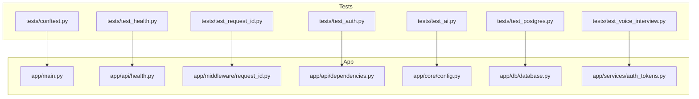
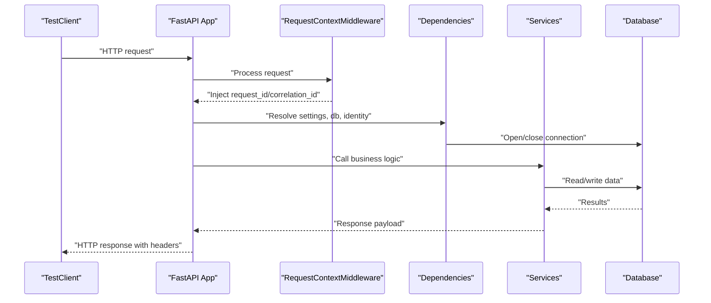
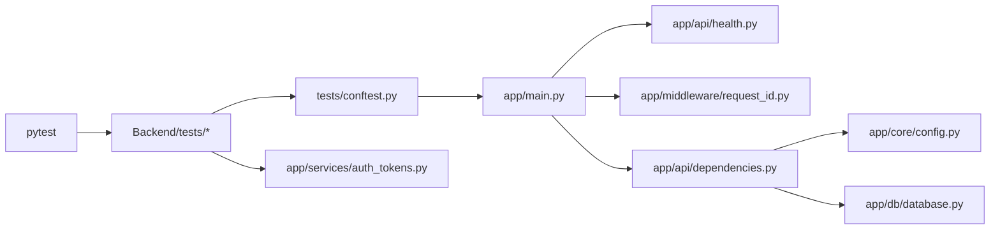

# Unit Testing

<cite>
**Referenced Files in This Document**
- [conftest.py](file://Backend/tests/conftest.py)
- [test_health.py](file://Backend/tests/test_health.py)
- [test_request_id.py](file://Backend/tests/test_request_id.py)
- [test_auth.py](file://Backend/tests/test_auth.py)
- [test_postgres.py](file://Backend/tests/test_postgres.py)
- [test_ai.py](file://Backend/tests/test_ai.py)
- [test_voice_interview.py](file://Backend/tests/test_voice_interview.py)
- [main.py](file://Backend/app/main.py)
- [health.py](file://Backend/app/api/health.py)
- [request_id.py](file://Backend/app/middleware/request_id.py)
- [config.py](file://Backend/app/core/config.py)
- [database.py](file://Backend/app/db/database.py)
- [dependencies.py](file://Backend/app/api/dependencies.py)
- [auth_tokens.py](file://Backend/app/services/auth_tokens.py)
- [pyproject.toml](file://Backend/pyproject.toml)
</cite>

## Table of Contents
1. [Introduction](#introduction)
2. [Project Structure](#project-structure)
3. [Core Components](#core-components)
4. [Architecture Overview](#architecture-overview)
5. [Detailed Component Analysis](#detailed-component-analysis)
6. [Dependency Analysis](#dependency-analysis)
7. [Performance Considerations](#performance-considerations)
8. [Troubleshooting Guide](#troubleshooting-guide)
9. [Conclusion](#conclusion)

## Introduction
This document provides comprehensive unit testing guidance for the ATS backend, focusing on FastAPI endpoints, service classes, and business logic functions. It explains how to write isolated tests using pytest fixtures and mocks, covers database operations with SQLite and optional PostgreSQL, configuration validation, utility functions, health checks, request ID propagation, and external dependency mocking. It also includes best practices for test organization, naming conventions, and assertion strategies tailored to Python/FastAPI applications.

## Project Structure
The backend uses a layered structure:
- API layer: FastAPI routers and dependencies
- Services: Business logic (e.g., authentication tokens, voice interview readiness)
- Core: Configuration and error handling
- Database: Engine-agnostic persistence with SQLite by default and optional PostgreSQL
- Middleware: Request context (request/correlation IDs)
- Tests: Pytest suite under Backend/tests

**Diagram sources**
- [conftest.py:14-49](file://Backend/tests/conftest.py#L14-L49)
- [main.py:15-58](file://Backend/app/main.py#L15-L58)
- [health.py:6-21](file://Backend/app/api/health.py#L6-L21)
- [request_id.py:16-54](file://Backend/app/middleware/request_id.py#L16-L54)
- [dependencies.py:22-37](file://Backend/app/api/dependencies.py#L22-L37)
- [config.py:16-210](file://Backend/app/core/config.py#L16-L210)
- [database.py:508-525](file://Backend/app/db/database.py#L508-L525)
- [auth_tokens.py:22-86](file://Backend/app/services/auth_tokens.py#L22-L86)

**Section sources**
- [conftest.py:14-49](file://Backend/tests/conftest.py#L14-L49)
- [main.py:15-58](file://Backend/app/main.py#L15-L58)
- [pyproject.toml:45-48](file://Backend/pyproject.toml#L45-L48)

## Core Components
- Test client and settings fixture: A shared TestClient is created per test with an isolated SQLite database and safe defaults for SMTP/LiveKit/AI keys.
- Health endpoints: Simple liveness/readiness checks that return version from settings.
- Request ID middleware: Validates and propagates request/correlation IDs as UUIDs; generates opaque IDs when invalid input is provided.
- Authentication services: JWT access token issuance/decoding and refresh token rotation with DB-backed storage.
- Database abstraction: Unified interface over SQLite and PostgreSQL with schema migrations and connection management.

Key patterns:
- Use Settings.model_validate to override environment-specific values in tests.
- Prefer SQLite for fast, isolated unit tests; skip or conditionally run PostgreSQL tests.
- Assert status codes and structured JSON bodies consistently.

**Section sources**
- [conftest.py:14-49](file://Backend/tests/conftest.py#L14-L49)
- [health.py:6-21](file://Backend/app/api/health.py#L6-L21)
- [request_id.py:16-54](file://Backend/app/middleware/request_id.py#L16-L54)
- [auth_tokens.py:22-127](file://Backend/app/services/auth_tokens.py#L22-L127)
- [database.py:508-525](file://Backend/app/db/database.py#L508-L525)

## Architecture Overview
End-to-end flow for a typical request during tests:
- TestClient sends HTTP requests to the FastAPI app created via create_app(settings).
- RequestContextMiddleware validates and injects request/correlation IDs into scope and response headers.
- Dependencies resolve Settings, DB connections, and identity based on Authorization header or development identity.
- Endpoints call services and store modules to perform business logic and persist data.

**Diagram sources**
- [main.py:15-58](file://Backend/app/main.py#L15-L58)
- [request_id.py:16-54](file://Backend/app/middleware/request_id.py#L16-L54)
- [dependencies.py:22-37](file://Backend/app/api/dependencies.py#L22-L37)
- [database.py:508-525](file://Backend/app/db/database.py#L508-L525)

## Detailed Component Analysis

### Health Endpoints Testing
Strategy:
- Use the shared TestClient fixture to hit /health/live and /health/ready.
- Assert 200 status and exact JSON shape including version from settings.

Best practices:
- Keep health tests minimal and deterministic.
- Avoid side effects; these endpoints do not mutate state.

Example references:
- Liveness and readiness assertions are covered in the test file.

**Section sources**
- [test_health.py:4-15](file://Backend/tests/test_health.py#L4-L15)
- [health.py:6-21](file://Backend/app/api/health.py#L6-L21)

### Request ID Propagation Testing
Strategy:
- Send valid UUIDs in X-Request-ID and X-Correlation-ID and assert they are echoed back.
- Send non-UUID free text and assert the middleware replaces it with a generated UUID and sets correlation_id equal to request_id.

Implementation notes:
- The middleware enforces UUID format and safely falls back to generating new IDs.
- Tests validate both propagation and sanitization behavior.

**Section sources**
- [test_request_id.py:6-24](file://Backend/tests/test_request_id.py#L6-L24)
- [request_id.py:16-54](file://Backend/app/middleware/request_id.py#L16-L54)

### Authentication Flow Testing
Strategy:
- Register a user, then login, refresh, and logout flows.
- Assert token issuance, refresh rotation, and revocation semantics.
- Validate error responses for invalid credentials and revoked tokens.
- Confirm development identity header works without bearer tokens in test/dev environments.

Patterns:
- Helper functions encapsulate common actions like registration and bearer header creation.
- Assertions cover both success and failure paths.

**Section sources**
- [test_auth.py:21-165](file://Backend/tests/test_auth.py#L21-L165)
- [auth_tokens.py:22-127](file://Backend/app/services/auth_tokens.py#L22-L127)
- [dependencies.py:49-87](file://Backend/app/api/dependencies.py#L49-L87)

### Optional PostgreSQL Integration Testing
Strategy:
- Skip tests if PostgreSQL is unreachable; otherwise, configure a live Postgres URL and seed demo data.
- Reset schema cache before creating the app to ensure clean state.
- Assert seeded employer data and pipeline cards are present.

Guidance:
- Use environment variables to control connectivity.
- Keep integration tests separate from unit tests to maintain speed and isolation.

**Section sources**
- [test_postgres.py:1-72](file://Backend/tests/test_postgres.py#L1-L72)
- [database.py:508-525](file://Backend/app/db/database.py#L508-L525)

### AI Endpoint Behavior Testing
Strategy:
- Verify that question generation returns a disabled status when AI is not configured.
- In production-like settings, assert that unauthenticated requests are rejected.

Approach:
- Create a temporary SQLite database per test to avoid cross-test contamination.
- Override settings to simulate production constraints.

**Section sources**
- [test_ai.py:9-55](file://Backend/tests/test_ai.py#L9-L55)
- [config.py:16-210](file://Backend/app/core/config.py#L16-L210)

### Voice Interview Readiness Testing
Strategy:
- Validate mapping of synthesis reports to evaluations (score scaling, human decision flags).
- Ensure ensure_voice_ready raises a 503 when required LiveKit/AI configuration is missing.

Patterns:
- Directly invoke service functions with controlled inputs.
- Assert structured outputs and expected exceptions.

**Section sources**
- [test_voice_interview.py:12-49](file://Backend/tests/test_voice_interview.py#L12-L49)
- [auth_tokens.py:22-127](file://Backend/app/services/auth_tokens.py#L22-L127)

### Database Operations and Connection Handling
Strategy:
- For unit tests, rely on SQLite via Settings.database_path and reset_schema_cache to isolate runs.
- For integration tests, use THOS_DATABASE_URL to target PostgreSQL and skip when unreachable.
- Always close connections via dependency lifecycle; tests should not leak resources.

Recommendations:
- Wrap DB-dependent tests in fixtures that manage schema resets and connections.
- Use explicit asserts on row counts and field presence rather than full object equality.

**Section sources**
- [database.py:508-525](file://Backend/app/db/database.py#L508-L525)
- [test_postgres.py:39-55](file://Backend/tests/test_postgres.py#L39-L55)

### Configuration Validation Testing
Strategy:
- Use Settings.model_validate to construct configurations for specific scenarios (e.g., production vs test).
- Assert properties like cors_origin_list, ai_is_configured, livekit_is_configured, and voice_interview_ready.
- Validate field validators raise appropriate errors for out-of-range TTLs or wildcard CORS outside development.

Patterns:
- Keep configuration tests focused on one setting or validator at a time.
- Use tmp_path for file-based settings to avoid polluting the filesystem.

**Section sources**
- [config.py:16-210](file://Backend/app/core/config.py#L16-L210)
- [test_ai.py:30-55](file://Backend/tests/test_ai.py#L30-L55)

### Utility Functions Testing
Strategy:
- Isolate pure functions (e.g., JSON helpers, timestamp utilities) and assert inputs/outputs deterministically.
- Mock external calls only when necessary; prefer direct invocation for small utilities.

Patterns:
- Name tests after the function and scenario (e.g., test_from_json_with_none_returns_default).
- Cover edge cases like None inputs and malformed data.

[No sources needed since this section provides general guidance]

### Best Practices for Mocking External Dependencies
- Replace real SMTP, S3, LiveKit, and AI providers with no-op or in-memory implementations in tests.
- Use Settings overrides to disable features (e.g., set ai_api_key=None, livekit_url=None).
- For network-bound services, consider httpx mock clients or patching low-level connectors.

[No sources needed since this section provides general guidance]

### Test Organization and Naming Conventions
- Group tests by feature area (auth, health, voice, ai) with descriptive filenames.
- Prefix helper functions with underscores to indicate internal test utilities.
- Use clear, scenario-focused test names (e.g., test_register_login_refresh_logout).

**Section sources**
- [test_auth.py:1-165](file://Backend/tests/test_auth.py#L1-L165)
- [pyproject.toml:45-48](file://Backend/pyproject.toml#L45-L48)

### Assertion Strategies
- Assert HTTP status codes first, then parse JSON and assert key fields.
- For error responses, assert structured error objects with code and message.
- For DB-backed flows, assert counts and presence of identifiers rather than full payloads.

**Section sources**
- [test_health.py:4-15](file://Backend/tests/test_health.py#L4-L15)
- [test_auth.py:21-165](file://Backend/tests/test_auth.py#L21-L165)

## Dependency Analysis
The test suite depends on:
- FastAPI TestClient for endpoint testing
- Pytest for discovery and execution
- Application components: main app factory, config, middleware, dependencies, services, and database

**Diagram sources**
- [pyproject.toml:45-48](file://Backend/pyproject.toml#L45-L48)
- [conftest.py:14-49](file://Backend/tests/conftest.py#L14-L49)
- [main.py:15-58](file://Backend/app/main.py#L15-L58)
- [health.py:6-21](file://Backend/app/api/health.py#L6-L21)
- [request_id.py:16-54](file://Backend/app/middleware/request_id.py#L16-L54)
- [dependencies.py:22-37](file://Backend/app/api/dependencies.py#L22-L37)
- [config.py:16-210](file://Backend/app/core/config.py#L16-L210)
- [database.py:508-525](file://Backend/app/db/database.py#L508-L525)
- [auth_tokens.py:22-127](file://Backend/app/services/auth_tokens.py#L22-L127)

**Section sources**
- [pyproject.toml:45-48](file://Backend/pyproject.toml#L45-L48)
- [conftest.py:14-49](file://Backend/tests/conftest.py#L14-L49)

## Performance Considerations
- Prefer SQLite for unit tests to keep suites fast and self-contained.
- Reset schema caches between tests to avoid stale state.
- Skip heavy integration tests unless required; use markers to selectively run them.
- Minimize network calls by mocking external services and disabling optional features via Settings.

[No sources needed since this section provides general guidance]

## Troubleshooting Guide
Common issues and resolutions:
- Missing PostgreSQL: Tests will skip if unreachable; ensure THOS_DATABASE_URL points to a running instance or adjust skip conditions.
- Stale schema state: Call reset_schema_cache before creating the app in tests that modify DB state.
- Invalid request IDs: Middleware replaces non-UUID values; verify your tests send proper UUIDs or expect replacement behavior.
- Authentication failures: In production-like settings, ensure required headers or tokens are provided; in dev/test, use development identity header.

**Section sources**
- [test_postgres.py:20-36](file://Backend/tests/test_postgres.py#L20-L36)
- [database.py:519-525](file://Backend/app/db/database.py#L519-L525)
- [request_id.py:16-54](file://Backend/app/middleware/request_id.py#L16-L54)
- [dependencies.py:49-87](file://Backend/app/api/dependencies.py#L49-L87)

## Conclusion
The ATS backend’s test suite demonstrates robust patterns for isolating concerns, validating configuration, and asserting API behavior. By leveraging pytest fixtures, Settings overrides, and engine-agnostic database abstractions, you can write fast, reliable unit tests while optionally integrating with PostgreSQL for deeper verification. Follow the recommended organization, naming, and assertion strategies to maintain clarity and confidence across the test suite.