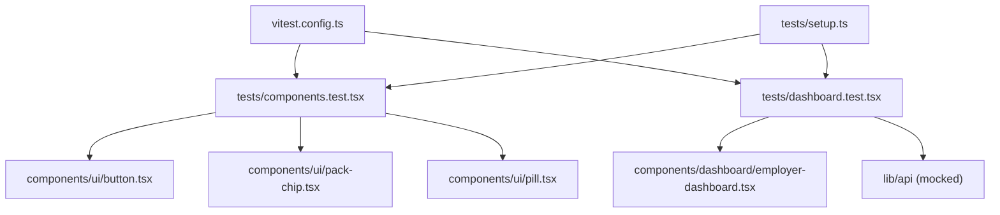
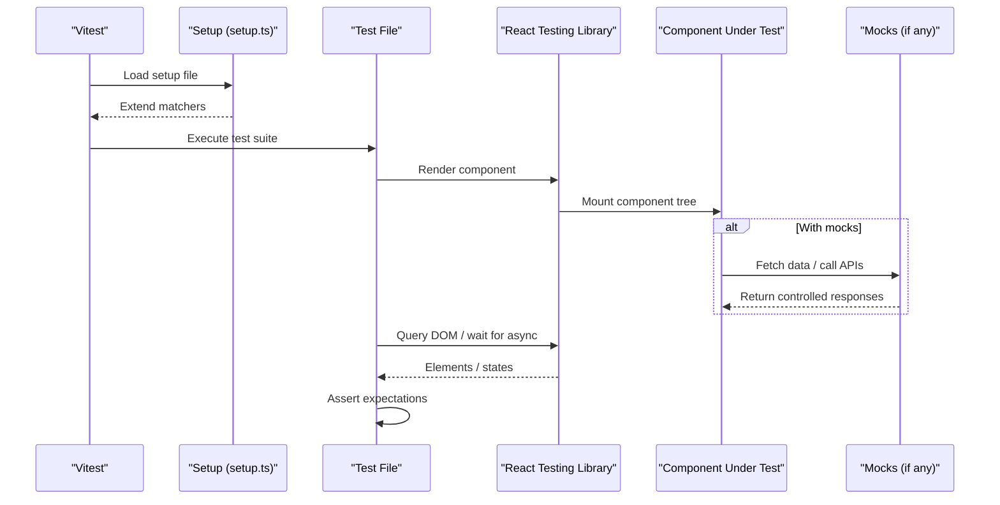
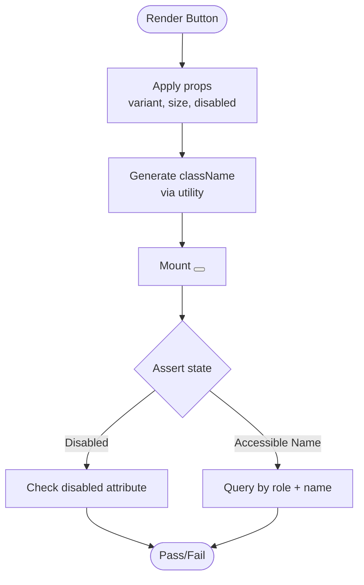
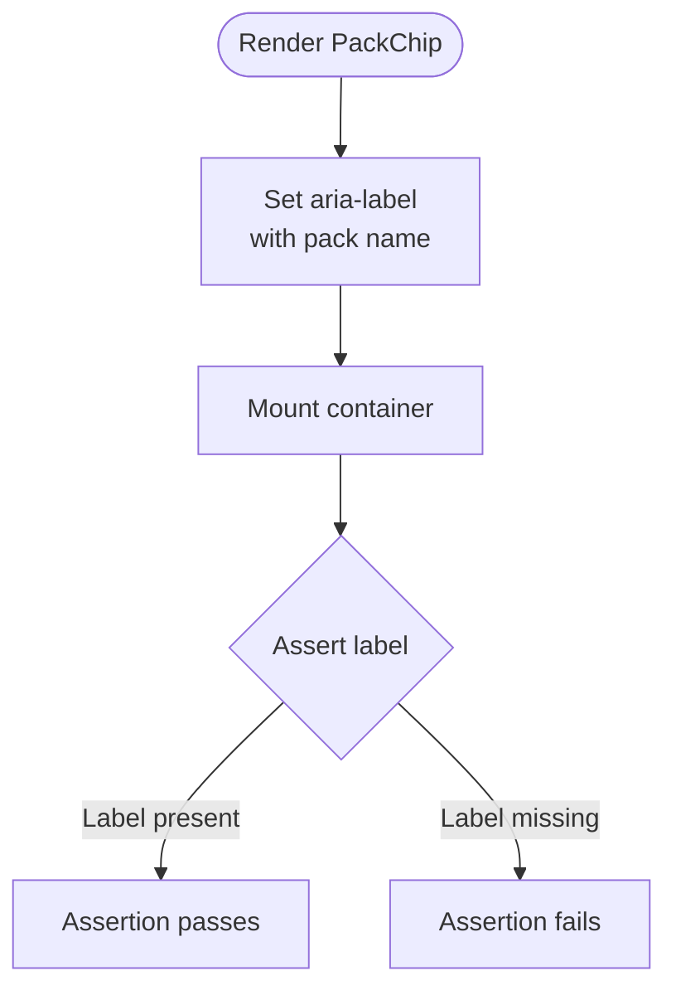
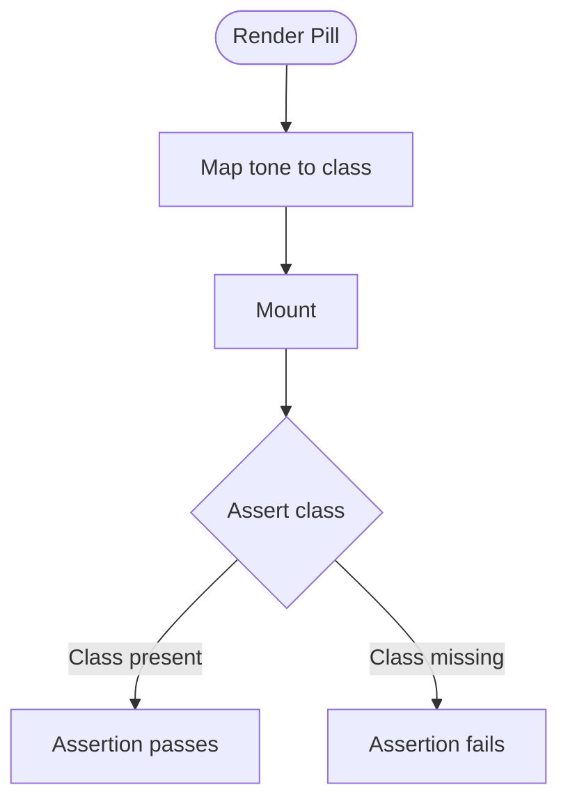
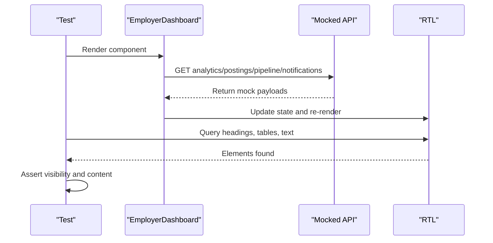
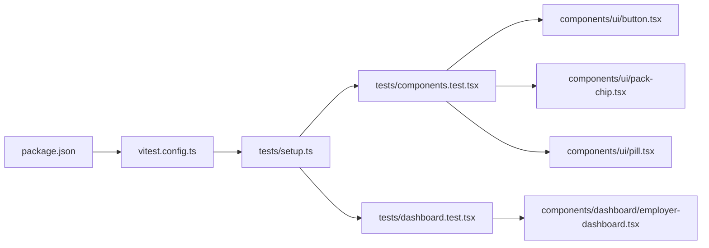

# Component Testing

<cite>
**Referenced Files in This Document**
- [components.test.tsx](file://Frontend/tests/components.test.tsx)
- [dashboard.test.tsx](file://Frontend/tests/dashboard.test.tsx)
- [setup.ts](file://Frontend/tests/setup.ts)
- [vitest.config.ts](file://Frontend/vitest.config.ts)
- [package.json](file://Frontend/package.json)
- [button.tsx](file://Frontend/components/ui/button.tsx)
- [pack-chip.tsx](file://Frontend/components/ui/pack-chip.tsx)
- [pill.tsx](file://Frontend/components/ui/pill.tsx)
- [employer-dashboard.tsx](file://Frontend/components/dashboard/employer-dashboard.tsx)
</cite>

## Table of Contents
1. [Introduction](#introduction)
2. [Project Structure](#project-structure)
3. [Core Components](#core-components)
4. [Architecture Overview](#architecture-overview)
5. [Detailed Component Analysis](#detailed-component-analysis)
6. [Dependency Analysis](#dependency-analysis)
7. [Performance Considerations](#performance-considerations)
8. [Troubleshooting Guide](#troubleshooting-guide)
9. [Conclusion](#conclusion)

## Introduction
This document provides comprehensive component testing guidance for React components using React Testing Library and Vitest. It focuses on shared UI components (Button, PackChip, Pill) and a dashboard page that integrates multiple components and data fetching. You will learn how to render components, simulate user interactions, assert on DOM elements, test accessibility attributes, verify visual styling via CSS classes, and handle conditional rendering and state changes. The guide also includes best practices for writing maintainable tests with clear assertions and organized structure.

## Project Structure
The Frontend project uses:
- Vitest as the test runner with jsdom environment
- React Testing Library for rendering and querying
- Jest-dom matchers for enhanced assertions
- Module aliasing for clean imports

**Diagram sources**
- [components.test.tsx:1-22](file://Frontend/tests/components.test.tsx#L1-L22)
- [dashboard.test.tsx:1-46](file://Frontend/tests/dashboard.test.tsx#L1-L46)
- [vitest.config.ts:1-17](file://Frontend/vitest.config.ts#L1-L17)
- [setup.ts:1-2](file://Frontend/tests/setup.ts#L1-L2)
- [button.tsx:1-26](file://Frontend/components/ui/button.tsx#L1-L26)
- [pack-chip.tsx:1-9](file://Frontend/components/ui/pack-chip.tsx#L1-L9)
- [pill.tsx:1-24](file://Frontend/components/ui/pill.tsx#L1-L24)
- [employer-dashboard.tsx:1-193](file://Frontend/components/dashboard/employer-dashboard.tsx#L1-L193)

**Section sources**
- [vitest.config.ts:1-17](file://Frontend/vitest.config.ts#L1-L17)
- [setup.ts:1-2](file://Frontend/tests/setup.ts#L1-L2)
- [package.json:1-36](file://Frontend/package.json#L1-L36)

## Core Components
This section documents the shared UI components and their tested behaviors.

- Button
  - Renders a semantic button element with variant and size classes
  - Supports disabled state and accessible name from children
  - Test verifies disabled state via role-based query and disabled assertion

- PackChip
  - Displays an active domain pack indicator
  - Provides an accessible label describing the active pack
  - Test asserts the aria-label content for assistive technology

- Pill
  - Renders a status badge with tone-based class names
  - Test asserts that the correct tone class is applied based on prop

These components are small, focused, and well-suited for unit tests that validate props, accessibility attributes, and styling classes.

**Section sources**
- [button.tsx:1-26](file://Frontend/components/ui/button.tsx#L1-L26)
- [pack-chip.tsx:1-9](file://Frontend/components/ui/pack-chip.tsx#L1-L9)
- [pill.tsx:1-24](file://Frontend/components/ui/pill.tsx#L1-L24)
- [components.test.tsx:1-22](file://Frontend/tests/components.test.tsx#L1-L22)

## Architecture Overview
The testing architecture centers around Vitest configuration and setup files that provide a consistent environment for all tests. Shared UI components are isolated and tested independently, while the dashboard test demonstrates integration-level behavior by mocking API calls and asserting rendered sections.

**Diagram sources**
- [vitest.config.ts:1-17](file://Frontend/vitest.config.ts#L1-L17)
- [setup.ts:1-2](file://Frontend/tests/setup.ts#L1-L2)
- [dashboard.test.tsx:1-46](file://Frontend/tests/dashboard.test.tsx#L1-L46)

## Detailed Component Analysis

### Button Component Tests
- Rendering and state
  - Renders a semantic button with an accessible name derived from children
  - Disabled prop maps to native disabled attribute; verified via role query and disabled assertion
- Accessibility
  - Uses native button semantics; no extra roles needed
- Styling
  - Applies variant and size classes through a utility function; can be asserted via className checks if needed

**Diagram sources**
- [button.tsx:1-26](file://Frontend/components/ui/button.tsx#L1-L26)
- [components.test.tsx:6-10](file://Frontend/tests/components.test.tsx#L6-L10)

**Section sources**
- [button.tsx:1-26](file://Frontend/components/ui/button.tsx#L1-L26)
- [components.test.tsx:6-10](file://Frontend/tests/components.test.tsx#L6-L10)

### PackChip Component Tests
- Accessibility
  - Exposes an aria-label that describes the active domain pack
  - Test queries by label to ensure assistive technology support
- Content
  - Displays a mark and the pack name; mark is hidden from screen readers

**Diagram sources**
- [pack-chip.tsx:1-9](file://Frontend/components/ui/pack-chip.tsx#L1-L9)
- [components.test.tsx:12-15](file://Frontend/tests/components.test.tsx#L12-L15)

**Section sources**
- [pack-chip.tsx:1-9](file://Frontend/components/ui/pack-chip.tsx#L1-L9)
- [components.test.tsx:12-15](file://Frontend/tests/components.test.tsx#L12-L15)

### Pill Component Tests
- Styling
  - Applies tone-specific class names based on prop
  - Test asserts presence of the expected class for a given tone
- Semantics
  - Renders a span; appropriate when used as inline status indicators

**Diagram sources**
- [pill.tsx:1-24](file://Frontend/components/ui/pill.tsx#L1-L24)
- [components.test.tsx:17-20](file://Frontend/tests/components.test.tsx#L17-L20)

**Section sources**
- [pill.tsx:1-24](file://Frontend/components/ui/pill.tsx#L1-L24)
- [components.test.tsx:17-20](file://Frontend/tests/components.test.tsx#L17-L20)

### Employer Dashboard Integration Test
- Data fetching and conditional rendering
  - Mocks API responses for analytics, postings, pipeline, and notifications
  - Verifies presence of key sections: attention queue, active requisitions table, next actions
- Accessibility
  - Uses headings and tables with captions or labels for meaningful structure
- User interaction simulation
  - While this test focuses on rendering, you can extend it to simulate clicks on links or buttons within the dashboard

**Diagram sources**
- [dashboard.test.tsx:1-46](file://Frontend/tests/dashboard.test.tsx#L1-L46)
- [employer-dashboard.tsx:1-193](file://Frontend/components/dashboard/employer-dashboard.tsx#L1-L193)

**Section sources**
- [dashboard.test.tsx:1-46](file://Frontend/tests/dashboard.test.tsx#L1-L46)
- [employer-dashboard.tsx:1-193](file://Frontend/components/dashboard/employer-dashboard.tsx#L1-L193)

## Dependency Analysis
The test suite depends on:
- Vitest configuration for environment and setup
- Setup file to enable jest-dom matchers
- Package dependencies for React Testing Library and jsdom

**Diagram sources**
- [package.json:1-36](file://Frontend/package.json#L1-L36)
- [vitest.config.ts:1-17](file://Frontend/vitest.config.ts#L1-L17)
- [setup.ts:1-2](file://Frontend/tests/setup.ts#L1-L2)
- [components.test.tsx:1-22](file://Frontend/tests/components.test.tsx#L1-L22)
- [dashboard.test.tsx:1-46](file://Frontend/tests/dashboard.test.tsx#L1-L46)
- [button.tsx:1-26](file://Frontend/components/ui/button.tsx#L1-L26)
- [pack-chip.tsx:1-9](file://Frontend/components/ui/pack-chip.tsx#L1-L9)
- [pill.tsx:1-24](file://Frontend/components/ui/pill.tsx#L1-L24)
- [employer-dashboard.tsx:1-193](file://Frontend/components/dashboard/employer-dashboard.tsx#L1-L193)

**Section sources**
- [package.json:1-36](file://Frontend/package.json#L1-L36)
- [vitest.config.ts:1-17](file://Frontend/vitest.config.ts#L1-L17)
- [setup.ts:1-2](file://Frontend/tests/setup.ts#L1-L2)

## Performance Considerations
- Keep tests fast and deterministic by mocking external dependencies (e.g., API calls)
- Use minimal renders and targeted queries to reduce overhead
- Avoid deep DOM traversal; prefer semantic queries like getByRole and getByText
- Batch related assertions within a single test to minimize re-renders
- For large components, split into smaller units where possible to improve test isolation

[No sources needed since this section provides general guidance]

## Troubleshooting Guide
Common issues and resolutions:
- Environment not configured
  - Ensure vitest.config.ts sets jsdom environment and setupFiles
  - Verify setup.ts imports jest-dom matchers
- Module alias resolution
  - Confirm vitest resolve.alias maps "@" to the project root
- Mocking failures
  - Validate mock paths and return structures match component expectations
- Flaky async tests
  - Use findBy* queries to wait for asynchronous updates
  - Avoid relying on timers unless necessary

**Section sources**
- [vitest.config.ts:1-17](file://Frontend/vitest.config.ts#L1-L17)
- [setup.ts:1-2](file://Frontend/tests/setup.ts#L1-L2)
- [dashboard.test.tsx:1-46](file://Frontend/tests/dashboard.test.tsx#L1-L46)

## Conclusion
This documentation outlined a practical approach to testing React components with React Testing Library and Vitest. By focusing on semantic queries, accessibility attributes, and styling classes, you can write robust tests for shared UI components like Button, PackChip, and Pill. For complex pages such as the Employer Dashboard, mocking external dependencies enables reliable integration tests that validate conditional rendering and user-facing structure. Following these patterns ensures maintainable, readable, and effective tests that protect your UI over time.

[No sources needed since this section summarizes without analyzing specific files]