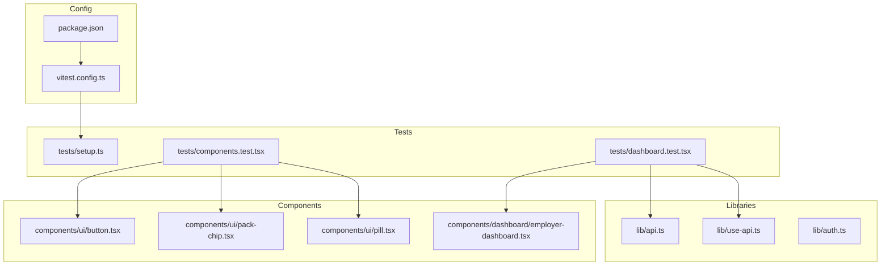
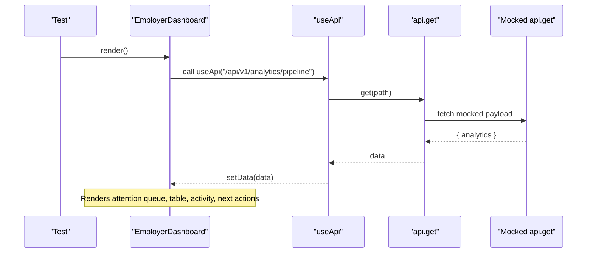
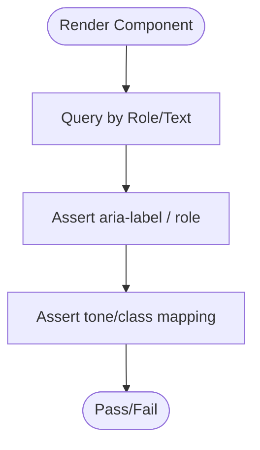
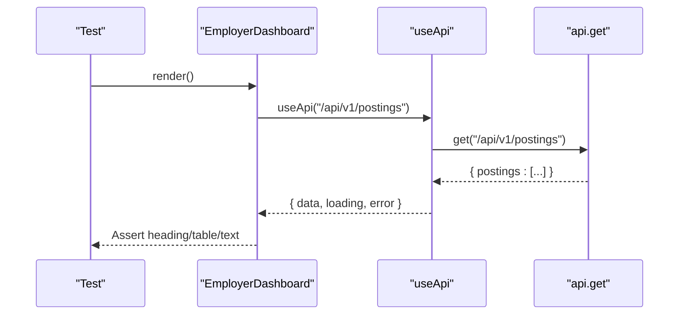
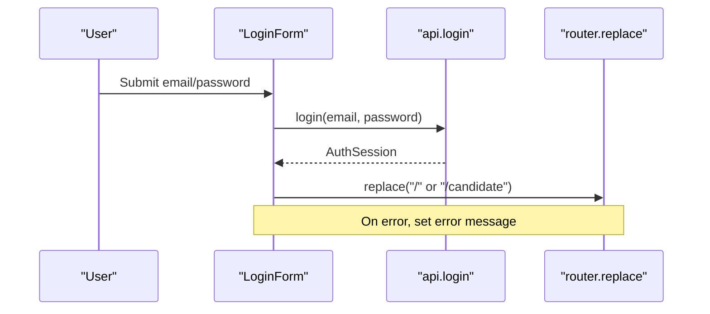
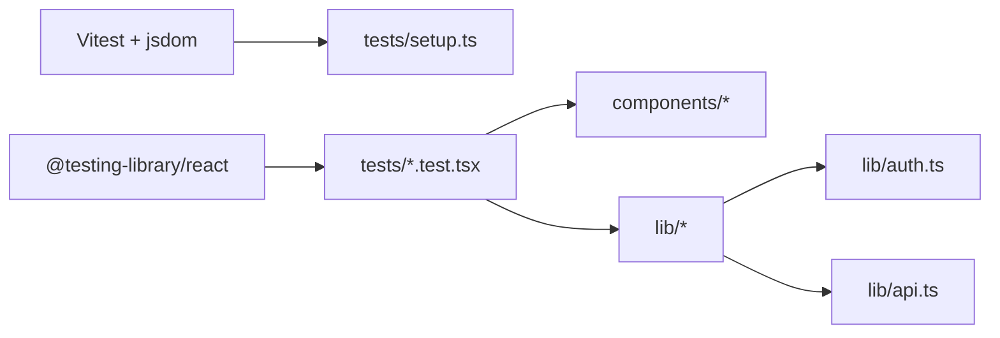

# Frontend Testing

<cite>
**Referenced Files in This Document**
- [vitest.config.ts](file://Frontend/vitest.config.ts)
- [setup.ts](file://Frontend/tests/setup.ts)
- [components.test.tsx](file://Frontend/tests/components.test.tsx)
- [dashboard.test.tsx](file://Frontend/tests/dashboard.test.tsx)
- [package.json](file://Frontend/package.json)
- [button.tsx](file://Frontend/components/ui/button.tsx)
- [pack-chip.tsx](file://Frontend/components/ui/pack-chip.tsx)
- [pill.tsx](file://Frontend/components/ui/pill.tsx)
- [employer-dashboard.tsx](file://Frontend/components/dashboard/employer-dashboard.tsx)
- [api.ts](file://Frontend/lib/api.ts)
- [auth.ts](file://Frontend/lib/auth.ts)
- [use-api.ts](file://Frontend/lib/use-api.ts)
- [login-form.tsx](file://Frontend/components/auth/login-form.tsx)
- [register-form.tsx](file://Frontend/components/auth/register-form.tsx)
</cite>

## Table of Contents
1. Introduction
2. Project Structure
3. Core Components
4. Architecture Overview
5. Detailed Component Analysis
6. Dependency Analysis
7. Performance Considerations
8. Troubleshooting Guide
9. Conclusion
10. Appendices

## Introduction
This document provides a comprehensive guide to frontend testing for the Next.js application using Vitest and React Testing Library. It covers unit and integration testing strategies, including user interaction simulation, state management testing, async operation handling, API mocking, authentication flows, and real-time communication considerations. It also documents test setup configuration, utilities, accessibility testing, performance testing, and visual regression approaches tailored to this codebase.

## Project Structure
The frontend test suite is organized under Frontend/tests with a minimal setup file and example tests for UI components and a dashboard page. The project uses Vitest with jsdom environment, automatic JSX transform via esbuild, and global test APIs enabled. A single setup file extends Jest DOM matchers for Vitest.

**Diagram sources**
- [vitest.config.ts:1-17](file://Frontend/vitest.config.ts#L1-L17)
- [setup.ts:1-2](file://Frontend/tests/setup.ts#L1-L2)
- [components.test.tsx:1-22](file://Frontend/tests/components.test.tsx#L1-L22)
- [dashboard.test.tsx:1-46](file://Frontend/tests/dashboard.test.tsx#L1-L46)
- [package.json:1-36](file://Frontend/package.json#L1-L36)
- [button.tsx:1-26](file://Frontend/components/ui/button.tsx#L1-L26)
- [pack-chip.tsx:1-9](file://Frontend/components/ui/pack-chip.tsx#L1-L9)
- [pill.tsx:1-24](file://Frontend/components/ui/pill.tsx#L1-L24)
- [employer-dashboard.tsx:1-193](file://Frontend/components/dashboard/employer-dashboard.tsx#L1-L193)
- [api.ts:1-199](file://Frontend/lib/api.ts#L1-L199)
- [use-api.ts:1-34](file://Frontend/lib/use-api.ts#L1-L34)
- [auth.ts:1-70](file://Frontend/lib/auth.ts#L1-L70)

**Section sources**
- [vitest.config.ts:1-17](file://Frontend/vitest.config.ts#L1-L17)
- [setup.ts:1-2](file://Frontend/tests/setup.ts#L1-L2)
- [package.json:1-36](file://Frontend/package.json#L1-L36)

## Core Components
- Shared UI components (Button, PackChip, Pill) are tested for rendering, accessibility attributes, and styling classes.
- EmployerDashboard integrates multiple data endpoints via useApi and renders loading, error, and empty states. Tests mock the API module to provide deterministic payloads and assert visible content.

Key patterns:
- Render components with React Testing Library’s render and query by role/text.
- Assert accessibility labels and aria attributes.
- Mock network calls at the module level to isolate component logic.

**Section sources**
- [components.test.tsx:1-22](file://Frontend/tests/components.test.tsx#L1-L22)
- [dashboard.test.tsx:1-46](file://Frontend/tests/dashboard.test.tsx#L1-L46)
- [button.tsx:1-26](file://Frontend/components/ui/button.tsx#L1-L26)
- [pack-chip.tsx:1-9](file://Frontend/components/ui/pack-chip.tsx#L1-L9)
- [pill.tsx:1-24](file://Frontend/components/ui/pill.tsx#L1-L24)
- [employer-dashboard.tsx:1-193](file://Frontend/components/dashboard/employer-dashboard.tsx#L1-L193)

## Architecture Overview
The dashboard page composes several data-fetching hooks that call into a centralized API client. The API client handles token injection, refresh flows, and error mapping. Tests mock the API layer to avoid real network calls and validate UI behavior across loading, success, and error states.

**Diagram sources**
- [employer-dashboard.tsx:18-33](file://Frontend/components/dashboard/employer-dashboard.tsx#L18-L33)
- [use-api.ts:6-33](file://Frontend/lib/use-api.ts#L6-L33)
- [api.ts:148-155](file://Frontend/lib/api.ts#L148-L155)
- [dashboard.test.tsx:5-33](file://Frontend/tests/dashboard.test.tsx#L5-L33)

## Detailed Component Analysis

### UI Components: Button, PackChip, Pill
- Button renders with semantic roles and supports disabled state; tests assert button role and disabled attribute.
- PackChip exposes an accessible label describing active domain pack; tests assert aria-label content.
- Pill applies tone-based classes; tests assert class presence for a given tone.

Testing strategy:
- Render each component in isolation.
- Query by role or text.
- Assert accessibility attributes and CSS classes.

**Diagram sources**
- [components.test.tsx:6-20](file://Frontend/tests/components.test.tsx#L6-L20)
- [button.tsx:11-25](file://Frontend/components/ui/button.tsx#L11-L25)
- [pack-chip.tsx:1-9](file://Frontend/components/ui/pack-chip.tsx#L1-L9)
- [pill.tsx:13-23](file://Frontend/components/ui/pill.tsx#L13-L23)

**Section sources**
- [components.test.tsx:1-22](file://Frontend/tests/components.test.tsx#L1-L22)
- [button.tsx:1-26](file://Frontend/components/ui/button.tsx#L1-L26)
- [pack-chip.tsx:1-9](file://Frontend/components/ui/pack-chip.tsx#L1-L9)
- [pill.tsx:1-24](file://Frontend/components/ui/pill.tsx#L1-L24)

### Dashboard Integration: EmployerDashboard
- Uses useApi to fetch analytics, postings, pipeline, and notifications.
- Displays loading, error, and empty states based on hook results.
- Tests mock api.get to return predefined payloads and assert rendered headings, tables, and text.

**Diagram sources**
- [employer-dashboard.tsx:18-33](file://Frontend/components/dashboard/employer-dashboard.tsx#L18-L33)
- [use-api.ts:6-33](file://Frontend/lib/use-api.ts#L6-L33)
- [dashboard.test.tsx:5-46](file://Frontend/tests/dashboard.test.tsx#L5-L46)

**Section sources**
- [dashboard.test.tsx:1-46](file://Frontend/tests/dashboard.test.tsx#L1-L46)
- [employer-dashboard.tsx:1-193](file://Frontend/components/dashboard/employer-dashboard.tsx#L1-L193)
- [use-api.ts:1-34](file://Frontend/lib/use-api.ts#L1-L34)
- [api.ts:148-155](file://Frontend/lib/api.ts#L148-L155)

### Authentication Flows: Login and Register Forms
- LoginForm and RegisterForm call api.login and api.register respectively, then navigate based on session properties.
- Errors are surfaced via ApiError messages.
- To test these forms:
  - Mock api.login and api.register to resolve with expected sessions or throw ApiError.
  - Mock next/navigation router to assert navigation outcomes.
  - Simulate form submission and assert error messages and busy states.

**Diagram sources**
- [login-form.tsx:8-27](file://Frontend/components/auth/login-form.tsx#L8-L27)
- [register-form.tsx:8-27](file://Frontend/components/auth/register-form.tsx#L8-L27)
- [api.ts:157-176](file://Frontend/lib/api.ts#L157-L176)

**Section sources**
- [login-form.tsx:1-75](file://Frontend/components/auth/login-form.tsx#L1-L75)
- [register-form.tsx:1-79](file://Frontend/components/auth/register-form.tsx#L1-L79)
- [api.ts:157-176](file://Frontend/lib/api.ts#L157-L176)

### Real-Time WebSocket Communication
- The frontend includes LiveKit-related components for voice interviews. While not directly tested here, you can test WebSocket interactions by:
  - Mocking LiveKit SDK methods (e.g., room join, publish/subscribe events).
  - Verifying UI reacts to connection states and media tracks.
  - Using timers to simulate delayed events and timeouts.

[No sources needed since this section provides conceptual guidance]

## Dependency Analysis
The test suite depends on Vitest, jsdom, and React Testing Library. The dashboard test mocks the API module to decouple UI from backend behavior. The API client depends on auth storage and environment variables.

**Diagram sources**
- [package.json:22-34](file://Frontend/package.json#L22-L34)
- [setup.ts:1-2](file://Frontend/tests/setup.ts#L1-L2)
- [dashboard.test.tsx:1-46](file://Frontend/tests/dashboard.test.tsx#L1-L46)
- [api.ts:1-199](file://Frontend/lib/api.ts#L1-L199)
- [auth.ts:1-70](file://Frontend/lib/auth.ts#L1-L70)

**Section sources**
- [package.json:1-36](file://Frontend/package.json#L1-L36)
- [dashboard.test.tsx:1-46](file://Frontend/tests/dashboard.test.tsx#L1-L46)
- [api.ts:1-199](file://Frontend/lib/api.ts#L1-L199)
- [auth.ts:1-70](file://Frontend/lib/auth.ts#L1-L70)

## Performance Considerations
- Keep tests fast by mocking all network calls and avoiding real browser features when unnecessary.
- Prefer shallow or focused renders for unit tests; only mount full trees for integration scenarios.
- Use vi.useFakeTimers() to control time-dependent logic (e.g., polling, delays).
- Avoid heavy snapshots for frequently changing UI; prefer assertions on roles and text.

[No sources needed since this section provides general guidance]

## Troubleshooting Guide
Common issues and resolutions:
- Missing jsdom globals: Ensure vitest.config.ts sets environment to jsdom and setupFiles include jest-dom extensions.
- Module resolution errors: Confirm alias "@" points to project root in vitest config.
- Navigation mocks: When testing forms that use next/navigation, mock useRouter to prevent runtime errors.
- API mocks: For components using useApi, mock api.get to return deterministic payloads or errors.
- LocalStorage access: If testing functions that read/write localStorage, ensure jsdom provides window and localStorage.

**Section sources**
- [vitest.config.ts:4-15](file://Frontend/vitest.config.ts#L4-L15)
- [setup.ts:1-2](file://Frontend/tests/setup.ts#L1-L2)
- [dashboard.test.tsx:5-33](file://Frontend/tests/dashboard.test.tsx#L5-L33)
- [api.ts:25-57](file://Frontend/lib/api.ts#L25-L57)
- [auth.ts:30-65](file://Frontend/lib/auth.ts#L30-L65)

## Conclusion
The current test suite demonstrates solid foundations for unit and integration testing using Vitest and React Testing Library. By extending mocks for API, authentication, and third-party integrations, and adding accessibility and performance checks, the suite can comprehensively cover UI behavior, data flows, and edge cases.

[No sources needed since this section summarizes without analyzing specific files]

## Appendices

### Test Setup Configuration
- Environment: jsdom for DOM APIs.
- Globals: Enabled for describe/it/expect.
- Setup file: Extends Jest DOM matchers for Vitest.
- Alias: Resolves "@" to project root.

**Section sources**
- [vitest.config.ts:4-15](file://Frontend/vitest.config.ts#L4-L15)
- [setup.ts:1-2](file://Frontend/tests/setup.ts#L1-L2)

### Example Test Patterns

- Unit test for UI components:
  - Render component with props.
  - Query by role or text.
  - Assert accessibility attributes and classes.

- Integration test for dashboard:
  - Mock api.get to return structured payloads.
  - Render component and await async elements.
  - Assert headings, tables, and status indicators.

- Form interaction test:
  - Mock api.login/register to resolve or reject.
  - Submit form and assert navigation or error messages.

**Section sources**
- [components.test.tsx:6-20](file://Frontend/tests/components.test.tsx#L6-L20)
- [dashboard.test.tsx:35-45](file://Frontend/tests/dashboard.test.tsx#L35-L45)
- [login-form.tsx:15-27](file://Frontend/components/auth/login-form.tsx#L15-L27)
- [register-form.tsx:16-27](file://Frontend/components/auth/register-form.tsx#L16-L27)

### Mocking Strategies

- API mocking:
  - Replace api.get with a function returning predefined payloads or throwing ApiError.
  - Validate loading/error states and retry behavior via reload.

- Authentication mocking:
  - Mock api.login/register to return sessions or errors.
  - Mock router.replace to assert navigation targets.

- Browser APIs:
  - Use jsdom for window, localStorage, and fetch.
  - For advanced features (e.g., WebRTC), stub or mock relevant modules.

- Third-party libraries:
  - Mock LiveKit SDK methods to simulate room lifecycle and media events.

**Section sources**
- [dashboard.test.tsx:5-33](file://Frontend/tests/dashboard.test.tsx#L5-L33)
- [api.ts:12-104](file://Frontend/lib/api.ts#L12-L104)
- [auth.ts:30-65](file://Frontend/lib/auth.ts#L30-L65)

### Accessibility Testing
- Assert roles, labels, and aria attributes for interactive elements.
- Ensure status changes are announced via appropriate roles (e.g., alert for errors).
- Verify keyboard focus and tab order for forms.

**Section sources**
- [components.test.tsx:12-15](file://Frontend/tests/components.test.tsx#L12-L15)
- [pack-chip.tsx:1-9](file://Frontend/components/ui/pack-chip.tsx#L1-L9)
- [login-form.tsx:31-61](file://Frontend/components/auth/login-form.tsx#L31-L61)

### Performance Testing
- Use timers to speed up async operations in tests.
- Avoid heavy renders; prefer focused component mounts.
- Measure render times for critical paths if necessary.

[No sources needed since this section provides general guidance]

### Visual Regression Testing
- Integrate snapshot testing cautiously for stable UI regions.
- Consider dedicated tools (e.g., Playwright visual comparisons) for cross-browser screenshots.
- Focus on diffing meaningful UI changes rather than brittle markup.

[No sources needed since this section provides general guidance]