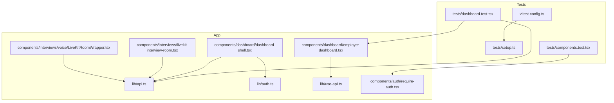
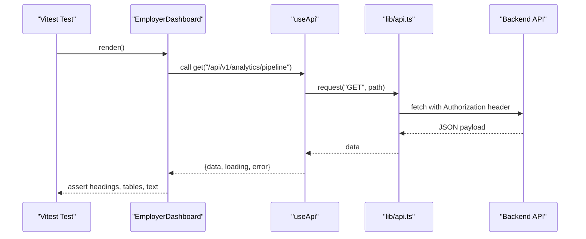
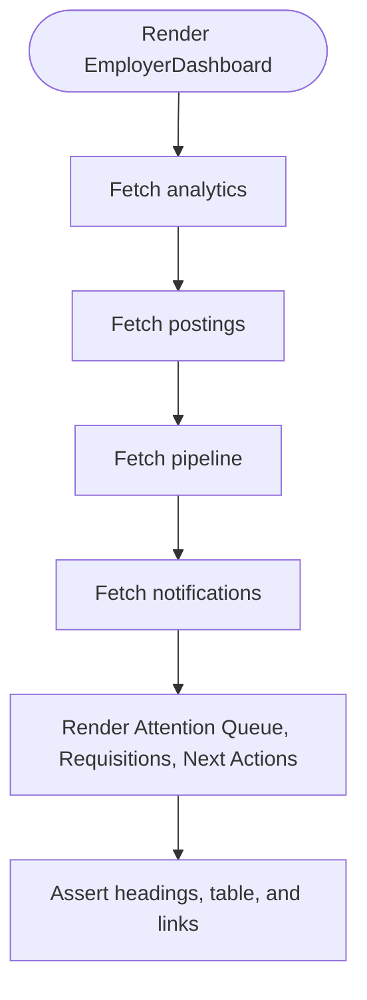
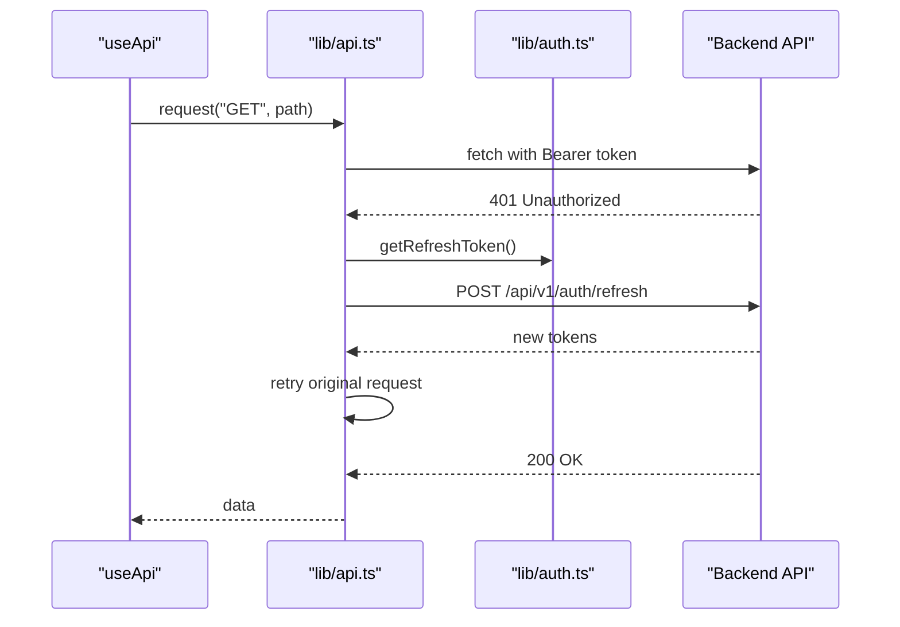
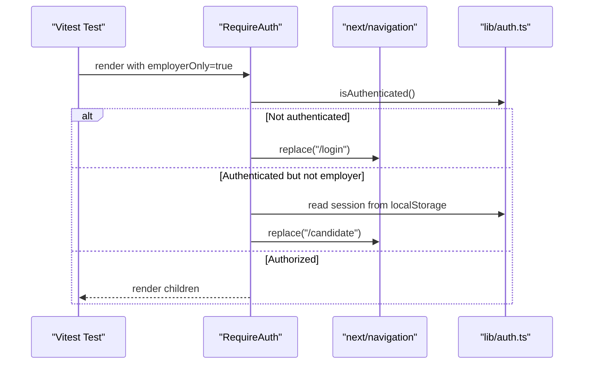
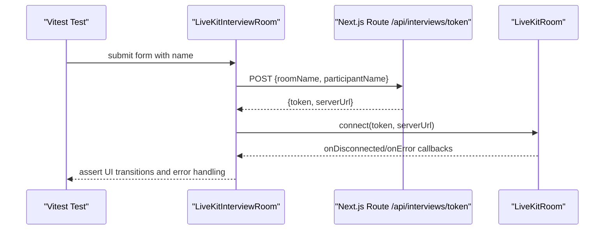
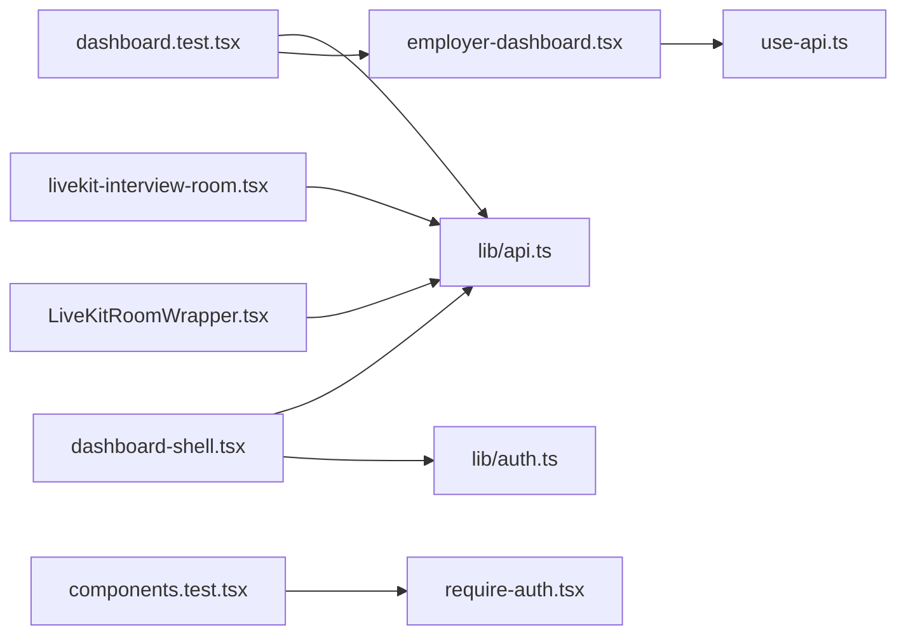

# Integration Testing

<cite>
**Referenced Files in This Document**
- [vitest.config.ts](file://Frontend/vitest.config.ts)
- [setup.ts](file://Frontend/tests/setup.ts)
- [dashboard.test.tsx](file://Frontend/tests/dashboard.test.tsx)
- [components.test.tsx](file://Frontend/tests/components.test.tsx)
- [api.ts](file://Frontend/lib/api.ts)
- [auth.ts](file://Frontend/lib/auth.ts)
- [use-api.ts](file://Frontend/lib/use-api.ts)
- [require-auth.tsx](file://Frontend/components/auth/require-auth.tsx)
- [employer-dashboard.tsx](file://Frontend/components/dashboard/employer-dashboard.tsx)
- [dashboard-shell.tsx](file://Frontend/components/dashboard/dashboard-shell.tsx)
- [livekit-interview-room.tsx](file://Frontend/components/interviews/livekit-interview-room.tsx)
- [LiveKitRoomWrapper.tsx](file://Frontend/components/interviews/voice/LiveKitRoomWrapper.tsx)
</cite>

## Table of Contents
1. Introduction
2. Project Structure
3. Core Components
4. Architecture Overview
5. Detailed Component Analysis
6. Dependency Analysis
7. Performance Considerations
8. Troubleshooting Guide
9. Conclusion

## Introduction
This document provides integration testing guidance for the Next.js application with a focus on API integration, authentication flows, and multi-component interactions. It explains how to test dashboard functionality, API calls, user authentication workflows, real-time features (WebSocket/LiveKit), and error handling scenarios. It also documents strategies for mocking external services, handling async operations, and testing data fetching patterns using Vitest and React Testing Library.

## Project Structure
The frontend uses Vitest with jsdom for component tests. Tests are located under Frontend/tests and configured via vitest.config.ts. The setup file extends matchers for DOM assertions. The application’s core integration points include:
- API client with automatic token refresh and error mapping
- Authentication utilities that persist session tokens and user info
- Data fetching hook that centralizes loading/error state
- Dashboard components that consume multiple APIs and render composite UI
- Interview room components that integrate with LiveKit over WebSocket

**Diagram sources**
- [vitest.config.ts:1-17](file://Frontend/vitest.config.ts#L1-L17)
- [setup.ts:1-2](file://Frontend/tests/setup.ts#L1-L2)
- [dashboard.test.tsx:1-46](file://Frontend/tests/dashboard.test.tsx#L1-L46)
- [components.test.tsx:1-22](file://Frontend/tests/components.test.tsx#L1-L22)
- [api.ts:1-199](file://Frontend/lib/api.ts#L1-L199)
- [auth.ts:1-70](file://Frontend/lib/auth.ts#L1-L70)
- [use-api.ts:1-34](file://Frontend/lib/use-api.ts#L1-L34)
- [require-auth.tsx:1-42](file://Frontend/components/auth/require-auth.tsx#L1-L42)
- [dashboard-shell.tsx:1-178](file://Frontend/components/dashboard/dashboard-shell.tsx#L1-L178)
- [employer-dashboard.tsx:1-193](file://Frontend/components/dashboard/employer-dashboard.tsx#L1-L193)
- [livekit-interview-room.tsx:1-100](file://Frontend/components/interviews/livekit-interview-room.tsx#L1-L100)
- [LiveKitRoomWrapper.tsx:1-104](file://Frontend/components/interviews/voice/LiveKitRoomWrapper.tsx#L1-L104)

**Section sources**
- [vitest.config.ts:1-17](file://Frontend/vitest.config.ts#L1-L17)
- [setup.ts:1-2](file://Frontend/tests/setup.ts#L1-L2)

## Core Components
- API client: Centralized fetch wrapper with Bearer token injection, automatic 401 retry via refresh flow, and typed ApiError mapping.
- Auth utilities: LocalStorage-backed session management for access/refresh tokens and user metadata; helpers to check authentication status.
- Data fetching hook: useApi encapsulates GET requests, loading/error states, and reload capability.
- RequireAuth: Client-side guard that redirects unauthenticated users or non-employers based on role checks.
- Dashboard shell: Wraps pages with RequireAuth and loads workspace context (organization, domain pack, notifications).
- Employer dashboard: Aggregates analytics, postings, pipeline, and notifications to render priority work, requisitions table, and next actions.
- Interview rooms: Integrate with LiveKit via token endpoints and WebSocket connections; handle connection lifecycle and errors.

**Section sources**
- [api.ts:1-199](file://Frontend/lib/api.ts#L1-L199)
- [auth.ts:1-70](file://Frontend/lib/auth.ts#L1-L70)
- [use-api.ts:1-34](file://Frontend/lib/use-api.ts#L1-L34)
- [require-auth.tsx:1-42](file://Frontend/components/auth/require-auth.tsx#L1-L42)
- [dashboard-shell.tsx:1-178](file://Frontend/components/dashboard/dashboard-shell.tsx#L1-L178)
- [employer-dashboard.tsx:1-193](file://Frontend/components/dashboard/employer-dashboard.tsx#L1-L193)
- [livekit-interview-room.tsx:1-100](file://Frontend/components/interviews/livekit-interview-room.tsx#L1-L100)
- [LiveKitRoomWrapper.tsx:1-104](file://Frontend/components/interviews/voice/LiveKitRoomWrapper.tsx#L1-L104)

## Architecture Overview
Integration tests should validate end-to-end flows across components and services:
- Mock the API layer to control responses and simulate failures.
- Render components that depend on auth and data hooks.
- Assert UI states for loading, success, and error paths.
- For real-time features, mock token acquisition and verify connection setup without requiring a live server.

**Diagram sources**
- [employer-dashboard.tsx:18-22](file://Frontend/components/dashboard/employer-dashboard.tsx#L18-L22)
- [use-api.ts:6-32](file://Frontend/lib/use-api.ts#L6-L32)
- [api.ts:59-104](file://Frontend/lib/api.ts#L59-L104)

## Detailed Component Analysis

### Dashboard Integration Testing
Strategy:
- Mock the API module to return deterministic payloads for analytics, postings, pipeline, and notifications.
- Render the employer dashboard and assert presence of key sections: attention queue, active requisitions table, and next actions.
- Verify that loading and error states are handled by rendering appropriate placeholders when data is not available.

Example approach:
- Use vi.mock to intercept api.get calls and return predefined objects keyed by endpoint.
- Wait for async renders using findByRole or waitFor to ensure tables appear.
- Assert accessibility labels and visible content for critical elements.

**Diagram sources**
- [employer-dashboard.tsx:18-22](file://Frontend/components/dashboard/employer-dashboard.tsx#L18-L22)
- [dashboard.test.tsx:5-33](file://Frontend/tests/dashboard.test.tsx#L5-L33)

**Section sources**
- [dashboard.test.tsx:1-46](file://Frontend/tests/dashboard.test.tsx#L1-L46)
- [employer-dashboard.tsx:18-193](file://Frontend/components/dashboard/employer-dashboard.tsx#L18-L193)

### API Integration Testing
Patterns:
- Wrap fetch calls through lib/api.ts to inject Authorization headers and handle 401 retries automatically.
- In tests, mock api.get/post/patch/put/delete to avoid network calls and assert behavior under various statuses.
- Validate error mapping: ApiError includes code and message; ensure components surface messages and offer retry.

Key behaviors to test:
- Successful GET returns data and sets loading false.
- Network failure throws ApiError with network_unreachable code.
- 401 triggers refresh flow; if successful, original request retries once.

**Diagram sources**
- [api.ts:25-57](file://Frontend/lib/api.ts#L25-L57)
- [api.ts:59-104](file://Frontend/lib/api.ts#L59-L104)
- [auth.ts:30-65](file://Frontend/lib/auth.ts#L30-L65)

**Section sources**
- [api.ts:1-199](file://Frontend/lib/api.ts#L1-L199)
- [use-api.ts:1-34](file://Frontend/lib/use-api.ts#L1-L34)

### Authentication Flow Testing
Scenarios:
- Unauthenticated access: RequireAuth redirects to login; verify router navigation occurs.
- Employer-only routes: RequireAuth checks session membership; redirect to candidate area if not authorized.
- Logout: Ensure session is cleared and user navigated back to login.

Testing tips:
- Mock useRouter.replace to assert navigation without actual routing.
- Pre-populate localStorage with session data to simulate authenticated state.
- After logout, assert local storage keys are removed.

**Diagram sources**
- [require-auth.tsx:17-31](file://Frontend/components/auth/require-auth.tsx#L17-L31)
- [auth.ts:30-65](file://Frontend/lib/auth.ts#L30-L65)

**Section sources**
- [require-auth.tsx:1-42](file://Frontend/components/auth/require-auth.tsx#L1-L42)
- [auth.ts:1-70](file://Frontend/lib/auth.ts#L1-L70)

### Real-Time Features (WebSocket/LiveKit) Testing
Approach:
- Mock token acquisition endpoints used by interview room components to return valid token and serverUrl.
- Assert that the component transitions from lobby to room after successful token fetch.
- Simulate connection errors and verify error UI and state changes.
- For voice interviews, mock publicApi.getLiveKitToken and telemetry URL generation to isolate WebSocket concerns.

**Diagram sources**
- [livekit-interview-room.tsx:21-48](file://Frontend/components/interviews/livekit-interview-room.tsx#L21-L48)
- [livekit-interview-room.tsx:50-69](file://Frontend/components/interviews/livekit-interview-room.tsx#L50-L69)

**Section sources**
- [livekit-interview-room.tsx:1-100](file://Frontend/components/interviews/livekit-interview-room.tsx#L1-L100)
- [LiveKitRoomWrapper.tsx:35-53](file://Frontend/components/interviews/voice/LiveKitRoomWrapper.tsx#L35-L53)

### Error Handling Scenarios
Patterns:
- Network unreachable: expect ApiError with code network_unreachable; assert user-facing message.
- Server errors: map response.error.code/message into ApiError; ensure components show message and allow retry.
- Auth failures: 401 triggers refresh; if refresh fails, clear session and redirect appropriately.

Testing tips:
- Use vi.fn().mockRejectedValue to simulate fetch failures.
- Provide malformed JSON to test payload parsing fallbacks.
- Assert that retry functions trigger re-fetches and update state.

**Section sources**
- [api.ts:70-104](file://Frontend/lib/api.ts#L70-L104)
- [use-api.ts:11-26](file://Frontend/lib/use-api.ts#L11-L26)

### Test Utilities and Helpers
- Vitest configuration:
  - Environment set to jsdom for DOM APIs.
  - JSX transform enabled via esbuild.
  - Global aliases resolve @ to project root for imports.
- Setup file:
  - Extends Jest/DOM matchers for assertions like toBeInTheDocument.

Usage:
- Import render and screen from @testing-library/react in tests.
- Leverage vi.mock to stub modules such as "@/lib/api".
- Use findByRole/waitFor to handle async renders.

**Section sources**
- [vitest.config.ts:1-17](file://Frontend/vitest.config.ts#L1-L17)
- [setup.ts:1-2](file://Frontend/tests/setup.ts#L1-L2)
- [dashboard.test.tsx:1-46](file://Frontend/tests/dashboard.test.tsx#L1-L46)
- [components.test.tsx:1-22](file://Frontend/tests/components.test.tsx#L1-L22)

## Dependency Analysis
The following diagram shows key dependencies among testing and runtime modules:

**Diagram sources**
- [dashboard.test.tsx:1-46](file://Frontend/tests/dashboard.test.tsx#L1-L46)
- [components.test.tsx:1-22](file://Frontend/tests/components.test.tsx#L1-L22)
- [employer-dashboard.tsx:1-193](file://Frontend/components/dashboard/employer-dashboard.tsx#L1-L193)
- [use-api.ts:1-34](file://Frontend/lib/use-api.ts#L1-L34)
- [dashboard-shell.tsx:1-178](file://Frontend/components/dashboard/dashboard-shell.tsx#L1-L178)
- [api.ts:1-199](file://Frontend/lib/api.ts#L1-L199)
- [auth.ts:1-70](file://Frontend/lib/auth.ts#L1-L70)
- [livekit-interview-room.tsx:1-100](file://Frontend/components/interviews/livekit-interview-room.tsx#L1-L100)
- [LiveKitRoomWrapper.tsx:1-104](file://Frontend/components/interviews/voice/LiveKitRoomWrapper.tsx#L1-L104)

**Section sources**
- [api.ts:1-199](file://Frontend/lib/api.ts#L1-L199)
- [use-api.ts:1-34](file://Frontend/lib/use-api.ts#L1-L34)
- [auth.ts:1-70](file://Frontend/lib/auth.ts#L1-L70)
- [require-auth.tsx:1-42](file://Frontend/components/auth/require-auth.tsx#L1-L42)
- [dashboard-shell.tsx:1-178](file://Frontend/components/dashboard/dashboard-shell.tsx#L1-L178)
- [employer-dashboard.tsx:1-193](file://Frontend/components/dashboard/employer-dashboard.tsx#L1-L193)
- [livekit-interview-room.tsx:1-100](file://Frontend/components/interviews/livekit-interview-room.tsx#L1-L100)
- [LiveKitRoomWrapper.tsx:1-104](file://Frontend/components/interviews/voice/LiveKitRoomWrapper.tsx#L1-L104)

## Performance Considerations
- Prefer mocking at the API boundary to avoid slow network calls and flaky tests.
- Keep test fixtures small and focused on the feature under test.
- Use findBy queries sparingly; prefer stable selectors and explicit waits where necessary.
- Avoid rendering entire shells unless required; wrap only what you need behind mocks.

[No sources needed since this section provides general guidance]

## Troubleshooting Guide
Common issues and resolutions:
- Module resolution errors: Ensure vitest alias resolves @ correctly and imports use consistent paths.
- Missing DOM matchers: Confirm setup file is included in Vitest config.
- Flaky async tests: Use findByRole or waitFor to await rendered content; avoid immediate assertions after render.
- Auth-related redirects: Mock useRouter.replace and pre-seed localStorage with session data to control flow.
- LiveKit connection failures: Mock token endpoints and assert error UI rather than relying on real servers.

**Section sources**
- [vitest.config.ts:1-17](file://Frontend/vitest.config.ts#L1-L17)
- [setup.ts:1-2](file://Frontend/tests/setup.ts#L1-L2)
- [require-auth.tsx:17-31](file://Frontend/components/auth/require-auth.tsx#L17-L31)
- [livekit-interview-room.tsx:21-48](file://Frontend/components/interviews/livekit-interview-room.tsx#L21-L48)

## Conclusion
By mocking the API layer, leveraging the centralized auth utilities, and using the useApi hook consistently, you can write robust integration tests that cover dashboard functionality, authentication flows, and real-time features. Focus on asserting meaningful UI outcomes, validating error handling paths, and isolating external dependencies to achieve reliable and fast tests.

[No sources needed since this section summarizes without analyzing specific files]