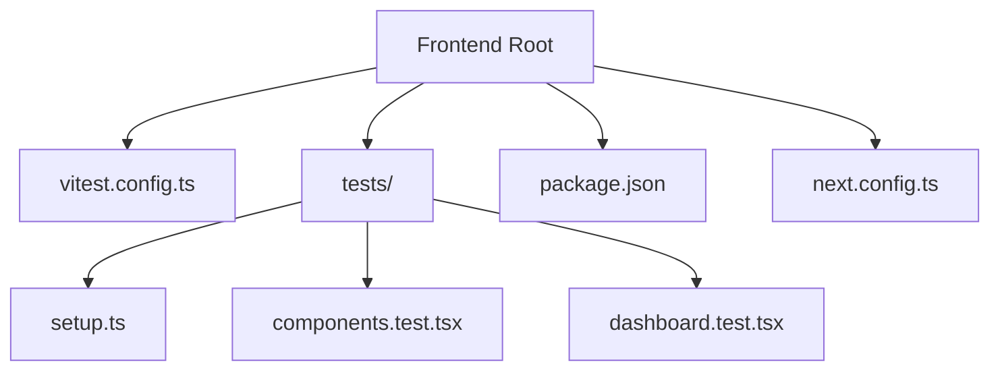
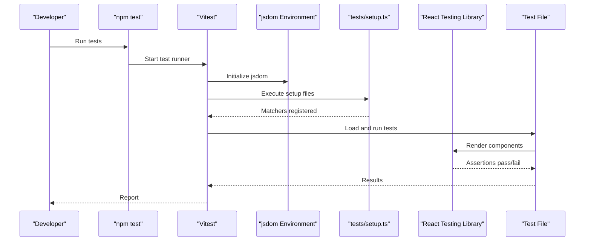
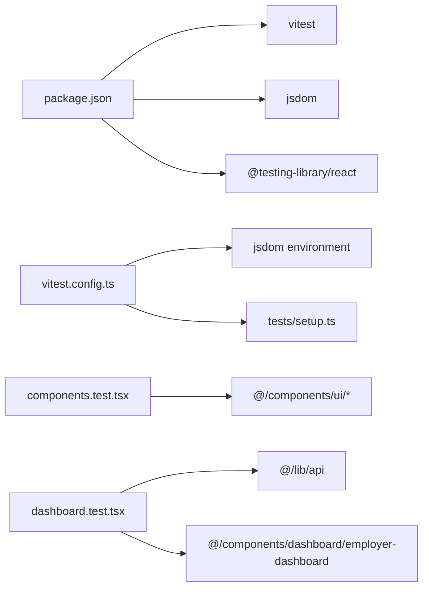
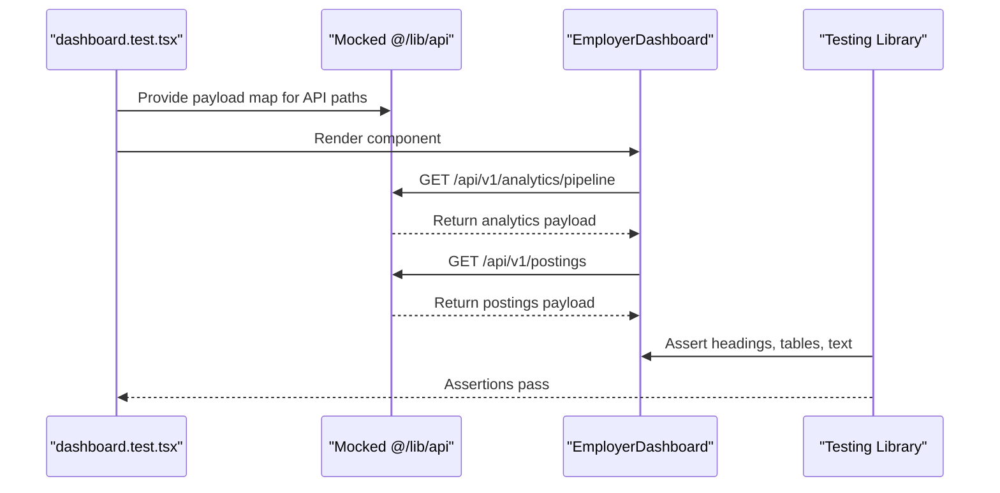

# Test Configuration & Setup

<cite>
**Referenced Files in This Document**
- [vitest.config.ts](file://Frontend/vitest.config.ts)
- [setup.ts](file://Frontend/tests/setup.ts)
- [package.json](file://Frontend/package.json)
- [components.test.tsx](file://Frontend/tests/components.test.tsx)
- [dashboard.test.tsx](file://Frontend/tests/dashboard.test.tsx)
- [next.config.ts](file://Frontend/next.config.ts)
</cite>

## Table of Contents
1. [Introduction](#introduction)
2. [Project Structure](#project-structure)
3. [Core Components](#core-components)
4. [Architecture Overview](#architecture-overview)
5. [Detailed Component Analysis](#detailed-component-analysis)
6. [Dependency Analysis](#dependency-analysis)
7. [Performance Considerations](#performance-considerations)
8. [Troubleshooting Guide](#troubleshooting-guide)
9. [Conclusion](#conclusion)
10. [Appendices](#appendices)

## Introduction
This document explains how Vitest is configured and used for testing the Next.js frontend. It covers the test runner configuration, environment setup, global utilities, test organization and naming conventions, mocking strategies, coverage reporting options, parallel execution, performance tuning, environment variables, fixtures, reusable helpers, debugging guidance, and common troubleshooting steps.

## Project Structure
The Frontend uses a minimal but effective testing layout:
- A single Vitest configuration file at the project root.
- A shared test setup file that registers DOM matchers.
- Tests colocated under a tests directory alongside the application code.
- React Testing Library for component rendering and assertions.
- jsdom as the browser-like environment for running tests.

**Diagram sources**
- [vitest.config.ts:1-17](file://Frontend/vitest.config.ts#L1-L17)
- [setup.ts:1-2](file://Frontend/tests/setup.ts#L1-L2)
- [components.test.tsx:1-22](file://Frontend/tests/components.test.tsx#L1-L22)
- [dashboard.test.tsx:1-46](file://Frontend/tests/dashboard.test.tsx#L1-L46)
- [package.json:1-36](file://Frontend/package.json#L1-L36)
- [next.config.ts:1-8](file://Frontend/next.config.ts#L1-L8)

**Section sources**
- [vitest.config.ts:1-17](file://Frontend/vitest.config.ts#L1-L17)
- [package.json:1-36](file://Frontend/package.json#L1-L36)

## Core Components
- Vitest configuration:
  - Enables automatic JSX transform via esbuild.
  - Sets the test environment to jsdom for DOM APIs.
  - Registers a global setup file for test bootstrapping.
  - Enables globals (e.g., describe, it, expect).
  - Configures an alias so imports using @ resolve to the project root.
- Test setup:
  - Extends Jest/Vitest matchers with React Testing Library’s DOM assertions.
- Test runner scripts:
  - npm script runs tests in non-interactive mode.

Key behaviors:
- The @ alias ensures consistent module resolution across components and tests.
- jsdom provides window/document for UI tests.
- Global setup centralizes common extensions like matchers.

**Section sources**
- [vitest.config.ts:1-17](file://Frontend/vitest.config.ts#L1-L17)
- [setup.ts:1-2](file://Frontend/tests/setup.ts#L1-L2)
- [package.json:1-36](file://Frontend/package.json#L1-L36)

## Architecture Overview
The test execution flow integrates Vitest, jsdom, and React Testing Library to render and assert on components.

**Diagram sources**
- [vitest.config.ts:1-17](file://Frontend/vitest.config.ts#L1-L17)
- [setup.ts:1-2](file://Frontend/tests/setup.ts#L1-L2)
- [components.test.tsx:1-22](file://Frontend/tests/components.test.tsx#L1-L22)
- [dashboard.test.tsx:1-46](file://Frontend/tests/dashboard.test.tsx#L1-L46)

## Detailed Component Analysis

### Vitest Configuration
- JSX Transform: Automatic JSX transform is enabled through esbuild to support React components without extra tooling.
- Environment: jsdom provides a browser-like environment suitable for UI tests.
- Setup Files: A single setup file registers DOM matchers globally.
- Globals: Test functions are available globally to reduce boilerplate.
- Alias Resolution: The @ alias points to the project root, enabling clean imports from components and libraries.

Practical implications:
- You can import components using @/... consistently in both app and tests.
- DOM queries and assertions work out-of-the-box due to jsdom and setup registration.

**Section sources**
- [vitest.config.ts:1-17](file://Frontend/vitest.config.ts#L1-L17)

### Test Setup
- The setup file imports React Testing Library’s DOM matchers, which augment Vitest’s expect with semantic assertions like toBeInTheDocument.

Usage pattern:
- Place any global initialization or polyfills here if needed.
- Keep it minimal to avoid slow startup.

**Section sources**
- [setup.ts:1-2](file://Frontend/tests/setup.ts#L1-L2)

### Test Organization and Naming Conventions
- Location: All tests live under Frontend/tests.
- Naming: Tests use .test.tsx suffix and group related functionality within describe blocks.
- Co-location: Tests are organized by feature/component area (e.g., components, dashboard).

Examples:
- Shared UI components are tested in a dedicated file.
- Dashboard behavior is covered in its own test file.

**Section sources**
- [components.test.tsx:1-22](file://Frontend/tests/components.test.tsx#L1-L22)
- [dashboard.test.tsx:1-46](file://Frontend/tests/dashboard.test.tsx#L1-L46)

### Test Runner Configuration
- Script: The npm test command executes Vitest in run mode, ideal for CI and local runs.
- No interactive watch mode is invoked by default; use vitest directly for interactive development.

**Section sources**
- [package.json:1-36](file://Frontend/package.json#L1-L36)

### Mocking Strategies
- Module mocking: The dashboard test demonstrates mocking a module that performs API calls. It replaces the get function with a mock that returns predefined payloads keyed by path.
- Selective overrides: The mock preserves other exports while overriding only the necessary parts.

Benefits:
- Deterministic behavior without network calls.
- Fast and isolated tests focused on UI logic.

**Section sources**
- [dashboard.test.tsx:1-46](file://Frontend/tests/dashboard.test.tsx#L1-L46)

### Test Database Setup
- Current state: There is no database integration in the frontend tests. Network requests are mocked instead of hitting a real database.
- Recommendation: If backend integration tests are added later, consider using a test database instance and seeding data via setup hooks.

[No sources needed since this section does not analyze specific files]

### Coverage Reporting Configuration
- Current state: Coverage is not explicitly configured in the Vitest config or package scripts.
- How to enable: Add coverage settings to the Vitest configuration and extend the test script to include coverage output. Typical options include collecting coverage, setting thresholds, and generating reports.

[No sources needed since this section provides general guidance]

### Parallel Test Execution and Performance Optimization
- Current state: No explicit parallelism or performance flags are set in the configuration.
- Recommendations:
  - Enable parallel execution to speed up large suites.
  - Use isolate each test to prevent cross-test pollution.
  - Limit concurrency if memory usage becomes an issue.
  - Consider splitting tests into unit vs integration suites for faster feedback.

[No sources needed since this section provides general guidance]

### Environment Variables
- Current state: No environment variables are defined specifically for tests.
- Guidance:
  - Define test-specific variables in a local env file and load them during test runs.
  - Avoid secrets in repository; use CI secrets or local-only files.
  - Ensure mocks do not depend on runtime environment unless intentionally tested.

[No sources needed since this section provides general guidance]

### Test Fixtures and Reusable Helpers
- Current state: No dedicated fixtures or helper modules exist yet.
- Recommendations:
  - Create a fixtures directory for shared test data (e.g., sample users, jobs).
  - Build small helpers for common actions like rendering components with providers or building API responses.
  - Keep helpers pure and easy to compose.

[No sources needed since this section provides general guidance]

### Debugging Tests
- Tips:
  - Use console logs sparingly; prefer structured logging or assertion messages.
  - Isolate failing tests by running a single file or test case.
  - Inspect rendered output using debug utilities from React Testing Library when needed.
  - Verify mocks return expected values and paths match actual request URLs.

[No sources needed since this section provides general guidance]

## Dependency Analysis
The testing stack depends on Vitest, jsdom, and React Testing Library. The test files import components and utilities from the application source using the @ alias.

**Diagram sources**
- [package.json:1-36](file://Frontend/package.json#L1-L36)
- [vitest.config.ts:1-17](file://Frontend/vitest.config.ts#L1-L17)
- [setup.ts:1-2](file://Frontend/tests/setup.ts#L1-L2)
- [components.test.tsx:1-22](file://Frontend/tests/components.test.tsx#L1-L22)
- [dashboard.test.tsx:1-46](file://Frontend/tests/dashboard.test.tsx#L1-L46)

**Section sources**
- [package.json:1-36](file://Frontend/package.json#L1-L36)
- [vitest.config.ts:1-17](file://Frontend/vitest.config.ts#L1-L17)

## Performance Considerations
- Keep setup minimal to reduce startup time.
- Prefer targeted mocks over full application bootstrap.
- Use selective imports in tests to avoid heavy dependencies.
- Consider splitting tests into smaller suites for faster iteration.
- When scaling, enable parallel execution and monitor memory usage.

[No sources needed since this section provides general guidance]

## Troubleshooting Guide
Common issues and resolutions:
- Missing DOM APIs: Ensure jsdom is set as the environment and setup file is loaded.
- Import alias errors: Confirm the @ alias resolves correctly in Vitest configuration.
- Mock mismatches: Verify mocked paths match actual request paths used by components.
- Slow tests: Reduce unnecessary renders and side effects; isolate expensive operations behind mocks.
- Flaky tests: Avoid relying on timers or network timing; use stable mocks and deterministic data.

**Section sources**
- [vitest.config.ts:1-17](file://Frontend/vitest.config.ts#L1-L17)
- [dashboard.test.tsx:1-46](file://Frontend/tests/dashboard.test.tsx#L1-L46)

## Conclusion
The Frontend’s testing setup is concise and effective: Vitest with jsdom, React Testing Library for assertions, and a simple setup file for global matchers. Tests are co-located and clearly named, with module-level mocking to ensure deterministic behavior. To scale further, consider adding coverage, fixtures, and performance optimizations such as parallel execution and isolation.

[No sources needed since this section summarizes without analyzing specific files]

## Appendices

### Appendix A: Example Test Flow for Dashboard

**Diagram sources**
- [dashboard.test.tsx:1-46](file://Frontend/tests/dashboard.test.tsx#L1-L46)
- [components/dashboard/employer-dashboard.tsx:1-193](file://Frontend/components/dashboard/employer-dashboard.tsx#L1-L193)