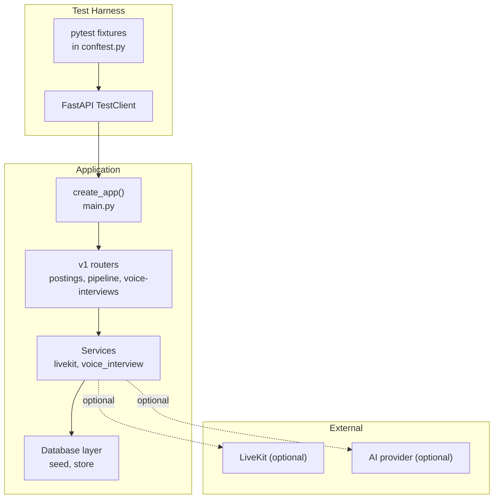
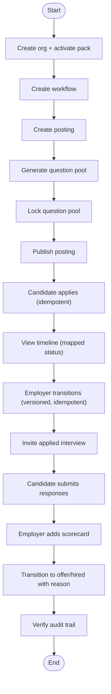
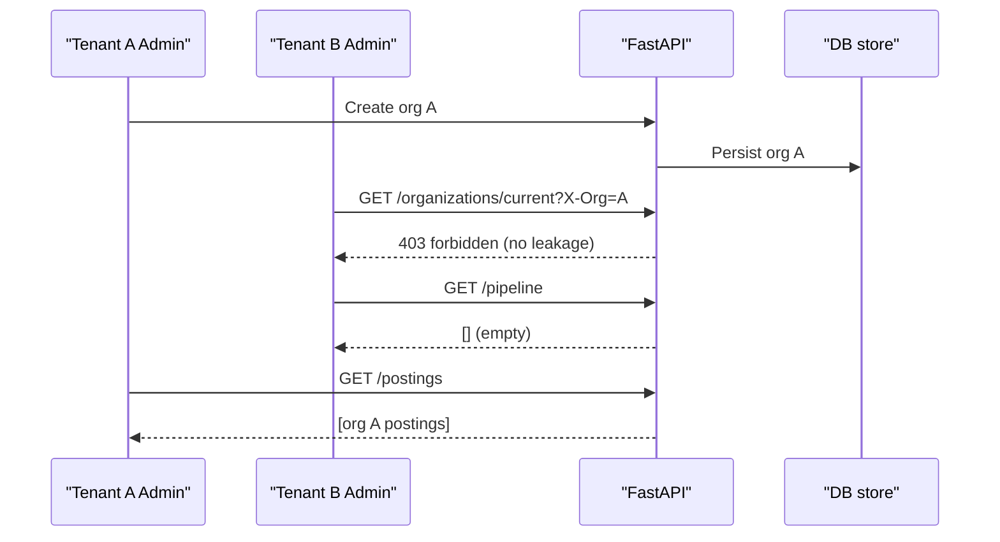
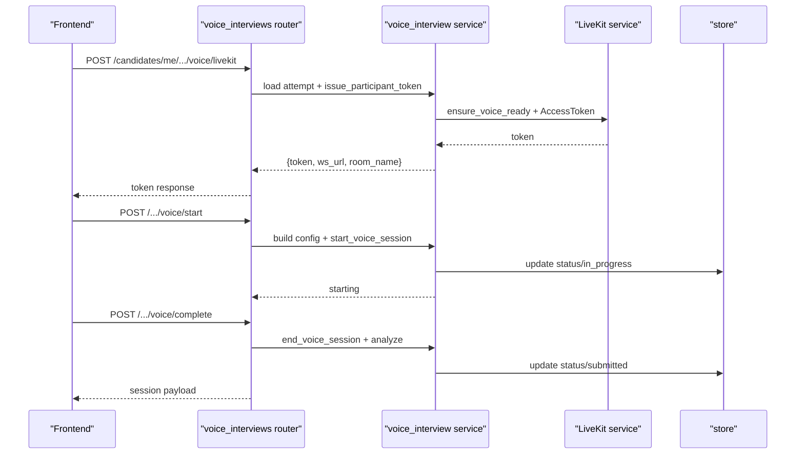
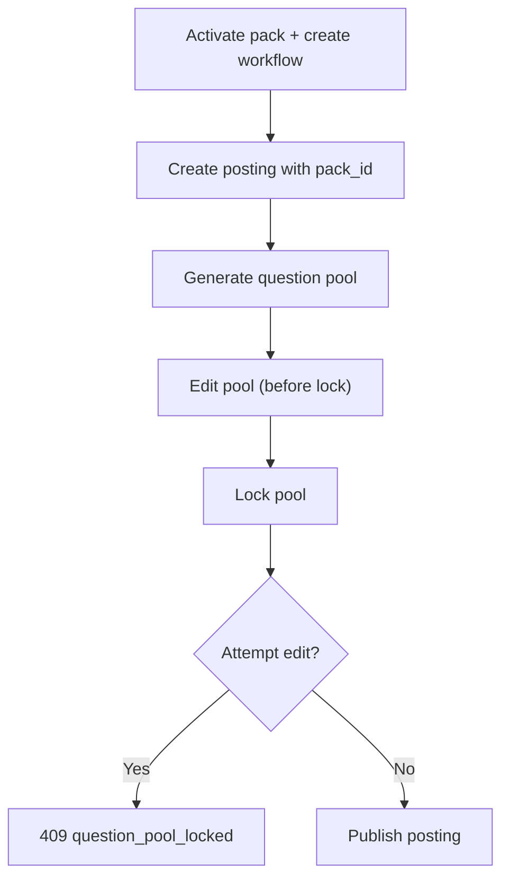
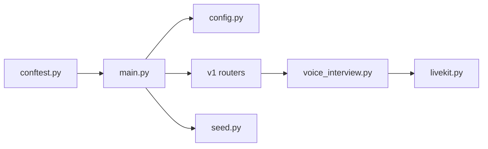

# Integration Testing

<cite>
**Referenced Files in This Document**
- [conftest.py](file://Backend/tests/conftest.py)
- [main.py](file://Backend/app/main.py)
- [seed.py](file://Backend/app/db/seed.py)
- [config.py](file://Backend/app/core/config.py)
- [livekit.py](file://Backend/app/services/livekit.py)
- [voice_interview.py](file://Backend/app/services/voice_interview.py)
- [voice_interviews.py](file://Backend/app/api/v1/voice_interviews.py)
- [test_hiring_loop.py](file://Backend/tests/test_hiring_loop.py)
- [test_tenancy.py](file://Backend/tests/test_tenancy.py)
- [test_livekit.py](file://Backend/tests/test_livekit.py)
- [test_ai.py](file://Backend/tests/test_ai.py)
- [test_workflows_and_packs.py](file://Backend/tests/test_workflows_and_packs.py)
- [docker-compose.yml](file://infrastructure/local/docker-compose.yml)
</cite>

## Table of Contents
1. [Introduction](#introduction)
2. [Project Structure](#project-structure)
3. [Core Components](#core-components)
4. [Architecture Overview](#architecture-overview)
5. [Detailed Component Analysis](#detailed-component-analysis)
6. [Dependency Analysis](#dependency-analysis)
7. [Performance Considerations](#performance-considerations)
8. [Troubleshooting Guide](#troubleshooting-guide)
9. [Conclusion](#conclusion)
10. [Appendices](#appendices)

## Introduction
This document provides comprehensive integration testing guidance for the ATS system, focusing on end-to-end workflows and cross-component interactions. It covers:
- Complete hiring loops from job posting to decision
- Multi-tenant isolation and role enforcement
- Real-time interview sessions with LiveKit and AI orchestration
- Database transactional behavior and idempotency
- Message-like flows via notifications and audit trails
- External service integrations (LiveKit, AI providers)
- Test environment setup, database seeding, mock strategies, and test data management
- Performance testing approaches for AI-heavy operations and real-time communication

## Project Structure
The backend is a FastAPI application with modular routers, services, and domain logic. Tests use pytest with an in-memory SQLite database by default and a TestClient to exercise full HTTP flows. Seed data can be enabled for development scenarios.



**Diagram sources**
- [main.py:15-58](file://Backend/app/main.py#L15-L58)
- [conftest.py:14-49](file://Backend/tests/conftest.py#L14-L49)
- [voice_interviews.py:177-384](file://Backend/app/api/v1/voice_interviews.py#L177-L384)
- [voice_interview.py:154-251](file://Backend/app/services/voice_interview.py#L154-L251)

**Section sources**
- [main.py:15-58](file://Backend/app/main.py#L15-L58)
- [conftest.py:14-49](file://Backend/tests/conftest.py#L14-L49)

## Core Components
- Test client and settings: A pytest fixture configures Settings for tests, forces SQLite, disables external SMTP/LiveKit/AI unless explicitly configured, and yields a TestClient bound to create_app().
- Application lifecycle: create_app() installs CORS, request context middleware, exception handlers, and includes v1 routers. In development with seed_demo_data enabled, it seeds demo data at startup.
- Seeding: seed_if_empty() creates organizations, users, workflows, postings, candidates, applications, and evaluations when the database is empty or needs backfill.
- Configuration: Settings centralizes all runtime configuration, including environment flags, database targets, JWT, LiveKit, and AI provider options. It exposes readiness properties like livekit_is_configured and ai_is_configured.
- Voice interviews: Services build configurations for profile screening and job interviews, issue LiveKit tokens, start/end sessions, and persist state. Endpoints expose session lifecycle and telemetry over WebSocket.

**Section sources**
- [conftest.py:14-49](file://Backend/tests/conftest.py#L14-L49)
- [main.py:15-58](file://Backend/app/main.py#L15-L58)
- [seed.py:70-85](file://Backend/app/db/seed.py#L70-L85)
- [config.py:16-177](file://Backend/app/core/config.py#L16-L177)
- [voice_interview.py:53-151](file://Backend/app/services/voice_interview.py#L53-L151)
- [voice_interviews.py:177-384](file://Backend/app/api/v1/voice_interviews.py#L177-L384)

## Architecture Overview
Integration tests drive the full stack through HTTP endpoints, exercising multi-tenant boundaries, workflow transitions, question pool generation/locking, applied interview flows, and voice interview sessions.

```mermaid
sequenceDiagram
participant Test as "pytest Test"
participant Client as "TestClient"
participant API as "FastAPI app"
participant Store as "DB store"
participant Voice as "voice_interview service"
participant LiveKit as "LiveKit service"
Test->>Client : POST /api/v1/postings
Client->>API : Create posting (with pack_id)
API->>Store : Persist posting + workflow snapshot
API-->>Client : {posting}
Test->>Client : POST /api/v1/postings/{id}/question-pool/generate
Client->>API : Generate questions (AI disabled in tests)
API-->>Client : {question_pool}
Test->>Client : POST /api/v1/postings/{id}/question-pool/lock
Client->>API : Lock pool
API-->>Client : 200 OK
Test->>Client : POST /api/v1/postings/{id}/publish
Client->>API : Publish posting
API-->>Client : 200 OK
Note over Test,Client : Candidate applies; employer moves stages; applied interview invited and completed
```

**Diagram sources**
- [test_hiring_loop.py:9-54](file://Backend/tests/test_hiring_loop.py#L9-L54)
- [test_hiring_loop.py:57-275](file://Backend/tests/test_hiring_loop.py#L57-L275)

## Detailed Component Analysis

### End-to-End Hiring Loop
This suite validates the complete hiring loop: organization creation, domain pack activation, workflow creation, posting creation, question pool generation/locking/publishing, candidate application (idempotent), timeline mapping, stage transitions with versioning and idempotency, applied interview invitation/completion/submit immutability, scorecard creation, reason-required transitions, and final hired state. It also asserts that audit records capture key actions across the flow.



**Diagram sources**
- [test_hiring_loop.py:9-54](file://Backend/tests/test_hiring_loop.py#L9-L54)
- [test_hiring_loop.py:57-275](file://Backend/tests/test_hiring_loop.py#L57-L275)

**Section sources**
- [test_hiring_loop.py:9-54](file://Backend/tests/test_hiring_loop.py#L9-L54)
- [test_hiring_loop.py:57-275](file://Backend/tests/test_hiring_loop.py#L57-L275)

### Multi-Tenant Isolation and Role Enforcement
Tests assert:
- Users without membership are denied access to tenant-scoped resources.
- Cross-tenant header usage returns nondisclosing 403 errors regardless of whether the target org exists.
- Tenant B cannot see Tenant A’s postings or pipeline entries; direct object access returns 404.
- Non-admin roles cannot configure workflows or create postings.
- Candidates cannot access employer-only endpoints.



**Diagram sources**
- [test_tenancy.py:19-48](file://Backend/tests/test_tenancy.py#L19-L48)
- [test_tenancy.py:50-86](file://Backend/tests/test_tenancy.py#L50-L86)
- [test_tenancy.py:88-116](file://Backend/tests/test_tenancy.py#L88-L116)

**Section sources**
- [test_tenancy.py:19-48](file://Backend/tests/test_tenancy.py#L19-L48)
- [test_tenancy.py:50-86](file://Backend/tests/test_tenancy.py#L50-L86)
- [test_tenancy.py:88-116](file://Backend/tests/test_tenancy.py#L88-L116)

### Real-Time Interview Sessions (Voice Interviews)
Integration points include:
- Token issuance endpoint that fails safely when credentials are missing.
- Production mode rejects caller-chosen identities.
- Voice interview endpoints manage session lifecycle: get session, obtain LiveKit token, start session, complete session, and stream telemetry via WebSocket.
- Identity verification uses a live image compared against stored avatar.



**Diagram sources**
- [voice_interviews.py:177-384](file://Backend/app/api/v1/voice_interviews.py#L177-L384)
- [voice_interview.py:154-251](file://Backend/app/services/voice_interview.py#L154-L251)
- [livekit.py:10-39](file://Backend/app/services/livekit.py#L10-L39)
- [test_livekit.py:7-37](file://Backend/tests/test_livekit.py#L7-L37)

**Section sources**
- [test_livekit.py:7-37](file://Backend/tests/test_livekit.py#L7-L37)
- [voice_interviews.py:177-384](file://Backend/app/api/v1/voice_interviews.py#L177-L384)
- [voice_interview.py:154-251](file://Backend/app/services/voice_interview.py#L154-L251)
- [livekit.py:10-39](file://Backend/app/services/livekit.py#L10-L39)

### Workflows and Domain Packs
Tests validate:
- Unknown workflow components are rejected.
- Company workflow is assembled from catalog components and fixed stages.
- Custom domain packs can be created, updated, activated, and pinned to postings.
- Locked question pools are immutable and cannot be regenerated while locked.
- Talent search and workspace search return expected results based on active packs.



**Diagram sources**
- [test_workflows_and_packs.py:14-65](file://Backend/tests/test_workflows_and_packs.py#L14-L65)
- [test_workflows_and_packs.py:67-133](file://Backend/tests/test_workflows_and_packs.py#L67-L133)
- [test_workflows_and_packs.py:135-206](file://Backend/tests/test_workflows_and_packs.py#L135-L206)
- [test_workflows_and_packs.py:208-265](file://Backend/tests/test_workflows_and_packs.py#L208-L265)

**Section sources**
- [test_workflows_and_packs.py:14-65](file://Backend/tests/test_workflows_and_packs.py#L14-L65)
- [test_workflows_and_packs.py:67-133](file://Backend/tests/test_workflows_and_packs.py#L67-L133)
- [test_workflows_and_packs.py:135-206](file://Backend/tests/test_workflows_and_packs.py#L135-L206)
- [test_workflows_and_packs.py:208-265](file://Backend/tests/test_workflows_and_packs.py#L208-L265)

### AI Features and Fallback Behavior
- When AI is not configured, question generation returns a disabled status with no questions and requires human review.
- In production, AI endpoints require trusted identity; unauthenticated requests are rejected.

**Section sources**
- [test_ai.py:9-27](file://Backend/tests/test_ai.py#L9-L27)
- [test_ai.py:30-56](file://Backend/tests/test_ai.py#L30-L56)

## Dependency Analysis
Key dependencies and their roles in integration tests:
- FastAPI TestClient drives HTTP calls against create_app(), which wires routers and middleware.
- Settings control environment-specific behavior (database, CORS, LiveKit, AI).
- Seed data populates realistic tenants, postings, and applications for end-to-end scenarios.
- Voice interview endpoints depend on voice_interview service and optionally LiveKit/AI.



**Diagram sources**
- [conftest.py:14-49](file://Backend/tests/conftest.py#L14-L49)
- [main.py:15-58](file://Backend/app/main.py#L15-L58)
- [voice_interview.py:154-251](file://Backend/app/services/voice_interview.py#L154-L251)
- [livekit.py:10-39](file://Backend/app/services/livekit.py#L10-L39)
- [seed.py:70-85](file://Backend/app/db/seed.py#L70-L85)

**Section sources**
- [conftest.py:14-49](file://Backend/tests/conftest.py#L14-L49)
- [main.py:15-58](file://Backend/app/main.py#L15-L58)
- [config.py:16-177](file://Backend/app/core/config.py#L16-L177)
- [voice_interview.py:154-251](file://Backend/app/services/voice_interview.py#L154-L251)
- [livekit.py:10-39](file://Backend/app/services/livekit.py#L10-L39)
- [seed.py:70-85](file://Backend/app/db/seed.py#L70-L85)

## Performance Considerations
- Use SQLite in tests for speed and isolation; avoid heavy AI calls by relying on disabled fallback paths in tests.
- For AI-heavy operations, consider mocking or stubbing external providers to measure API latency and throughput without external costs.
- For real-time communication scenarios (voice interviews), simulate short-lived sessions and limit transcript sizes in tests to keep runs fast.
- Batch test data creation using seed functions where appropriate to reduce setup overhead.
- Measure end-to-end durations for critical paths (e.g., question pool generation, stage transitions, voice session start/complete) and assert SLAs in CI.

[No sources needed since this section provides general guidance]

## Troubleshooting Guide
Common issues and how tests help detect them:
- Missing LiveKit configuration: Token endpoint returns 503 with integration_not_configured; ensure THOS_LIVEKIT_* variables are set for integration tests requiring voice features.
- Production security: Caller-chosen identities are rejected in production; tests enforce authentication_required for unauthorized attempts.
- AI disabled path: Question generation returns disabled status; verify metadata and human-review flags in tests.
- Idempotency conflicts: Duplicate applications and stale transitions return explicit conflict codes; tests assert correct error shapes and messages.
- Tenancy leaks: Cross-tenant access returns consistent 403 responses without leaking existence; tests compare real vs fake org responses.

**Section sources**
- [test_livekit.py:7-37](file://Backend/tests/test_livekit.py#L7-L37)
- [test_ai.py:9-56](file://Backend/tests/test_ai.py#L9-L56)
- [test_hiring_loop.py:57-275](file://Backend/tests/test_hiring_loop.py#L57-L275)
- [test_tenancy.py:19-48](file://Backend/tests/test_tenancy.py#L19-L48)

## Conclusion
The integration test suite comprehensively validates ATS workflows across hiring loops, multi-tenant isolation, voice interview sessions, and external integrations. By leveraging isolated test databases, controlled settings, and robust assertions, the suite ensures correctness, security, and resilience under realistic conditions. Extending these patterns will support future features and maintain high confidence in system behavior.

[No sources needed since this section summarizes without analyzing specific files]

## Appendices

### Test Environment Setup
- Local infrastructure: PostgreSQL container defined for local development and integration tests that require Postgres.
- Test database: Tests default to SQLite via Settings to ensure isolation and speed.
- Seeding: Enable seed_demo_data in development to populate realistic data; tests can rely on seed functions or create minimal data per scenario.
- Mock services: Disable external integrations (SMTP, LiveKit, AI) in tests unless explicitly configured; tests assert safe failure modes when missing.

**Section sources**
- [docker-compose.yml:1-24](file://infrastructure/local/docker-compose.yml#L1-L24)
- [conftest.py:14-49](file://Backend/tests/conftest.py#L14-L49)
- [config.py:16-177](file://Backend/app/core/config.py#L16-L177)
- [seed.py:70-85](file://Backend/app/db/seed.py#L70-L85)