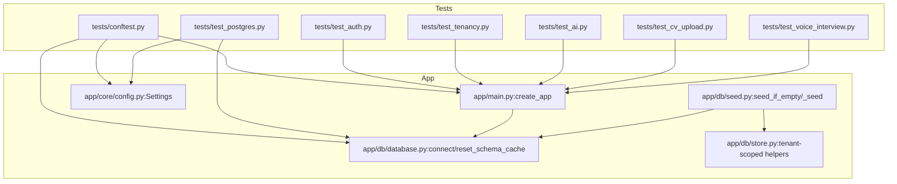
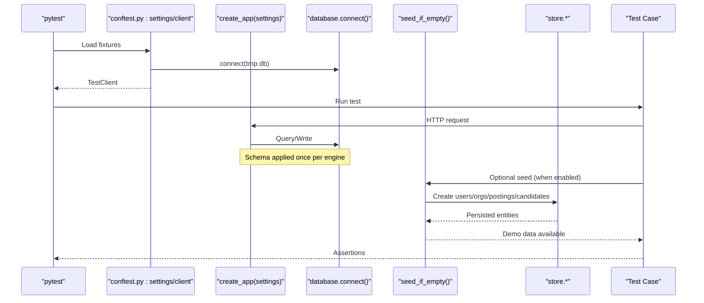
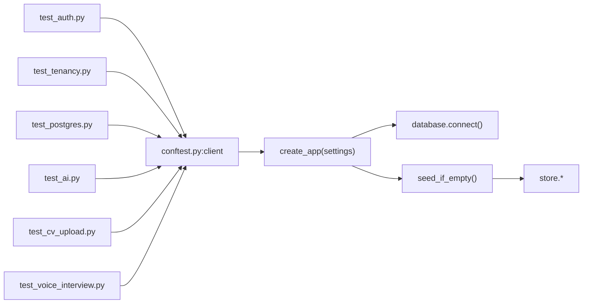

# Test Data Management

<cite>
**Referenced Files in This Document**
- [conftest.py](file://Backend/tests/conftest.py)
- [database.py](file://Backend/app/db/database.py)
- [seed.py](file://Backend/app/db/seed.py)
- [store.py](file://Backend/app/db/store.py)
- [test_auth.py](file://Backend/tests/test_auth.py)
- [test_postgres.py](file://Backend/tests/test_postgres.py)
- [test_tenancy.py](file://Backend/tests/test_tenancy.py)
- [test_ai.py](file://Backend/tests/test_ai.py)
- [test_cv_upload.py](file://Backend/tests/test_cv_upload.py)
- [test_voice_interview.py](file://Backend/tests/test_voice_interview.py)
</cite>

## Table of Contents
1. Introduction
2. Project Structure
3. Core Components
4. Architecture Overview
5. Detailed Component Analysis
6. Dependency Analysis
7. Performance Considerations
8. Troubleshooting Guide
9. Conclusion

## Introduction
This document explains how the ATS backend manages test data to support reliable, isolated, and parallelizable tests. It covers strategies for creating realistic test data using fixtures and seed data, database testing with transactional isolation and per-test databases, and mocking approaches for external services such as AI providers, file storage, and voice interview infrastructure. It also provides concrete examples of building fixtures for users, organizations, jobs (postings), candidates, and interview sessions, along with best practices for maintaining consistency across test suites.

## Project Structure
The test data strategy spans several layers:
- Test configuration and client setup via pytest fixtures
- A synthetic seed script that creates realistic multi-tenant demo data
- A tenant-scoped store layer over a portable database abstraction
- Tests that exercise authentication, tenancy, CV upload, AI endpoints, and voice interviews

**Diagram sources**
- [conftest.py:14-45](file://Backend/tests/conftest.py#L14-L45)
- [database.py:508-521](file://Backend/app/db/database.py#L508-L521)
- [seed.py:70-86](file://Backend/app/db/seed.py#L70-L86)
- [store.py:1-20](file://Backend/app/db/store.py#L1-L20)

**Section sources**
- [conftest.py:14-45](file://Backend/tests/conftest.py#L14-L45)
- [database.py:508-521](file://Backend/app/db/database.py#L508-L521)
- [seed.py:70-86](file://Backend/app/db/seed.py#L70-L86)
- [store.py:1-20](file://Backend/app/db/store.py#L1-L20)

## Core Components
- Test client fixture: Provides an isolated FastAPI TestClient backed by a temporary SQLite database and disabled external integrations.
- Settings override: Forces test environment, disables SMTP, sets a safe JWT secret, and points to a local domain packs directory.
- Seed data generator: Creates realistic multi-tenant demo data including users, organizations, units, postings, candidates, applications, profile/applied interviews, and notifications.
- Database abstraction: Supports both PostgreSQL and SQLite with schema migrations and connection management; includes a cache reset utility for test isolation.
- Tenant-scoped store: Encapsulates all persistence operations with explicit tenant scoping and audit/outbox/idempotency records.

Key responsibilities:
- Isolation: Each test suite runs against a fresh SQLite file under tmp_path, preventing cross-test pollution.
- Realism: Seed data models real-world scenarios (multiple orgs, workflows, postings, candidate pipelines).
- Determinism: Seed is idempotent and only runs when no users exist, avoiding duplication on restarts.
- External service isolation: Tests disable or stub out AI, LiveKit, and SMTP where appropriate.

**Section sources**
- [conftest.py:14-45](file://Backend/tests/conftest.py#L14-L45)
- [database.py:508-521](file://Backend/app/db/database.py#L508-L521)
- [seed.py:70-86](file://Backend/app/db/seed.py#L70-L86)
- [store.py:1-20](file://Backend/app/db/store.py#L1-L20)

## Architecture Overview
The test architecture ensures isolation and realism through layered fixtures and seed data:

**Diagram sources**
- [conftest.py:14-45](file://Backend/tests/conftest.py#L14-L45)
- [database.py:508-521](file://Backend/app/db/database.py#L508-L521)
- [seed.py:70-86](file://Backend/app/db/seed.py#L70-L86)
- [store.py:1-20](file://Backend/app/db/store.py#L1-L20)

## Detailed Component Analysis

### Test Client and Settings Fixture
- The settings fixture configures a test-only environment:
  - Uses a temporary SQLite database path under tmp_path for full isolation.
  - Disables SMTP and LiveKit to avoid external dependencies.
  - Sets a deterministic JWT secret and development identity header behavior.
  - Points to domain packs for realistic workflow and interview content.
- The client fixture wraps create_app with TestClient, ensuring each test gets a clean app instance.

Best practices:
- Use the provided client fixture for API-level tests to inherit isolation.
- For tests requiring Postgres, use the dedicated fixture pattern shown in the live-Postgres smoke test.

**Section sources**
- [conftest.py:14-45](file://Backend/tests/conftest.py#L14-L45)
- [test_postgres.py:39-55](file://Backend/tests/test_postgres.py#L39-L55)

### Seed Data Generator
- Idempotent seeding: Only runs when there are no users; backfills missing password hashes for existing rows.
- Multi-tenant demo data:
  - Users: superadmin and multiple staff/candidate identities.
  - Organizations: Two universities with memberships and units.
  - Workflows: Default workflow versions published per organization.
  - Postings: Multiple job postings with optional question pools from domain packs.
  - Candidates: Profiles with skills, credentials, and consents.
  - Applications: Staged pipeline transitions with audit records.
  - Interviews: Profile and applied interview attempts with evaluations and notifications.

Usage patterns:
- Enable seed_demo_data in settings for integration tests that need rich baseline data.
- Disable seed_demo_data for unit tests that prefer minimal, controlled state.

**Section sources**
- [seed.py:70-86](file://Backend/app/db/seed.py#L70-L86)
- [seed.py:88-188](file://Backend/app/db/seed.py#L88-L188)
- [seed.py:202-301](file://Backend/app/db/seed.py#L202-L301)
- [seed.py:303-373](file://Backend/app/db/seed.py#L303-L373)
- [seed.py:374-473](file://Backend/app/db/seed.py#L374-L473)

### Database Abstraction and Migration
- Portable engine: Works with SQLite for tests and PostgreSQL for integration/smoke tests.
- Schema application: DDL is applied once per engine with migration helpers for new columns.
- Connection lifecycle: Ensures foreign keys and WAL mode for SQLite; uses dict rows for consistent access.
- Cache reset: reset_schema_cache clears initialization tracking so tests can reuse engines safely.

Implications for tests:
- Use reset_schema_cache before switching databases or reinitializing schemas.
- Prefer tmp_path-based SQLite files for complete isolation between test runs.

**Section sources**
- [database.py:19-331](file://Backend/app/db/database.py#L19-L331)
- [database.py:462-505](file://Backend/app/db/database.py#L462-L505)
- [database.py:508-521](file://Backend/app/db/database.py#L508-L521)

### Tenant-Scoped Store Layer
- All mutations and queries take explicit tenant_id or are scoped by ownership.
- Includes helpers for users, organizations, memberships, postings, candidates, applications, interviews, audits, outbox events, and idempotency.
- Ensures consistent state changes with transactions and audit trails.

Testing implications:
- Build fixtures by calling store functions directly when you need fine-grained control over test data.
- Validate tenant isolation by asserting cross-tenant access denial in tests.

**Section sources**
- [store.py:1-20](file://Backend/app/db/store.py#L1-L20)
- [store.py:23-61](file://Backend/app/db/store.py#L23-L61)
- [store.py:64-108](file://Backend/app/db/store.py#L64-L108)

### Authentication and Identity Fixtures
- Development identity header: Tests authenticate via X-Development-Identity without passwords for speed and simplicity.
- Registration/login flows: Tests register users, obtain tokens, refresh, and verify logout semantics.
- Superadmin flows: Admin endpoints used to verify organizations and manage tenants.

Fixture guidance:
- Use the provided client fixture and set headers via as_identity helper for quick authenticated requests.
- For production-like checks, spin up a separate client with production settings and required auth.

**Section sources**
- [test_auth.py:21-53](file://Backend/tests/test_auth.py#L21-L53)
- [test_auth.py:66-105](file://Backend/tests/test_auth.py#L66-L105)
- [test_auth.py:162-166](file://Backend/tests/test_auth.py#L162-L166)
- [conftest.py:48-50](file://Backend/tests/conftest.py#L48-L50)

### Tenancy and Access Control
- Cross-tenant denial: Tests assert that users cannot access another tenant’s resources and that non-existent IDs do not leak existence information.
- Role enforcement: Non-admin roles are blocked from configuration endpoints.
- Candidate vs employer boundaries: Candidate accounts cannot access employer endpoints.

Fixture guidance:
- Create separate clients or reuse one client with different identity headers to simulate multiple tenants.
- Assert consistent error shapes for forbidden and not found responses to prevent leakage.

**Section sources**
- [test_tenancy.py:19-48](file://Backend/tests/test_tenancy.py#L19-L48)
- [test_tenancy.py:50-85](file://Backend/tests/test_tenancy.py#L50-L85)
- [test_tenancy.py:88-116](file://Backend/tests/test_tenancy.py#L88-L116)

### AI Service Mocking Strategy
- Disabled fallback: When AI is not configured, endpoints return deterministic “disabled” responses with metadata.
- Production guard: In production-like settings, unauthenticated requests to AI endpoints are rejected.

Mocking approach:
- Rely on configuration to disable AI calls during tests.
- Validate response shape and metadata rather than actual AI outputs.

**Section sources**
- [test_ai.py:9-27](file://Backend/tests/test_ai.py#L9-L27)
- [test_ai.py:30-56](file://Backend/tests/test_ai.py#L30-L56)

### File Storage and CV Upload Testing
- In-memory file generation: Tests construct DOCX and PDF bytes locally to avoid filesystem dependencies.
- Endpoint coverage: Upload endpoint parses CVs, returns source format, and indicates embedding availability.

Mocking approach:
- Avoid real storage backends by relying on in-memory bytes and assertions on parsed results.
- If storage side effects must be tested, mount a temporary directory and assert paths returned by the API.

**Section sources**
- [test_cv_upload.py:21-70](file://Backend/tests/test_cv_upload.py#L21-L70)
- [test_cv_upload.py:73-113](file://Backend/tests/test_cv_upload.py#L73-L113)

### Voice Interview and LiveKit Integration
- Readiness checks: ensure_voice_ready raises a specific error when LiveKit/AI configuration is missing.
- Strategy selection: get_interview_strategy returns context-appropriate language based on interview type.

Mocking approach:
- Configure LiveKit and AI keys to None in tests to force readiness failures or disabled behaviors.
- Validate error codes and status codes rather than invoking real media servers.

**Section sources**
- [test_voice_interview.py:12-22](file://Backend/tests/test_voice_interview.py#L12-L22)
- [test_voice_interview.py:24-38](file://Backend/tests/test_voice_interview.py#L24-L38)
- [test_voice_interview.py:40-50](file://Backend/tests/test_voice_interview.py#L40-L50)

### Example Fixtures for Common Entities
Below are recommended patterns derived from the codebase to build reusable fixtures for your own tests:

- Users
  - Use store.get_or_create_user for dev-header identities.
  - Use store.create_user for explicit email/password-backed users.
  - Reference: [store.py:23-61](file://Backend/app/db/store.py#L23-L61), [store.py:64-108](file://Backend/app/db/store.py#L64-L108)

- Organizations and Memberships
  - Create organizations via store.create_organization and add members with store.add_member.
  - Reference: [seed.py:113-128](file://Backend/app/db/seed.py#L113-L128)

- Postings (Jobs)
  - Create postings with store.create_posting, optionally attaching question pools from domain packs.
  - Reference: [seed.py:202-301](file://Backend/app/db/seed.py#L202-L301)

- Candidates
  - Create or link candidates via store.get_or_create_candidate and update profiles with store.update_candidate.
  - Reference: [seed.py:303-339](file://Backend/app/db/seed.py#L303-L339)

- Interview Sessions
  - Create profile or applied interview attempts via store.create_profile_attempt / store.create_applied_attempt and save responses and evaluations.
  - Reference: [seed.py:341-373](file://Backend/app/db/seed.py#L341-L373), [seed.py:417-451](file://Backend/app/db/seed.py#L417-L451)

- Applications and Pipeline Transitions
  - Create applications and record stage transitions with store.record_transition to simulate pipeline movement.
  - Reference: [seed.py:374-416](file://Backend/app/db/seed.py#L374-L416)

**Section sources**
- [store.py:23-61](file://Backend/app/db/store.py#L23-L61)
- [store.py:64-108](file://Backend/app/db/store.py#L64-L108)
- [seed.py:113-128](file://Backend/app/db/seed.py#L113-L128)
- [seed.py:202-301](file://Backend/app/db/seed.py#L202-L301)
- [seed.py:303-373](file://Backend/app/db/seed.py#L303-L373)
- [seed.py:374-416](file://Backend/app/db/seed.py#L374-L416)
- [seed.py:417-451](file://Backend/app/db/seed.py#L417-L451)

## Dependency Analysis
The following diagram shows how tests depend on core components for data and execution:

**Diagram sources**
- [conftest.py:14-45](file://Backend/tests/conftest.py#L14-L45)
- [database.py:508-521](file://Backend/app/db/database.py#L508-L521)
- [seed.py:70-86](file://Backend/app/db/seed.py#L70-L86)
- [store.py:1-20](file://Backend/app/db/store.py#L1-L20)

**Section sources**
- [conftest.py:14-45](file://Backend/tests/conftest.py#L14-L45)
- [database.py:508-521](file://Backend/app/db/database.py#L508-L521)
- [seed.py:70-86](file://Backend/app/db/seed.py#L70-L86)
- [store.py:1-20](file://Backend/app/db/store.py#L1-L20)

## Performance Considerations
- Prefer SQLite in tests for speed and isolation; it avoids network overhead and simplifies teardown.
- Reuse the settings fixture to avoid repeated setup costs.
- Limit seed usage to integration tests that require rich data; unit tests should create minimal necessary state.
- Keep test payloads small and focused to reduce serialization and parsing time.
- Avoid unnecessary external calls by disabling AI/LiveKit/SMTP in tests.

[No sources needed since this section provides general guidance]

## Troubleshooting Guide
Common issues and resolutions:
- Schema cache collisions across tests: Call reset_schema_cache before switching databases or reinitializing schemas to ensure clean state.
- Unreachable Postgres in smoke tests: Tests skip automatically if the database URL is unreachable; configure THOS_DATABASE_URL appropriately.
- Missing configuration for voice interviews: Ensure LiveKit and AI keys are set when enabling voice features; otherwise expect readiness errors.
- Duplicate seed data: Seed runs only when no users exist; if you need a clean slate, drop or replace the test database file.

**Section sources**
- [database.py:519-521](file://Backend/app/db/database.py#L519-L521)
- [test_postgres.py:20-36](file://Backend/tests/test_postgres.py#L20-L36)
- [test_voice_interview.py:40-50](file://Backend/tests/test_voice_interview.py#L40-L50)
- [seed.py:70-86](file://Backend/app/db/seed.py#L70-L86)

## Conclusion
The ATS backend employs a robust test data management strategy centered on isolated SQLite databases, configurable settings, and a comprehensive seed generator for realistic multi-tenant scenarios. Tests leverage fixtures to maintain isolation, determinism, and speed while mocking external services to keep suites fast and reliable. By following the patterns outlined here—using store helpers for precise fixture creation, leveraging seed data for integration tests, and configuring external dependencies—you can build scalable, maintainable tests across user, organization, job, candidate, and interview session domains.

[No sources needed since this section summarizes without analyzing specific files]