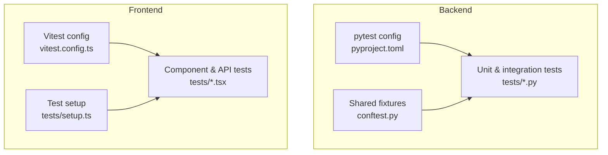
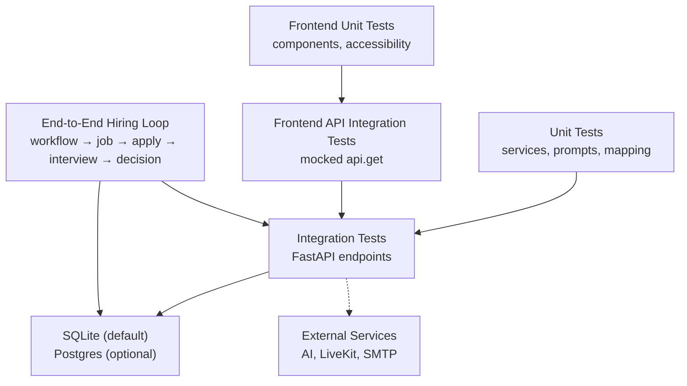
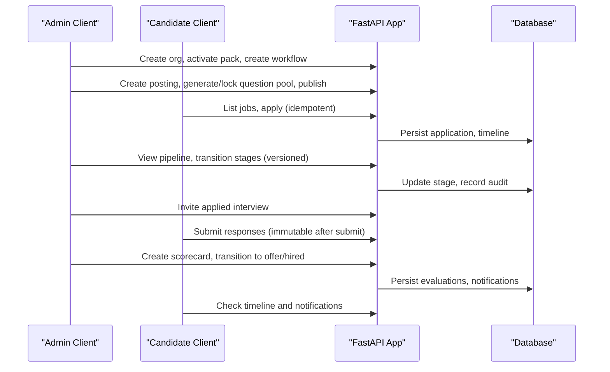
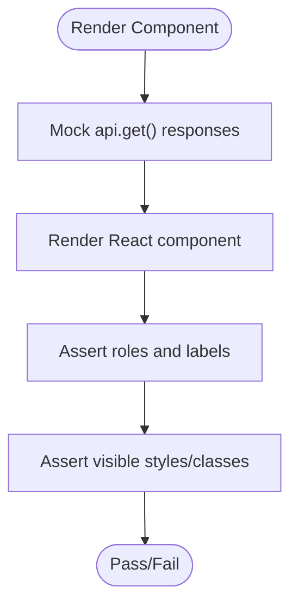
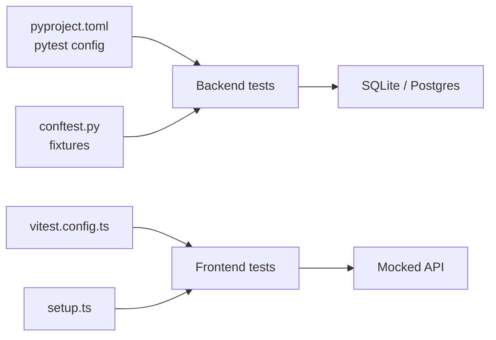

# Testing Strategy

<cite>
**Referenced Files in This Document**
- [Backend/tests/conftest.py](file://Backend/tests/conftest.py)
- [Backend/pyproject.toml](file://Backend/pyproject.toml)
- [Backend/tests/test_ai.py](file://Backend/tests/test_ai.py)
- [Backend/tests/test_hiring_loop.py](file://Backend/tests/test_hiring_loop.py)
- [Backend/tests/test_postgres.py](file://Backend/tests/test_postgres.py)
- [Backend/tests/test_voice_interview.py](file://Backend/tests/test_voice_interview.py)
- [Backend/tests/test_cv_upload.py](file://Backend/tests/test_cv_upload.py)
- [Backend/tests/test_matching.py](file://Backend/tests/test_matching.py)
- [Frontend/vitest.config.ts](file://Frontend/vitest.config.ts)
- [Frontend/tests/setup.ts](file://Frontend/tests/setup.ts)
- [Frontend/package.json](file://Frontend/package.json)
- [Frontend/tests/components.test.tsx](file://Frontend/tests/components.test.tsx)
- [Frontend/tests/dashboard.test.tsx](file://Frontend/tests/dashboard.test.tsx)
</cite>

## Table of Contents
1. Introduction
2. Project Structure
3. Core Components
4. Architecture Overview
5. Detailed Component Analysis
6. Dependency Analysis
7. Performance Considerations
8. Troubleshooting Guide
9. Conclusion

## Introduction
This document describes the multi-layered testing strategy for the ATS system, covering backend unit and integration tests with pytest, frontend component and API-integration tests with Vitest, end-to-end flows across the hiring pipeline, test data management, coverage reporting, continuous integration setup, and performance testing approaches for AI-heavy operations. It is designed to be accessible to both technical and non-technical readers while providing precise references to source files.

## Project Structure
The testing strategy spans two main areas:
- Backend (Python/FastAPI): pytest-based tests under Backend/tests, configuration via pyproject.toml, and shared fixtures in conftest.py.
- Frontend (Next.js/React): Vitest-based tests under Frontend/tests with jsdom environment and a minimal setup file.

**Diagram sources**
- [Backend/pyproject.toml:45-48](file://Backend/pyproject.toml#L45-L48)
- [Backend/tests/conftest.py:14-49](file://Backend/tests/conftest.py#L14-L49)
- [Frontend/vitest.config.ts:4-16](file://Frontend/vitest.config.ts#L4-L16)
- [Frontend/tests/setup.ts:1-2](file://Frontend/tests/setup.ts#L1-L2)

**Section sources**
- [Backend/pyproject.toml:45-48](file://Backend/pyproject.toml#L45-L48)
- [Backend/tests/conftest.py:14-49](file://Backend/tests/conftest.py#L14-L49)
- [Frontend/vitest.config.ts:4-16](file://Frontend/vitest.config.ts#L4-L16)
- [Frontend/tests/setup.ts:1-2](file://Frontend/tests/setup.ts#L1-L2)

## Core Components
- Backend test harness:
  - Pytest configuration defines test discovery and options.
  - Shared fixtures provide an isolated SQLite database per run, disabled SMTP, and a TestClient over the FastAPI app.
  - Identity header injection enables developer-mode authentication without real JWTs.
- Frontend test harness:
  - Vitest configured with jsdom, automatic JSX, and a global setup that extends assertions.
  - Tests can mock the API layer to simulate responses for components.

Key responsibilities:
- Isolation: Each test runs against a temporary SQLite store or optional live Postgres when explicitly enabled.
- Determinism: External services (AI, LiveKit, SMTP) are disabled or guarded by configuration checks.
- Reusability: Fixtures centralize client creation and identity headers.

**Section sources**
- [Backend/pyproject.toml:45-48](file://Backend/pyproject.toml#L45-L48)
- [Backend/tests/conftest.py:14-49](file://Backend/tests/conftest.py#L14-L49)
- [Frontend/vitest.config.ts:4-16](file://Frontend/vitest.config.ts#L4-L16)
- [Frontend/tests/setup.ts:1-2](file://Frontend/tests/setup.ts#L1-L2)

## Architecture Overview
The testing architecture layers from unit to end-to-end:

**Diagram sources**
- [Backend/tests/conftest.py:14-49](file://Backend/tests/conftest.py#L14-L49)
- [Backend/tests/test_postgres.py:39-55](file://Backend/tests/test_postgres.py#L39-L55)
- [Frontend/tests/dashboard.test.tsx:5-33](file://Frontend/tests/dashboard.test.tsx#L5-L33)
- [Backend/tests/test_hiring_loop.py:57-275](file://Backend/tests/test_hiring_loop.py#L57-L275)

## Detailed Component Analysis

### Backend Unit Testing Strategy
Focus areas:
- Prompt strategies and evaluation mapping: verify language and scoring behavior without calling external AI.
- Voice readiness guard: ensure missing configuration raises a specific error.
- CV extraction: validate supported formats and rejection of legacy formats using in-memory bytes.

Patterns:
- Direct function calls on service modules.
- Minimal fixtures; no HTTP layer required.
- Assertions on structured outputs and error codes.

Example references:
- Interview strategy selection and human-friendly language.
- Report-to-evaluation mapping with scaling and human review flags.
- Voice readiness validation raising a 503-like error when configuration is absent.
- PDF/DOCX text extraction and endpoint upload behavior.

**Section sources**
- [Backend/tests/test_voice_interview.py:12-49](file://Backend/tests/test_voice_interview.py#L12-L49)
- [Backend/tests/test_cv_upload.py:73-113](file://Backend/tests/test_cv_upload.py#L73-L113)

### Backend Integration Testing Strategy
Focus areas:
- API endpoints with isolated SQLite database per test.
- Authentication via development identity header.
- Optional live Postgres smoke tests when reachable.

Patterns:
- Use TestClient to exercise full request/response cycles.
- Seed or create necessary domain entities within tests.
- Skip heavy integrations unless explicitly available.

Example references:
- Default SQLite-backed client fixture for all tests.
- Optional Postgres tests that skip if unreachable and seed demo data.
- Health and request ID middleware tests.

**Section sources**
- [Backend/tests/conftest.py:14-49](file://Backend/tests/conftest.py#L14-L49)
- [Backend/tests/test_postgres.py:20-72](file://Backend/tests/test_postgres.py#L20-L72)

### Backend End-to-End Hiring Loop
Focus areas:
- Full lifecycle: organization setup, workflow activation, posting creation, question pool generation/lock/publish, application submission, timeline visibility, stage transitions with versioning and idempotency, applied interview invitation/submit, scorecard creation, offer/hired transitions, notifications, and audit trail.

Patterns:
- Single test orchestrates multiple endpoints to validate state transitions and business rules.
- Idempotency keys prevent duplicate side effects.
- Versioned transitions protect against concurrent updates.

**Diagram sources**
- [Backend/tests/test_hiring_loop.py:57-275](file://Backend/tests/test_hiring_loop.py#L57-L275)

**Section sources**
- [Backend/tests/test_hiring_loop.py:57-275](file://Backend/tests/test_hiring_loop.py#L57-L275)

### Backend AI and Matching Tests
Focus areas:
- AI feature gating: ensure deterministic fallback when AI is disabled and enforce trusted identity in production.
- Proactive matching: publishing a posting triggers consent-safe matching for candidates who opted in.

Patterns:
- Configure settings to disable AI or require trusted identity.
- Simulate candidate profile preparation and interview attempts to build match signals.
- Assert match counts, scores, reasons, and notifications.

**Section sources**
- [Backend/tests/test_ai.py:9-56](file://Backend/tests/test_ai.py#L9-L56)
- [Backend/tests/test_matching.py:9-100](file://Backend/tests/test_matching.py#L9-L100)

### Frontend Testing Strategy
Focus areas:
- Component tests: render UI components, assert roles, labels, and styling classes.
- Accessibility: verify ARIA labels and assistive technology exposure.
- API integration simulation: mock the API module to return stable payloads for dashboard rendering.

Patterns:
- Use jsdom environment for DOM APIs.
- Extend assertions with jest-dom matchers.
- Mock network calls at the API layer to isolate UI logic.

**Diagram sources**
- [Frontend/tests/components.test.tsx:6-21](file://Frontend/tests/components.test.tsx#L6-L21)
- [Frontend/tests/dashboard.test.tsx:5-45](file://Frontend/tests/dashboard.test.tsx#L5-L45)

**Section sources**
- [Frontend/vitest.config.ts:4-16](file://Frontend/vitest.config.ts#L4-L16)
- [Frontend/tests/setup.ts:1-2](file://Frontend/tests/setup.ts#L1-L2)
- [Frontend/tests/components.test.tsx:6-21](file://Frontend/tests/components.test.tsx#L6-L21)
- [Frontend/tests/dashboard.test.tsx:5-45](file://Frontend/tests/dashboard.test.tsx#L5-L45)

## Dependency Analysis
Testing dependencies and relationships:
- Backend tests depend on FastAPI TestClient and Pydantic Settings for isolation.
- Optional Postgres tests depend on psycopg connectivity and environment variables.
- Frontend tests depend on Vitest, jsdom, and testing-library utilities.
- All tests avoid real external services by configuration or mocking.

**Diagram sources**
- [Backend/pyproject.toml:45-48](file://Backend/pyproject.toml#L45-L48)
- [Backend/tests/conftest.py:14-49](file://Backend/tests/conftest.py#L14-L49)
- [Frontend/vitest.config.ts:4-16](file://Frontend/vitest.config.ts#L4-L16)
- [Frontend/tests/setup.ts:1-2](file://Frontend/tests/setup.ts#L1-L2)

**Section sources**
- [Backend/pyproject.toml:45-48](file://Backend/pyproject.toml#L45-L48)
- [Backend/tests/conftest.py:14-49](file://Backend/tests/conftest.py#L14-L49)
- [Frontend/vitest.config.ts:4-16](file://Frontend/vitest.config.ts#L4-L16)
- [Frontend/tests/setup.ts:1-2](file://Frontend/tests/setup.ts#L1-L2)

## Performance Considerations
- Prefer SQLite for fast, isolated unit and integration tests; use optional Postgres only for targeted smoke tests.
- Avoid calling AI providers in tests; rely on deterministic fallbacks and configuration guards.
- Keep end-to-end tests focused on critical paths to minimize runtime.
- For AI-heavy operations, consider:
  - Measuring latency of mocked endpoints to detect regressions.
  - Using small, fixed payloads to stabilize timing.
  - Adding timeouts and retries in tests that interact with third-party services.

[No sources needed since this section provides general guidance]

## Troubleshooting Guide
Common issues and resolutions:
- Missing external services:
  - AI/LiveKit/SMTP disabled by default in tests; ensure configuration sets appropriate values or expect guarded errors.
- Database connectivity:
  - Optional Postgres tests skip automatically when unreachable; set THOS_DATABASE_URL to enable.
- Authentication:
  - Use X-Development-Identity header for tests; production mode requires trusted identity.
- File uploads:
  - Ensure correct MIME types and supported formats; legacy formats raise explicit errors.

**Section sources**
- [Backend/tests/test_voice_interview.py:40-49](file://Backend/tests/test_voice_interview.py#L40-L49)
- [Backend/tests/test_postgres.py:20-36](file://Backend/tests/test_postgres.py#L20-L36)
- [Backend/tests/test_ai.py:30-56](file://Backend/tests/test_ai.py#L30-L56)
- [Backend/tests/test_cv_upload.py:87-93](file://Backend/tests/test_cv_upload.py#L87-L93)

## Conclusion
The ATS testing strategy combines isolated unit tests, robust integration tests with SQLite and optional Postgres, and frontend component/API tests with Vitest. End-to-end scenarios validate the complete hiring pipeline with strong guarantees around idempotency, versioning, and auditability. External dependencies are consistently mocked or disabled to ensure deterministic, fast, and reliable test execution.

[No sources needed since this section summarizes without analyzing specific files]