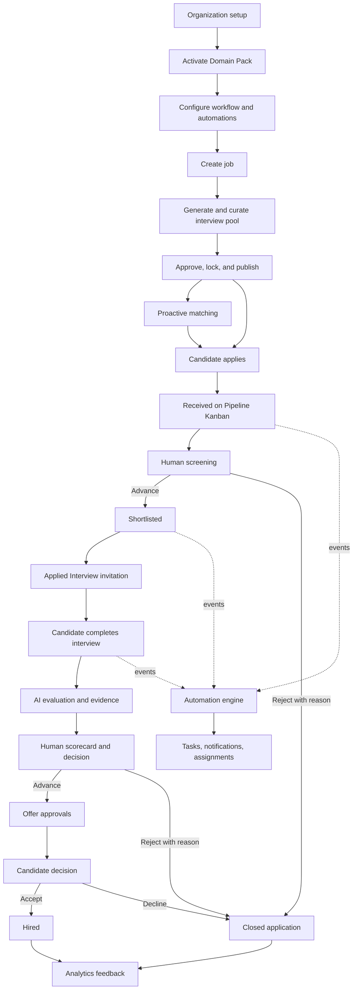

# THOS — Development Specification
**A National AI Talent Hiring Operating System**
Universal Hiring Engine + swappable Domain Intelligence Packs, with a Two-Stage AI Interview System.

Version: Revision 2 (July 2026) — Development reference derived from the formal proposal.
This document is written for engineering use: architecture, services, data model, APIs, and build phases. For business framing, see the formal proposal document.

---

## 1. System Overview

THOS is a multi-tenant SaaS hiring platform split into two strict layers:

| Layer | Contains | Changes per industry? |
|---|---|---|
| **Layer 1 — Universal Hiring Engine** | Auth, multi-tenancy, ATS, profiles, interview orchestration, sandbox execution, matching/notification, search, analytics | No — built once |
| **Layer 2 — Domain Intelligence Packs** | Ontology, knowledge graph, resume extraction rules, question generators, rubrics, compliance rules | Yes — one pack per industry |

**Golden rule for engineers:** if code contains an `if (domain === "education")` branch anywhere outside the Domain Pack Registry / pack loader, that is an architecture violation. All domain behavior must be data/config loaded from the active pack, not hardcoded in the engine.

**Phase 1 target:** ship the engine + one pack (Education, formerly "PATN") end-to-end, technical- and non-technical-task paths both working, so Phase 3's second pack (Software Engineering) proves the architecture without touching engine code.

---

## 2. Microservice Breakdown

| Service | Responsibility | Notes for implementation |
|---|---|---|
| Authentication Service | Identity, RBAC, tenant isolation | JWT/OAuth2; tenant_id scoping on every token |
| Organization Management Service | Units, departments/campuses, business units, config | Tree structure per org; role assignment |
| Profile Management Service | Candidate/member profiles, verification, credentials, Skill Score history | Stores both Profile Interview and Applied Interview results per candidate |
| ATS Service | Postings, pipeline stages, applications | Configurable stage machine: `Received → Screened → Shortlisted → Applied Interview → Offer → Hired` |
| Domain Pack Registry | Loads, versions, serves active pack's ontology/graph/generators/rubrics | Central plugin boundary — see §4 |
| Two-Stage Interview Orchestration Service | Generic session mechanics for Profile & Applied Interviews (sequencing, timing, follow-ups, recording) | Domain-agnostic; calls into the active pack for question/rubric content only |
| Practical Assessment Sandbox Service | Isolated multi-language code execution + structured scenario workspace | Docker/Judge0-style; reports back to pack's rubric engine |
| Proactive Matching & Notification Service | Event-driven; compares new postings against candidate pool, dispatches notifications | Kafka (or managed equivalent) consumer/producer |
| Messaging Service | Internal chat tied to job/candidate records | — |
| Analytics Service | Time-to-hire, pipeline conversion, notification→application→hire funnel | Feed conversion data back into pack matching weights (§6.4) |
| Search Service | Talent Discovery Engine — filter by expertise, qualification, Skill Score, availability | OpenSearch-backed |
| Notification Service | Email/SMS/in-app dispatch | — |

### Recommended data infrastructure
- **PostgreSQL** — transactional data (orgs, users, applications, ATS state)
- **OpenSearch** — full-text and faceted search (Talent Discovery Engine)
- **Neo4j** (or equivalent graph DB) — domain knowledge graphs, talent-network relationships
- **Docker-based sandbox runtime** (Judge0-style) — isolated code execution
- **Kafka** (or managed equivalent) — event bus for proactive matching pipeline
- **Object storage (S3-compatible)** — resumes, transcripts, interview recordings

---

## 3. Core Data Entities

```
Organization
 ├─ id, name, type (university | company), verification_status
 ├─ units[]            (campuses / departments / business units)
 ├─ domain_packs[]      (active pack ids + versions)
 └─ hiring_workflow_config (stage order, thresholds, required docs)

Candidate
 ├─ id, profile, resume_raw, resume_parsed
 ├─ target_domains[]    (roles/fields they've selected)
 ├─ profile_interviews[]  → ProfileInterviewAttempt[]
 └─ applications[]      → Application

Posting (Job/Requisition)
 ├─ id, org_id, unit_id, domain_pack_id
 ├─ job_description_raw / course_outline_raw
 ├─ applied_interview_question_pool  (AI-generated, org-curated)
 ├─ custom_closing_questions[]
 └─ pipeline_stage_config

Application
 ├─ candidate_id, posting_id, stage (enum, ATS pipeline)
 ├─ cv_match_score
 ├─ aptitude/profile_score_snapshot
 └─ applied_interview_attempt  (exactly one, immutable once submitted)

ProfileInterviewAttempt
 ├─ id, candidate_id, domain_pack_id, attempt_number
 ├─ transcript, practical_task_submission
 ├─ skill_score, strengths_gaps_summary
 └─ visibility (best | most_recent | all — org-configurable default)

DomainPack
 ├─ id, version, name (e.g. "Education", "Software Engineering")
 ├─ ontology, knowledge_graph_ref
 ├─ resume_extraction_rules
 ├─ matching_weights
 ├─ profile_interview_generator_config
 ├─ applied_interview_generator_config
 ├─ evaluation_rubric
 └─ compliance_rules (optional, e.g. HEC alignment)
```

---

## 4. Domain Pack Contract (Plugin Interface)

Every pack must implement the same interface so the engine never needs to know which pack is loaded. Suggested pack manifest shape:

```json
{
  "pack_id": "education-v1",
  "ontology": { "skills": [...], "certifications": [...], "concepts": [...] },
  "knowledge_graph": "neo4j://graph/education-v1",
  "resume_extraction_rules": { "signals": ["publications", "hec_rank", "teaching_experience"] },
  "matching_weights": { "cv_match": 0.4, "profile_interview_score": 0.6 },
  "profile_interview_generator": { "endpoint": "...", "task_style": "scenario" },
  "applied_interview_generator": { "endpoint": "...", "task_style": "scenario" },
  "evaluation_rubric": { "dimensions": ["structure", "reasoning", "domain_correctness"] },
  "compliance_rules": ["HEC_alignment"]
}
```

**Task style is per-pack, not per-engine:**
- `task_style: "code"` → routes practical task to the Sandbox's compiler/IDE path, graded against hidden test cases + AI code-quality review.
- `task_style: "scenario"` → routes to the structured written/recorded workspace, graded against the pack's rubric dimensions.

**Adding a new industry = authoring a new pack + registering it.** No engine service (ATS, orchestrator, sandbox, matching, search, analytics) should require a code change. Phase 3's Software Engineering pack is the validation test for this claim — track any exceptions found as architecture debt.

---

## 5. Two-Stage Interview System — Implementation Spec

### 5.1 Profile Interview (Stage 1 — candidate-owned)

| Property | Spec |
|---|---|
| Trigger | Candidate-initiated, any time |
| Scope | General to chosen domain (pack-generated, uniform for all candidates targeting that domain) |
| Repeatable | Yes — with cooldown window + attempt cap (anti-gaming) |
| Question/task source | Randomized/varied pool per attempt within the same domain (prevents memorization) |
| Visibility | Org-configurable: best attempt / most recent / full history (default: best-or-recent, not full history — keeps retakes low-pressure) |
| Output | Skill Score + written strengths/gaps summary, attached to candidate profile |

### 5.2 Applied Interview (Stage 2 — employer-owned)

State machine per posting:

```
1. POSTED           → pack generates large AI question pool + practical task from JD/course outline
2. CURATED           → org reviews pool: remove / edit / reorder / add questions
3. CUSTOM_APPENDED   → org attaches ≥0 custom closing questions
4. LOCKED            → pool frozen; every applicant to this posting draws from the same locked set
5. ATTEMPTED         → candidate applies → one attempt only, immutable on submit
6. EVALUATED         → AI produces evaluation summary → human reviewer makes final call
```

Key implementation constraints:
- No candidate-initiated retake. A redo can only be triggered by the hiring org (e.g. technical failure), logged as an explicit override.
- Every candidate applying to the *same posting* must see the *same locked pool* — do not regenerate per-candidate after `LOCKED`.

### 5.3 Practical Assessment Sandbox

- **Technical path:** embedded multi-language compiler/IDE (Python, Java, JavaScript, C++, etc.) → run against hidden test cases → correctness score + AI code-quality/edge-case review.
- **Non-technical path:** structured written/recorded workspace → AI grades against pack rubric dimensions (structure, reasoning, domain correctness).
- Both paths report back into the same `evaluation_rubric` scoring interface so the orchestrator doesn't need to know which path ran.

---

## 6. Hiring Pipeline & Matching

### 6.1 ATS pipeline (default, org-configurable)
```
Received → Screened → Shortlisted → Applied Interview → Offer → Hired
```
Each stage transition should be configurable per organization (thresholds, required approvals) rather than hardcoded — mirrors the improved-flow discussion: employers should be able to skip/reorder gates per role type, not forced through a fixed sequence.

### 6.2 Proactive Matching & Notification Engine
- Event-driven: on `POSTING_CREATED`, compare against every candidate whose resume + Profile Interview results fall in that domain.
- Dispatch match notifications automatically — this is what makes discovery non-search-driven.
- Candidate-side controls: notification preferences (domain, seniority, location, comp band, remote/on-site) to prevent noise at scale.
- Employer-side signal (recommended, Phase 3+): let a hiring manager "watch" for candidates newly crossing a Skill Score threshold, even pre-requisition.
- Feed notification→application→hire conversion data back into `matching_weights` per pack — this is a live learning loop, not a static config.

---

## 7. Non-Functional Requirements & Risk Controls

| Concern | Required control |
|---|---|
| **Interview integrity** (Profile Interview is self-directed & repeatable) | Randomized pool per attempt; session-level integrity signals (timing consistency, tab-focus loss, copy-paste bursts) → flag for human review, never auto-fail; disclose data collection to candidates upfront |
| **Code-answer plagiarism** | Similarity detection against reference solution set for technical tasks |
| **Retake abuse** | Cooldown window + attempt cap per time window |
| **AI grading consistency (scenario tasks)** | Periodic human spot-check sampling per pack; disagreements feed rubric recalibration |
| **High-stakes roles** | Employer-optional human-mediated follow-up on top of AI Applied Interview evaluation |
| **Bias/fairness** | Recurring bias audit per pack (score disparities across gender, institution tier, etc.) as standing governance, not one-time; clear appeals path routed to human review |
| **Compute cost** | Sandbox execution + AI scenario grading are expensive at scale — rate-limit retake frequency and sandbox usage from Phase 1 |
| **Data privacy** | Candidate records + interview recordings need cross-org access controls; encrypt at rest; candidate consent required for cross-org profile sharing |
| **Compliance** | HEC alignment (or equivalent) as a pack-level compliance ruleset for Education; generalize this mechanism so other packs can carry their own regulatory rules |

---

## 8. Stakeholder Roles & Permissions (for RBAC design)

| Role | Scope |
|---|---|
| Organization Administration | Platform setup, org-wide policy, oversight |
| Unit / Campus / Department Leads | Unit-level configuration & reporting |
| Hiring Managers | Job postings, candidate review, Applied Interview results, hiring decisions |
| HR / Talent Teams | Pipeline management, compliance, documentation, offers |
| Candidates / Members | Profile management, Profile Interview attempts, opportunity visibility |
| Short-Term / Visiting Talent | Availability listings, short-term engagement matching |
| Specialists & Collaborators | Specialized profiles for project/research collaboration |

---

## 9. Implementation Roadmap

| Phase | Scope | Exit criteria |
|---|---|---|
| **Phase 1** | Universal Hiring Engine + Education Pack together: candidate profiles, Profile Interview flow (both technical- and non-technical-style practical tasks), job portal, core ATS, Talent Discovery Engine, domain-pack boundary | End-to-end validated through Pakistani academic hiring (original PATN scope) |
| **Phase 2** | Applied Interview generation from uploaded JD/course outline, AI resume screening, Proactive Matching & Notification Engine, internal communication | Built against Domain Pack Registry so the same code path can serve a second pack later; pack interface hardened from Phase 1 learnings |
| **Phase 3** | Workforce planning analytics, research collaboration tools, retake/versioning + anti-abuse controls, **first non-education pack (Software Engineering)** | Zero engine-service changes required to add the new pack — this is the architecture's real test |
| **Phase 4** | Second contrasting pack (Business & Marketing) to validate the non-technical assessment path; open pack model to more industries and potentially third-party pack authors | Pack model generalized enough for external authors (WordPress-plugin / VS Code-extension model applied to hiring) |

---

## 10. Suggested API Surface (illustrative, engine-layer only)

```
POST   /orgs                                  create organization
POST   /orgs/{id}/units                       create unit/department
POST   /orgs/{id}/domain-packs                activate a pack for this org

POST   /candidates                            create candidate profile
POST   /candidates/{id}/profile-interviews    start a Profile Interview attempt
GET    /candidates/{id}/skill-scores           get current Skill Score(s) by domain

POST   /postings                               create posting (triggers pack-based question pool gen)
GET    /postings/{id}/question-pool            fetch AI-generated pool for org curation
PATCH  /postings/{id}/question-pool            edit/remove/add questions
POST   /postings/{id}/question-pool/lock       lock pool for this posting

POST   /applications                           candidate applies → triggers Applied Interview
POST   /applications/{id}/applied-interview    submit one-shot Applied Interview attempt
GET    /applications/{id}/evaluation           get AI evaluation summary

GET    /talent-search                          Talent Discovery Engine query
GET    /analytics/pipeline                     funnel/conversion dashboards
```

Note: this is an engine-only surface — no domain-specific fields belong in these routes. Domain-specific question/task content is always fetched indirectly via the active pack, never embedded in engine endpoints.

---

## 11. Key Architectural Discipline (recap for the dev team)

1. **Engine never contains domain knowledge.** If you're tempted to hardcode a domain-specific field, question, or rubric into an engine service, it belongs in a pack instead.
2. **Two interview stages, two owners.** Profile Interview = candidate-owned, general, retakeable. Applied Interview = employer-owned, specific, one-shot. Don't blur these in the data model or UI.
3. **Practical task is pack-decided, engine-executed.** The sandbox doesn't know if it's grading a rate-limiter implementation or a teaching scenario — it just runs whatever task type the pack specifies.
4. **Matching weights and notification triggers must be feedback-driven**, not static — wire analytics conversion data back into the pack config from Phase 2 onward.
5. **Every integrity/fairness control flags for human review — it never auto-rejects.** Final hiring decisions stay human at every stage.

---

# Editable Implementation Plan

> **How to use this section:** this is the working plan for design and development. Update status markers, owners, dates, dependencies, and decisions as implementation progresses. The architecture and constraints in §§1–11 remain the source of truth; if this plan conflicts with them, record a decision in §25 before changing behavior.
>
> Status markers: `⬜ Not started` · `🟡 In progress` · `🟢 Complete` · `🔴 Blocked` · `⚪ Deferred`

## 12. Product Delivery Principles

1. **Show the next action.** Every role-based dashboard must identify what needs attention now, why, and what happens next.
2. **Use progressive disclosure.** Cards show decision-critical summaries; drawers and detail pages hold evidence, history, and configuration.
3. **Make status visible everywhere.** A candidate or posting has one canonical state, displayed consistently in boards, lists, timelines, and detail views.
4. **Automate repetitive work, not hiring decisions.** Automation may notify, assign, request, summarize, and recommend. It must not silently reject, hire, or override a human decision.
5. **Keep actions reversible where possible.** Stage moves support undo; destructive or irreversible actions require confirmation and an audit note.
6. **Explain AI output.** Scores must show rubric dimensions, evidence, confidence/limitations, model/version metadata, and a route to human review.
7. **Design for keyboard, screen reader, mobile, slow network, and localization from the start.**
8. **Treat organization configuration as data.** Stages, permissions, thresholds, templates, and automation rules are tenant-scoped configuration, not frontend constants.

### 12.1 Initial delivery assumptions — edit before Sprint 1

| Decision | Working assumption | Confirmed? | Owner / date |
|---|---|---:|---|
| Web client | Responsive browser application | ⬜ | TBD |
| Initial locale | English; localization-ready | ⬜ | TBD |
| Initial market | Pakistani academic hiring | ⬜ | TBD |
| Organization model | One tenant can contain multiple units/departments | ⬜ | TBD |
| Default pipeline | Received → Screened → Shortlisted → Applied Interview → Offer → Hired | ⬜ | TBD |
| Candidate visibility | Best or most recent Profile Interview result | ⬜ | TBD |
| Applied Interview | One locked attempt; org-authorized technical reset only | ⬜ | TBD |
| Human approval | Required for rejection, offer, and hire | ⬜ | TBD |
| MVP notification channels | In-app + email | ⬜ | TBD |
| MVP architecture | Modular services with clear boundaries; deploy separately only where operationally justified | ⬜ | TBD |

---

## 13. Product Information Architecture

### 13.1 Employer workspace

Primary navigation:

1. **Home** — attention queue, active requisitions, recent candidate movement, upcoming interviews, automation exceptions.
2. **Jobs** — job list, creation wizard, question-pool curation, job detail, publishing controls.
3. **Pipeline** — Kanban/list view of applicants by job, unit, or hiring campaign.
4. **Talent** — proactive talent discovery, saved searches, watchlists, talent pools.
5. **Interviews** — Applied Interview setup, review queue, recordings/transcripts, scorecards.
6. **Messages** — job- and candidate-linked conversations.
7. **Analytics** — funnel, time-in-stage, source quality, fairness and rubric monitoring.
8. **Automations** — visual rule builder, templates, run history, failures.
9. **Administration** — organization, units, people/RBAC, workflows, domain packs, integrations, consent/retention settings.

### 13.2 Candidate workspace

Primary navigation:

1. **Overview** — profile completeness, recommended next step, applications, interviews due, new matches.
2. **Profile** — resume, structured experience, credentials, skills, visibility and consent.
3. **Skill Profile** — Profile Interview readiness, attempts, scores, strengths/gaps, retake availability.
4. **Opportunities** — matched jobs, search, saved jobs, notification preferences.
5. **Applications** — active and archived applications with a per-application timeline.
6. **Interviews** — setup check, practice environment, active session, submitted results.
7. **Messages** — organization conversations and support.
8. **Settings** — account, privacy, data sharing, accessibility, notifications.

### 13.3 Global UI shell

- Tenant/unit switcher for authorized employer users.
- Global search with categorized results: candidates, jobs, applications, messages.
- Command palette for frequent actions.
- Notification center grouped by `Needs action`, `Updates`, and `System`.
- Breadcrumbs on nested pages and a persistent contextual action area.
- Role-aware navigation: hidden items must also be denied server-side.
- Unsaved-change protection for forms, workflows, rubrics, and automation rules.

---

## 14. Complete End-to-End Workflow

### 14.1 Organization onboarding

1. Organization administrator creates or verifies the tenant.
2. Setup checklist collects organization details, units, hiring roles, retention policy, and active Domain Packs.
3. Administrator invites users and assigns role + unit scope.
4. Administrator starts from the default hiring workflow or creates a reusable workflow template.
5. Workflow designer configures stages, required fields, approvals, service-level targets, rejection reasons, and permitted transitions.
6. Administrator enables notification templates and optional automation recipes.
7. System validates the configuration, previews candidate/employer effects, then publishes a versioned workflow.
8. Published jobs pin their workflow version; later workflow edits require an explicit migration preview.

**Primary UI patterns:** guided setup stepper, checklist dashboard, organization tree, permission matrix, workflow preview, test configuration action.

### 14.2 Candidate onboarding and Skill Profile

1. Candidate creates an account and accepts privacy/AI-processing disclosures.
2. Candidate uploads a resume or enters profile data manually.
3. Resume parsing produces a review screen that highlights extracted fields and uncertainty; nothing is silently treated as verified.
4. Candidate corrects fields, adds availability/preferences, and controls cross-organization visibility.
5. Candidate selects one or more target domains provided by active packs.
6. Readiness checklist shows profile completion and Profile Interview requirements.
7. Candidate runs device/network checks and starts the Profile Interview.
8. Orchestrator delivers pack-generated questions and the appropriate practical workspace.
9. On submission, the UI shows processing state and permits safe navigation away.
10. Candidate receives a Skill Score, dimension breakdown, evidence-based strengths/gaps, and retake eligibility date.
11. Candidate can choose which permitted attempt is visible, subject to organization policy.

**Primary UI patterns:** resumable stepper, editable extraction comparison, completion ring, timeline, score/rubric cards, cooldown indicator, consent controls.

### 14.3 Job creation and publishing

1. Hiring manager selects a unit, Domain Pack, and workflow template.
2. Job wizard captures structured requirements, raw JD/course outline, location, compensation visibility, eligibility, and collaborators.
3. System validates required and potentially discriminatory content; warnings require review, not silent rewriting.
4. Pack generates matching criteria, question pool, practical task, and draft rubric.
5. Hiring team reviews content in the curation workspace: keep, edit, reorder, remove, regenerate individual items, and append custom questions.
6. Preview mode shows the exact candidate experience and estimated duration.
7. Required approvers sign off; the question pool and workflow version are locked.
8. Job is published and emits `POSTING_PUBLISHED`.
9. Matching service evaluates eligible candidates and creates explainable match notifications.

**Primary UI patterns:** autosaving wizard, split-pane editor/preview, sortable question list, approval checklist, publishing preflight, version badge.

### 14.4 Application and screening

1. Candidate opens a job and sees requirements, match explanation, process stages, expected timing, and data-sharing scope.
2. Candidate applies using a profile snapshot and answers job-specific screening questions.
3. Application is created in `Received`; duplicate submission is prevented idempotently.
4. Screening produces recommendations and evidence while preserving human control.
5. Recruiter sees the new card in the Pipeline board and attention queue.
6. Recruiter reviews the summary, opens the candidate drawer for evidence, and advances, holds, or rejects with a reason.
7. Stage transition service validates permissions, required fields, approvals, and the pinned workflow version.
8. Successful movement emits an event, records an audit entry, updates analytics, and evaluates automations.

### 14.5 Applied Interview

1. Moving a candidate to `Applied Interview` creates or activates an invitation from the posting’s locked pool.
2. Candidate sees deadline, expected duration, accommodations, device check, consent, and attempt rules.
3. Candidate completes the interview and technical or scenario assessment.
4. Autosave and reconnection protect progress; submission is explicit and immutable.
5. AI evaluation produces rubric scores, evidence citations, integrity flags, and limitations.
6. Human reviewers complete independent or shared scorecards and may request a documented technical reset.
7. Review panel compares rubric dimensions without exposing protected attributes where blind review is configured.
8. Hiring manager records the decision and advances the candidate.

### 14.6 Offer, hire, rejection, and closure

1. Offer stage requires configured approvals and complete compensation/start-date fields.
2. Candidate receives an accessible offer summary and records acceptance/decline.
3. Accepted offer moves to `Hired`; integrations may begin onboarding only after human confirmation.
4. Rejection requires a structured reason; candidate-facing wording comes from an approved template and can be edited.
5. Candidates not selected remain discoverable only according to their consent and retention policy.
6. Closing a job prompts disposition of every active application and records cancellation/closure reasons.
7. Analytics consume final outcomes for funnel reporting and controlled matching-weight evaluation.

### 14.7 Cross-cutting exception workflow

All async or AI-driven operations use these visible states:

`Queued → Processing → Completed` or `Needs attention → Retrying → Resolved/Cancelled`

- Failures appear in an exception inbox with owner, cause, safe retry, and support reference.
- A failed AI or integration task never silently blocks a candidate.
- Manual fallback is available for critical hiring actions.
- Every override records actor, reason, timestamp, old state, and new state.

---

## 15. Interactive UI Patterns

### 15.1 Candidate Pipeline Kanban

The Pipeline is the primary operational view for hiring teams.

**Board structure**

- One column per stage in the posting’s pinned workflow.
- Sticky column headers show candidate count, stage SLA, aging count, and optional capacity/WIP limit.
- Cards are ordered by configurable priority: manual rank, match score, newest, oldest, or time at risk.
- Horizontal virtualization supports long workflows; vertical virtualization supports large applicant pools.
- A list/table view provides the same actions for accessibility, bulk work, dense comparison, and smaller screens.

**Candidate card content**

- Candidate name/avatar or anonymized identifier in blind-review mode.
- Current position: `Stage 3 of 6 · Shortlisted` and time in stage.
- Match summary and Profile/Applied Interview score badges with labels—not color alone.
- Top two evidence-backed strengths and any visible action/attention badge.
- Owner, next scheduled action, tags, source, and last activity.
- Selection checkbox and overflow menu; card click opens a side drawer without losing board context.

**Card side drawer**

- Header with canonical stage, owner, next action, and permissible transitions.
- Tabs: `Overview`, `Resume`, `Interviews`, `Scorecards`, `Messages`, `Activity`, `Files`.
- Sticky action bar for stage move, message, schedule, assign, reject, and more.
- Activity tab combines human actions, automation runs, notes, and state changes in one audit timeline.

**Drag-and-drop behavior**

1. Dragging highlights only valid destinations.
2. Drop opens a transition sheet if the destination requires a reason, scorecard, approval, or schedule.
3. Server validates transition atomically; the UI uses optimistic movement only for unrestricted reversible moves.
4. Success offers a short `Undo` window when policy permits.
5. Failure restores the card and explains the exact missing requirement.
6. Keyboard users can select `Move candidate`, choose a destination, and complete the same transition form.

**Board controls**

- Scope selectors: organization, unit, job, campaign, owner.
- Search; filter chips for score, tag, source, age, SLA risk, interview state, availability, and flags.
- Saved views can be private or shared and must store filters/sort—not a stale candidate list.
- Bulk actions validate each candidate and summarize partial success before execution.
- `My work` view shows candidates assigned to the current user or awaiting their approval.
- Presence indicators and refresh events reduce conflicting edits by concurrent reviewers.

**Candidate-facing position**

Candidates do not see the internal Kanban or private stage names. Their application page uses a simplified timeline:

`Application received → Under review → Interview → Decision`

Each step displays `Completed`, `Current`, or `Upcoming`, a last-updated time, and the next expected action. Organizations map internal stages to these candidate-facing statuses, preventing disclosure of private deliberation while avoiding a vague “in process” experience.

### 15.2 Visual Automation Builder

Use a vertical flow builder so complex rules remain readable on narrower screens:

```text
WHEN  Candidate enters “Shortlisted”
  IF  Applied Interview is not scheduled
 AND  Candidate consent allows email
THEN  Send “Interview invitation”
 AND  Assign task to requisition owner, due in 2 days
WAIT  3 days
  IF  Invitation is unopened
THEN  Send reminder
```

**Builder components**

- Trigger node: application, job, interview, score, time/SLA, message, or system event.
- Condition group: AND/OR logic with human-readable field selectors.
- Action node: notify, create task, assign owner, add tag, request approval, move stage, or call an approved integration.
- Delay/wait node with business-day and timezone support.
- Human approval node for consequential actions.
- End/fallback node for skipped, failed, or expired paths.

**Safety and usability**

- Start from recipes such as interview reminders, SLA alerts, reviewer assignment, and offer approval.
- Draft/published versioning; active applications continue on a defined version.
- `Test with sample candidate` shows which branches and actions would run without side effects.
- Impact preview estimates affected jobs/candidates before publish.
- Loop detection, duplicate-notification suppression, rate limits, and mandatory stop conditions.
- Consequential templates default to creating a task rather than auto-moving/rejecting.
- Run history shows each node’s input, result, duration, actor, and retry state.
- Global pause and per-rule kill switch are available to administrators.

### 15.3 Job workflow designer

- Stage cards in a vertical sequence with drag handles and a mini-map preview.
- Selecting a stage opens settings for entry criteria, required data, approvals, SLA, allowed exits, candidate-facing label, and automation hooks.
- Validation identifies unreachable stages, loops without limits, missing terminal states, and stages that expose prohibited information.
- `Compare versions` shows added, removed, moved, and modified stages.
- Migration wizard lists affected active applications and the proposed stage mapping.

### 15.4 Interview question-pool curation

- Split pane: source JD/rubric on the left; generated pool on the right.
- Question cards show competency, difficulty, expected duration, rubric link, origin, and edit history.
- Filters reveal competency coverage and duplication; a coverage meter identifies gaps.
- Inline edit, drag reorder, regenerate-one, duplicate, remove, and restore.
- Preview supports candidate mode, reviewer mode, and estimated total duration.
- Lock action provides a final diff and records approvers; unlock requires a new version and cannot mutate completed attempts.

### 15.5 Talent discovery and comparison

- Faceted filter panel + result cards/table + saved search.
- Search chips expose how query terms map to pack ontology concepts.
- Match explanation separates required criteria, preferred criteria, Profile Interview evidence, and missing/unknown data.
- Comparison tray supports a small, explicit shortlist; compare candidates by rubric dimensions rather than a single opaque rank.
- Watchlist can trigger a notification when a consenting candidate meets saved criteria.

### 15.6 Dashboards and attention queues

Prefer actionable queues over decorative charts:

- `Needs review`, `Waiting on candidate`, `Approval required`, `SLA at risk`, `Automation failed`.
- Every metric links to a filtered list of the underlying records.
- Empty states teach the next action and distinguish no data from missing permission or an active filter.
- Analytics charts always include date range, unit/job scope, denominator, sample size, and export metadata.

---

## 16. Canonical State and Event Model

### 16.1 Application state

The stage ID is tenant-configurable; the state category remains engine-defined:

| Category | Example stage | Terminal? | Human approval required? |
|---|---|---:|---:|
| `new` | Received | No | No |
| `review` | Screened, Shortlisted | No | Configurable |
| `assessment` | Applied Interview | No | Invitation/configurable |
| `offer` | Offer | No | Yes |
| `hired` | Hired | Yes | Yes |
| `rejected` | Rejected | Yes | Yes |
| `withdrawn` | Withdrawn | Yes | Candidate or authorized staff |
| `closed` | Job closed/cancelled | Yes | Yes |

Never infer business behavior from a display label. Use stable IDs, category, and versioned transition rules.

### 16.2 Required domain events

- `ORGANIZATION_CREATED`, `DOMAIN_PACK_ACTIVATED`
- `CANDIDATE_CREATED`, `PROFILE_UPDATED`, `CONSENT_CHANGED`
- `PROFILE_INTERVIEW_STARTED`, `PROFILE_INTERVIEW_SUBMITTED`, `PROFILE_INTERVIEW_EVALUATED`
- `POSTING_CREATED`, `QUESTION_POOL_LOCKED`, `POSTING_PUBLISHED`, `POSTING_CLOSED`
- `APPLICATION_CREATED`, `APPLICATION_STAGE_CHANGED`, `APPLICATION_WITHDRAWN`, `APPLICATION_REJECTED`
- `APPLIED_INTERVIEW_INVITED`, `APPLIED_INTERVIEW_SUBMITTED`, `APPLIED_INTERVIEW_EVALUATED`, `INTERVIEW_RESET_AUTHORIZED`
- `OFFER_CREATED`, `OFFER_APPROVED`, `OFFER_ACCEPTED`, `CANDIDATE_HIRED`
- `AUTOMATION_STARTED`, `AUTOMATION_ACTION_COMPLETED`, `AUTOMATION_FAILED`
- `NOTIFICATION_REQUESTED`, `NOTIFICATION_DELIVERED`, `NOTIFICATION_FAILED`

Every event carries `event_id`, `event_version`, `occurred_at`, `tenant_id`, `actor`, `correlation_id`, resource ID/version, and privacy-safe payload. Consumers must be idempotent; schemas are versioned and contract-tested.

### 16.3 Transition command contract

All stage changes use one command path rather than directly updating `Application.stage`:

```json
{
  "application_id": "app_123",
  "from_stage_version": 14,
  "to_stage_id": "shortlisted",
  "reason_code": "meets_requirements",
  "note": "Optional reviewer context",
  "required_artifact_ids": [],
  "idempotency_key": "client-generated-id"
}
```

The response returns the canonical application, transition/audit record, newly required tasks, and triggered automation references. Version mismatch returns a conflict with current state for safe UI recovery.

---

## 17. System Interaction Map



---

## 18. Engineering Architecture and Delivery Boundaries

### 18.1 Recommended implementation approach

Start with independently owned modules and strict contracts. Separate deployment units only when scaling, security, or reliability requires it. This preserves the service boundaries in §2 without taking on unnecessary distributed-system overhead on day one.

**Initial modules/deployables**

1. **Web application** — employer and candidate routes, shared design system, permission-aware UI.
2. **Core API** — auth adapter, tenancy, organizations, profiles, jobs, applications, workflow transitions, audit.
3. **AI/Interview worker** — orchestration, pack calls, evaluation jobs, transcript processing.
4. **Automation/Notification worker** — event consumption, delayed jobs, templates, retries.
5. **Sandbox runtime** — isolated network-restricted assessment execution; never colocated with the Core API.
6. **Search indexer/query service** — async indexing with tenant and consent filters.

### 18.2 Frontend foundations

- Route groups by persona with shared domain models and design tokens.
- Server state/query cache separated from local interaction state.
- Forms use shared validation schemas aligned with API contracts.
- Reusable primitives: data table, board, drawer, timeline, stepper, scorecard, filter bar, audit log, rule builder, async job status.
- Permission checks improve UX but never replace API authorization.
- Feature flags are tenant-aware, audited, and safe when disabled mid-flow.
- Analytics instrumentation uses stable event names and excludes resume/transcript content.

### 18.3 Backend foundations

- Tenant context is mandatory and enforced at request, query, cache, event, object-storage, and search-index boundaries.
- Optimistic concurrency version on mutable workflow resources.
- Outbox pattern for reliable event publication from transactional changes.
- Idempotency keys for application, submission, transition, invitation, and notification commands.
- Background jobs have bounded retries, dead-letter handling, correlation IDs, and an operator-visible status.
- Signed short-lived object URLs; malware scanning and content-type/size enforcement on upload.
- Append-only audit records for permissions, configuration, candidate decisions, score changes, exports, and overrides.

### 18.4 AI implementation boundaries

- Prompt, model, pack, rubric, and policy versions are stored with every generated/evaluated artifact.
- Structured output is schema-validated; invalid output retries safely and then enters human fallback.
- Source evidence links to permitted transcript/resume segments; no invented evidence.
- Model calls strip fields not required for the task and follow configured data-residency/retention policy.
- Evaluation recalculation creates a new version and never overwrites the original result.
- Protected characteristics are excluded from scoring context unless a legally approved audit specifically requires them.

---

## 19. Phased Development Plan

The phases below are implementation gates, not fixed calendar promises. Add dates and owners after team capacity is known.

### Phase 0 — Discovery, decisions, and executable foundation

**Goal:** remove high-risk ambiguity and establish a deployable skeleton.

- [ ] Confirm assumptions in §12.1 and record decisions in §25.
- [ ] Map employer/candidate journeys with representative users.
- [ ] Confirm privacy, data residency, retention, AI disclosure, and accessibility requirements.
- [ ] Select runtime, frontend, database, queue/event, search, object storage, observability, and hosting stack.
- [ ] Define repository/module boundaries and environment strategy.
- [ ] Create design tokens and accessible component foundations.
- [ ] Define API conventions, errors, pagination, idempotency, and versioning.
- [ ] Define tenant isolation and threat model; automate isolation tests.
- [ ] Establish CI, migrations, seed data, feature flags, telemetry, and deployment skeleton.
- [ ] Build clickable low-fidelity prototypes for onboarding, Kanban, application timeline, interview curation, and automation builder.

**Exit criteria**

- [ ] Stakeholders approve core workflows and MVP boundaries.
- [ ] Architecture decisions and threat model are documented.
- [ ] Empty application deploys through all environments with health/telemetry checks.
- [ ] Prototype passes initial usability and keyboard-navigation review.

### Phase 1 — Identity, tenancy, organization, and configurable workflow

**Goal:** create the secure platform control plane.

- [ ] Authentication, session management, account recovery, and MFA-ready design.
- [ ] Tenant/unit data model and tenant-scoped authorization middleware.
- [ ] Invitation, membership, role, and unit-scope management.
- [ ] Organization onboarding checklist and settings.
- [ ] Domain Pack manifest validation, activation, version pinning, and test pack.
- [ ] Workflow template/stage/transition data model with version publishing.
- [ ] Workflow designer UI and candidate-facing stage mapping.
- [ ] Audit log and configuration history.

**Exit criteria**

- [ ] Automated tests prove users cannot read/write across tenant or unit scope.
- [ ] Administrator can publish a valid custom workflow and activate a pack.
- [ ] Invalid transitions/configurations are rejected consistently by UI and API.

### Phase 2 — Candidate profile and Profile Interview

**Goal:** create a trusted, reusable Skill Profile.

- [ ] Candidate onboarding, consent, privacy, accessibility, and notification preferences.
- [ ] Resume upload, scanning, parsing job, review/correction UI, structured profile.
- [ ] Credentials, skills, availability, domain selection, profile completeness.
- [ ] Profile Interview eligibility, cooldown, attempt cap, device check, and session recovery.
- [ ] Generic interview sequencing and pack-generated content.
- [ ] Non-technical scenario workspace first; technical sandbox adapter behind the same contract.
- [ ] Versioned evaluation, rubric evidence, result visibility, and human-review flagging.
- [ ] Candidate Skill Profile dashboard and attempt history.

**Exit criteria**

- [ ] Candidate completes onboarding and a Profile Interview end to end.
- [ ] Interrupted sessions recover without duplicate attempts or lost accepted responses.
- [ ] Education Pack content changes without engine code changes.
- [ ] Consent revocation is reflected in search and employer visibility within the defined SLA.

### Phase 3 — Jobs, application flow, and Pipeline Kanban

**Goal:** support the core ATS loop with clear candidate position.

- [ ] Job creation wizard, drafts, collaborators, approvals, and publishing lifecycle.
- [ ] Candidate job discovery/detail, saved job, application preview, and submission.
- [ ] Application profile snapshot and duplicate/idempotent submission protection.
- [ ] Transition command service with requirements, approvals, audit, and events.
- [ ] Employer Kanban, list view, filters, saved views, drawer, bulk actions, keyboard move.
- [ ] Candidate-facing application timeline and status notifications.
- [ ] Rejection, withdrawal, job closure, retention, and disposition workflow.
- [ ] Attention queue, stage SLA, owner assignment, tasks, and basic activity feed.

**Exit criteria**

- [ ] Hiring team processes a candidate from Received to Hired or Rejected.
- [ ] Every move is authorized, validated, auditable, and reflected in both personas.
- [ ] Board remains usable and responsive with the agreed representative data volume.
- [ ] No internal-only status or note is exposed to candidates.

### Phase 4 — Applied Interview and practical assessments

**Goal:** deliver the employer-owned, posting-specific assessment loop.

- [ ] JD/course outline ingestion and generation job status.
- [ ] Question-pool curation, competency coverage, preview, approval, locking, and versioning.
- [ ] Invitation, deadline, accommodations, device check, and reminders.
- [ ] Autosaving interview experience and explicit immutable submission.
- [ ] Technical sandbox isolation, limits, hidden tests, and result adapter.
- [ ] Scenario assessment rubric and evidence-backed evaluation.
- [ ] Reviewer scorecards, blind-review mode, panel summary, and disagreement handling.
- [ ] Organization-authorized technical reset with reason and audit.

**Exit criteria**

- [ ] All candidates on one posting receive the same locked pool/version.
- [ ] Technical and scenario paths return the same evaluation contract.
- [ ] Sandbox security tests and resource controls pass.
- [ ] AI score can never directly reject or advance a candidate without configured human action.

### Phase 5 — Matching, messaging, notifications, and automation

**Goal:** reduce repetitive coordination while preserving control.

- [ ] Search indexing pipeline with tenant, consent, freshness, and delete handling.
- [ ] Talent Discovery filters, explainable matches, comparison tray, and saved searches.
- [ ] Posting-triggered proactive matching with candidate preference controls.
- [ ] In-app/email templates, localization structure, delivery preference, deduplication, and retries.
- [ ] Candidate/job-linked messaging and communication audit.
- [ ] Automation schema/executor, delayed jobs, approval gates, and failure inbox.
- [ ] Visual automation builder, recipes, dry run, impact preview, versioning, and run history.
- [ ] Global/per-rule pause and operational dashboards.

**Exit criteria**

- [ ] Matching never returns a candidate outside tenant/consent constraints.
- [ ] Automation is deterministic, idempotent, inspectable, and safely pausable.
- [ ] Notification failure is visible and does not corrupt application state.
- [ ] Users can understand why a match or automation action occurred.

### Phase 6 — Analytics, governance, and production readiness

**Goal:** make the system measurable, supportable, fair, and releasable.

- [ ] Funnel, time-to-hire, time-in-stage, source, notification conversion, and workload metrics.
- [ ] Fairness monitoring with minimum sample thresholds and restricted access.
- [ ] Human-vs-AI disagreement and rubric calibration workflow.
- [ ] Data export/deletion, retention jobs, legal hold, and consent audit.
- [ ] Performance, capacity, backup/restore, disaster recovery, and failure-mode exercises.
- [ ] Security review, penetration testing, dependency/container scanning, and incident runbooks.
- [ ] Support tooling, feature-flag rollout, operator dashboards, and status communications.
- [ ] Pilot migration/seed plan, training, feedback intake, and go-live checklist.

**Exit criteria**

- [ ] SLOs, recovery objectives, alert ownership, and incident process are approved.
- [ ] Backup restoration and tenant data deletion are successfully rehearsed.
- [ ] Accessibility, privacy, security, and pilot acceptance gates pass.
- [ ] Production rollout has rollback criteria and named decision owners.

### Phase 7 — Domain-pack proof and expansion

**Goal:** prove that domain intelligence is truly swappable.

- [ ] Implement Software Engineering Pack without modifying engine domain logic.
- [ ] Run the same contract, interview, sandbox, matching, and analytics suites.
- [ ] Log every required engine change as architecture debt and resolve boundary leaks.
- [ ] Implement Business & Marketing Pack to stress the non-technical path.
- [ ] Define pack authoring SDK, schema docs, validation CLI, fixtures, certification, signing, and compatibility policy.
- [ ] Decide whether/when external pack authorship is safe to open.

**Exit criteria**

- [ ] New packs install, validate, activate, and run through existing engine paths.
- [ ] Pack compatibility and rollback behavior are documented and tested.
- [ ] No pack can bypass tenant isolation, assessment limits, consent, or human-decision controls.

---

## 20. Prioritized Epic Backlog

Update this table during planning; split epics into sprint-sized stories only when the responsible team is ready to implement them.

| ID | Epic | Priority | Depends on | Status | Owner | Acceptance summary |
|---|---|---|---|---|---|---|
| FND-01 | Repository, CI/CD, environments | P0 | — | ⬜ | TBD | Repeatable tested deploy and rollback |
| SEC-01 | Authentication and sessions | P0 | FND-01 | ⬜ | TBD | Secure login/recovery; audited sessions |
| TEN-01 | Tenant/unit isolation | P0 | SEC-01 | ⬜ | TBD | Automated cross-tenant denial suite |
| RBAC-01 | Roles and permissions | P0 | TEN-01 | ⬜ | TBD | API and UI enforce unit-scoped permissions |
| PACK-01 | Domain Pack Registry | P0 | TEN-01 | ⬜ | TBD | Versioned manifest validates and activates |
| FLOW-01 | Workflow model/designer | P0 | TEN-01 | ⬜ | TBD | Versioned stages/transitions publish safely |
| PROF-01 | Candidate profile/resume | P0 | TEN-01, PACK-01 | ⬜ | TBD | Candidate reviews parsed structured profile |
| PINT-01 | Profile Interview | P0 | PROF-01, PACK-01 | ⬜ | TBD | Attempt lifecycle and score are complete |
| JOB-01 | Job authoring/publishing | P0 | FLOW-01, PACK-01 | ⬜ | TBD | Approved job pins pack/workflow versions |
| APP-01 | Candidate application | P0 | JOB-01, PROF-01 | ⬜ | TBD | Idempotent application with profile snapshot |
| PIPE-01 | Kanban/list pipeline | P0 | APP-01, FLOW-01 | ⬜ | TBD | Accessible validated candidate movement |
| AINT-01 | Applied Interview curation | P0 | JOB-01, PACK-01 | ⬜ | TBD | Same immutable locked pool per posting |
| SBOX-01 | Practical assessment runtime | P0 | AINT-01 | ⬜ | TBD | Isolated technical/scenario contract works |
| EVAL-01 | Evaluation and scorecards | P0 | PINT-01, AINT-01 | ⬜ | TBD | Versioned evidence and human decision path |
| NOTIF-01 | In-app/email notifications | P1 | FND-01 | ⬜ | TBD | Preference-aware delivery with retries |
| SEARCH-01 | Talent Discovery | P1 | PROF-01, TEN-01 | ⬜ | TBD | Consent/tenant-safe explainable results |
| MATCH-01 | Proactive matching | P1 | SEARCH-01, JOB-01 | ⬜ | TBD | Event-driven matching respects preferences |
| AUTO-01 | Automation executor/builder | P1 | FLOW-01, NOTIF-01 | ⬜ | TBD | Versioned dry-run rules with audit and pause |
| MSG-01 | Contextual messaging | P1 | APP-01, NOTIF-01 | ⬜ | TBD | Permission-safe job/candidate conversations |
| ANLY-01 | Hiring analytics | P1 | PIPE-01, MATCH-01 | ⬜ | TBD | Traceable scoped funnel and time metrics |
| GOV-01 | Fairness and calibration | P1 | EVAL-01, ANLY-01 | ⬜ | TBD | Restricted review workflow; no auto-reject |
| SDK-01 | Domain Pack authoring SDK | P2 | PACK-01, Phase 7 findings | ⬜ | TBD | External-quality validation and docs |

---

## 21. Definition of Ready and Definition of Done

### 21.1 Story ready checklist

- [ ] User/persona and business outcome are explicit.
- [ ] Acceptance criteria include success, empty, loading, error, denied, and concurrency states.
- [ ] Tenant, role, unit scope, consent, and audit implications are identified.
- [ ] API/event/schema contract is agreed or the story explicitly includes it.
- [ ] Design covers keyboard, screen reader, responsive behavior, and content text.
- [ ] Analytics and operational signals are specified.
- [ ] Dependencies, migration, feature flag, and rollback needs are known.
- [ ] Test data does not contain real candidate personal data.

### 21.2 Story done checklist

- [ ] Acceptance criteria pass with automated coverage at the appropriate level.
- [ ] Authorization and tenant isolation tests cover changed access paths.
- [ ] Accessibility checks and keyboard workflow pass.
- [ ] Loading/error/retry/empty states are implemented.
- [ ] Audit, logs, metrics, traces, and alerts avoid sensitive content.
- [ ] Database/event/API changes are backward compatible or have a rehearsed migration.
- [ ] Documentation, runbooks, and feature-flag instructions are updated.
- [ ] Product/design acceptance is recorded for visible behavior.
- [ ] Deployed behavior is verified in a non-production environment.

---

## 22. Validation Strategy

### 22.1 Automated test layers

| Layer | Required focus |
|---|---|
| Unit | Transition policies, scoring adapters, permissions, pack validation, automation conditions |
| Component | Board/card interactions, forms, timeline, drawers, rule nodes, accessibility semantics |
| Contract | API schemas, pack interface, event compatibility, sandbox/evaluation result contract |
| Integration | Database isolation, outbox/events, object storage, search synchronization, background retries |
| End-to-end | Candidate onboarding → interview; job → application → Kanban → interview → decision |
| Security | Tenant escape, IDOR, privilege escalation, upload abuse, sandbox breakout, secret leakage |
| Performance | Board/search scale, async generation throughput, notification bursts, sandbox quotas |
| Resilience | Worker restart, duplicate event, stale update, provider timeout, partial outage, restore |
| AI quality | Schema validity, evidence grounding, rubric consistency, drift, protected-attribute exclusion |

### 22.2 Required end-to-end scenarios

1. Candidate completes profile, Profile Interview, application, Applied Interview, and receives a decision.
2. Hiring manager creates, curates, locks, publishes, and closes a job.
3. Recruiter moves cards by pointer and keyboard, including required fields, stale conflict, undo, rejection, and bulk partial failure.
4. Two recruiters edit the same application and receive a safe conflict instead of losing data.
5. Organization changes a workflow while active jobs remain pinned to their original version.
6. Automation runs, skips, retries, fails visibly, and is paused without duplicate side effects.
7. Candidate revokes sharing consent and disappears from discovery without corrupting existing lawful records.
8. AI provider is unavailable; interview/application state remains recoverable and human fallback works.
9. User from Tenant A attempts every direct object route for Tenant B and is denied without existence leakage.
10. New Domain Pack completes contract tests without engine branching.

### 22.3 UX research checkpoints

- Prototype test before Phase 1: terminology, navigation, privacy comprehension.
- Phase 2 test: resume correction, interview readiness, score interpretation.
- Phase 3 test: Kanban scanability, candidate movement, timeline transparency.
- Phase 4 test: question curation, interview recovery, reviewer evidence comprehension.
- Phase 5 test: automation mental model, dry run, exception recovery.
- Pilot test: complete real-world hiring exercise with representative roles and accessibility users.

---

## 23. Non-Functional Release Gates

Exact numeric targets must be agreed during Phase 0 and recorded here.

| Area | MVP gate | Target / owner |
|---|---|---|
| Availability | SLO defined for core API, interview submission, and sandbox separately | TBD |
| Performance | p95 targets defined for navigation, API reads/writes, search, and board interaction | TBD |
| Scale | Representative candidates/job, active jobs/tenant, and concurrent interviews tested | TBD |
| Recovery | RPO/RTO defined; restore and queue replay rehearsed | TBD |
| Security | Threat model closed; critical/high findings resolved or formally accepted | TBD |
| Accessibility | WCAG 2.2 AA target; keyboard and screen-reader critical paths pass | TBD |
| Privacy | Consent, export, deletion, retention, subprocessors, and residency verified | TBD |
| AI quality | Rubric agreement, evidence grounding, and invalid-output thresholds defined | TBD |
| Fairness | Audit protocol, sample thresholds, access controls, and escalation owner defined | TBD |
| Operations | Dashboards, alerts, runbooks, support access, and incident ownership ready | TBD |

---

## 24. Suggested Sprint Sequence

Use two-week sprints only as a planning default; adjust to team size and discovery results.

| Sprint | Intended outcome | Demonstrable increment |
|---|---|---|
| 0 | Decisions and foundation | Deployed shell, CI, contracts, clickable core prototype |
| 1 | Secure tenancy | Login, tenant/unit setup, invitations, isolation tests |
| 2 | Pack and workflow control | Activate Education Pack; publish a workflow |
| 3 | Candidate profile | Upload, parse, review, consent, Skill Profile shell |
| 4 | Profile Interview | Complete scenario attempt and see evidence-based result |
| 5 | Jobs and application | Publish a job and submit an application |
| 6 | Pipeline | Process cards in accessible Kanban/list and candidate timeline |
| 7 | Question curation | Generate, review, preview, approve, and lock a pool |
| 8 | Applied Interview | Submit scenario assessment; review human + AI scorecard |
| 9 | Technical sandbox | Complete isolated technical assessment through same contract |
| 10 | Notifications and search | Receive updates and find consenting talent |
| 11 | Matching and messaging | Explainable match notification and contextual conversation |
| 12 | Automation | Build, test, publish, observe, and pause a workflow rule |
| 13 | Analytics/governance | Trace funnel, inspect quality, run calibration workflow |
| 14 | Hardening/pilot | Security, accessibility, performance, restore, pilot exercise |

Each sprint review should demonstrate a cross-role user outcome rather than only endpoints or isolated components.

---

## 25. Editable Project Controls

### 25.1 Decision log

Add one row for every decision that affects scope, architecture, data, security, UX, or delivery order.

| Date | ID | Decision | Reason | Consequences | Owner | Status |
|---|---|---|---|---|---|---|
| YYYY-MM-DD | ADR-001 | Example: use one candidate-facing status mapping per workflow stage | Keeps internal stages private while providing transparency | Mapping becomes required before workflow publish | TBD | Proposed |

### 25.2 Scope/change log

| Date | Change requested | Why | Impacted phases/epics | Estimate impact | Decision | Owner |
|---|---|---|---|---|---|---|
| YYYY-MM-DD | — | — | — | — | Proposed / Approved / Rejected | TBD |

### 25.3 Risk register

| ID | Risk | Probability | Impact | Mitigation | Trigger/indicator | Owner | Status |
|---|---|---:|---:|---|---|---|---|
| R-01 | Domain logic leaks into engine | Medium | High | Pack contract tests and architecture review | Domain-specific branch outside registry | TBD | Open |
| R-02 | AI evaluation is inconsistent | High | High | Evidence, calibration samples, versioning, human decision | Reviewer disagreement exceeds threshold | TBD | Open |
| R-03 | Cross-tenant data exposure | Low | Critical | Mandatory tenant context, policy tests, audit | Isolation test/security finding | TBD | Open |
| R-04 | Sandbox escape or resource abuse | Medium | Critical | Separate runtime, no network, quotas, security tests | Abnormal runtime/network/resource event | TBD | Open |
| R-05 | Automation causes duplicate or harmful action | Medium | High | Idempotency, dry run, approval gates, kill switch | Duplicate notification/action or loop | TBD | Open |
| R-06 | Candidate loses interview progress | Medium | High | Autosave, reconnect, durable submission, fallback | Save failure/session disconnect rate | TBD | Open |
| R-07 | Kanban becomes unusable at scale | Medium | Medium | Virtualization, filters, list view, performance budget | p95 interaction exceeds target | TBD | Open |
| R-08 | Privacy/retention requirements arrive late | Medium | High | Phase 0 legal discovery and configurable policies | Market/customer policy conflict | TBD | Open |

### 25.4 Weekly status template

```md
## Week of YYYY-MM-DD

**Overall:** On track / At risk / Blocked

### Completed
- [ ]

### In progress
- [ ]

### Next
- [ ]

### Decisions needed
- Decision, owner, due date

### Risks / blockers
- Risk, impact, owner, next action

### Measures
- Build/deploy health:
- Escaped defects:
- User feedback:
- Delivery confidence:
```

### 25.5 Feature specification template

```md
## Feature: [name]

- **Epic / phase:**
- **Status / owner:**
- **Target users:**
- **Problem and desired outcome:**
- **In scope:**
- **Out of scope:**
- **User workflow:**
- **Permissions and tenant scope:**
- **Data/consent/audit implications:**
- **UI states:** loading, empty, success, error, denied, stale/conflict, offline/retry
- **API/events/jobs:**
- **Acceptance criteria:**
- **Accessibility criteria:**
- **Analytics/operations:**
- **Migration/feature flag/rollback:**
- **Open questions:**
```

---

## 26. Immediate Next Actions

Complete these in order before implementation expands:

1. [ ] Review and edit assumptions in §12.1 with product, engineering, design, security/privacy, and an Education-domain representative.
2. [ ] Assign an owner and target milestone to every P0 epic in §20.
3. [ ] Decide the concrete technology stack and capture each consequential choice in §25.1.
4. [ ] Prototype and user-test the five highest-risk interactions: resume extraction review, candidate application timeline, Pipeline Kanban movement, interview pool curation, and automation dry run.
5. [ ] Define tenant isolation, audit, consent, and human-decision policies before creating production data models.
6. [ ] Turn Phase 0 and Phase 1 checklist items into estimated delivery stories.
7. [ ] Agree measurable release gates in §23; do not leave quality targets as implicit expectations.
8. [ ] Establish the weekly plan review: update status, dependencies, decisions, and risks in this document.
